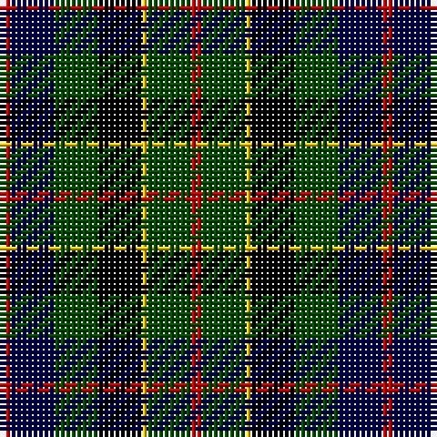

This page is one **sett** — a single exact thread-count. It belongs to the [tartan](/tartans/r2dg8ly1k8dg8db8r2/)
(the same proportion at any scale), whose colour order is pattern [RBGKYGR](/stripes/rbgkygr/).

Sourced from weddslist.  It is a [7 stripe tartan](/stripes/stripes7/).

Original link http://www.weddslist.com/cgi-bin/tartans/pg.pl?source=rb

## Thread count
R/2 DB8 G8 K8 Y1 G8 R/2

## Palette

Palette: <strong>Tartan Register</strong> <small style="color:#888">(3 of 5 colours)</small>
<table><thead><tr><th>Colour</th><th>Threads</th><th>Shade</th><th>Base</th><th>OKLCh</th></tr></thead><tbody><tr><td>R/</td><td style="text-align:right;font-variant-numeric:tabular-nums">2</td><td><code style="background-color:#C80000;">#C80000</code> <small style="color:#888">#C80000</small></td><td>R <code style="background-color:#CC0000;">#CC0000</code></td><td><small style="color:#888">oklch(52.3% 0.215 29.2)</small></td></tr><tr><td>DB</td><td style="text-align:right;font-variant-numeric:tabular-nums">8</td><td><code style="background-color:#00004C;">#00004C</code> <small style="color:#888">#00004C</small></td><td>B <code style="background-color:#2A418A;">#2A418A</code></td><td><small style="color:#888">oklch(18.8% 0.130 264.1)</small></td></tr><tr><td>G</td><td style="text-align:right;font-variant-numeric:tabular-nums">8</td><td><code style="background-color:#004C00;">#004C00</code> <small style="color:#888">#004C00</small></td><td>G <code style="background-color:#006100;">#006100</code></td><td><small style="color:#888">oklch(36.1% 0.123 142.5)</small></td></tr><tr><td>K</td><td style="text-align:right;font-variant-numeric:tabular-nums">8</td><td><code style="background-color:#000000;">#000000</code> <small style="color:#888">#000000</small></td><td>K <code style="background-color:#000000;">#000000</code></td><td><small style="color:#888">oklch(0.0% 0.000 0.0)</small></td></tr><tr><td>Y</td><td style="text-align:right;font-variant-numeric:tabular-nums">1</td><td><code style="background-color:#FFC800;">#FFC800</code> <small style="color:#888">#FFC800</small></td><td>Y <code style="background-color:#F2BF00;">#F2BF00</code></td><td><small style="color:#888">oklch(85.7% 0.175 88.5)</small></td></tr><tr><td>G</td><td style="text-align:right;font-variant-numeric:tabular-nums">8</td><td><code style="background-color:#004C00;">#004C00</code> <small style="color:#888">#004C00</small></td><td>G <code style="background-color:#006100;">#006100</code></td><td><small style="color:#888">oklch(36.1% 0.123 142.5)</small></td></tr><tr><td>R/</td><td style="text-align:right;font-variant-numeric:tabular-nums">2</td><td><code style="background-color:#C80000;">#C80000</code> <small style="color:#888">#C80000</small></td><td>R <code style="background-color:#CC0000;">#CC0000</code></td><td><small style="color:#888">oklch(52.3% 0.215 29.2)</small></td></tr></tbody></table>

# Sample pattern

## Nearest tartans

The nearest existing variants by ΔTartan distance, with this tartan at the top so the swatches line up against it.

ΔTartan

Tartan

Sett

—

<a href="/ttd/edit/#slug=r2dg8ly1k8dg8db8r2">Brodie Hunting</a> <a class="nn-out" href="/setts/s7/r2dg8ly1k8dg8db8r2/" title="open its dictionary page">↗</a>

0.69

<a href="/ttd/edit/#slug=r2k8ly1k8g8db8r2~x2">Brodie hunting</a> <a class="nn-out" href="/setts/s7/r2k8ly1k8g8db8r2~x2/" title="open its dictionary page">↗</a>

0.74

<a href="/ttd/edit/#slug=dg31ly4dg6k19db18t9~x2">Lanark</a> <a class="nn-out" href="/setts/s6/dg31ly4dg6k19db18t9~x2/" title="open its dictionary page">↗</a>

0.87

<a href="/ttd/edit/#slug=dg4lb1dg10k10db10r2">Rose Hunting</a> <a class="nn-out" href="/setts/s6/dg4lb1dg10k10db10r2/" title="open its dictionary page">↗</a>

0.90

<a href="/ttd/edit/#slug=w8r4k8k20k6k3k5~x2">BlackRock (Asymmetrical)</a> <a class="nn-out" href="/setts/s7/w8r4k8k20k6k3k5~x2/" title="open its dictionary page">↗</a>

0.94

<a href="/ttd/edit/#slug=r2k8lo1k8g8t8r2~x4">Brodie Hunting</a> <a class="nn-out" href="/setts/s7/r2k8lo1k8g8t8r2~x4/" title="open its dictionary page">↗</a>

0.96

<a href="/ttd/edit/#slug=k18db12k5g4r6g12k2lo4~x2">MacLeish</a> <a class="nn-out" href="/setts/s8/k18db12k5g4r6g12k2lo4~x2/" title="open its dictionary page">↗</a>

1.02

<a href="/ttd/edit/#slug=r2k8ly1k8dg8db8r2~x2">Brodie Hunting</a> <a class="nn-out" href="/setts/s7/r2k8ly1k8dg8db8r2~x2/" title="open its dictionary page">↗</a>

1.06

<a href="/ttd/edit/#slug=db25k12ly4k9r6k9ly4k12g25~x2">Vosko</a> <a class="nn-out" href="/setts/s9/db25k12ly4k9r6k9ly4k12g25~x2/" title="open its dictionary page">↗</a>

1.07

<a href="/ttd/edit/#slug=r1dr7db7k7g7dr7r1~x4">Tennant</a> <a class="nn-out" href="/setts/s7/r1dr7db7k7g7dr7r1~x4/" title="open its dictionary page">↗</a>

1.10

<a href="/ttd/edit/#slug=k5lr2dg18k17n16k3~x2">Melville</a> <a class="nn-out" href="/setts/s6/k5lr2dg18k17n16k3~x2/" title="open its dictionary page">↗</a>

## Neighbour map

Every grey dot is one of 14299 variants placed by the first two principal components of the ΔTartan feature space (44% of its variance). Red is this tartan; blue dots are its nearest — click one to open its page.

<svg viewBox="0 0 640 380" role="img" style="max-width:100%;height:auto;border:1px solid #e0e0e0;border-radius:4px;display:block" xmlns="http://www.w3.org/2000/svg"><image href="/nn/cloud.v1.png" width="640" height="380"/><a href="/setts/s7/r2k8ly1k8g8db8r2~x2/"><circle cx="138.4" cy="213.8" r="4" fill="#3465a4"><title>Brodie hunting</title></circle></a><a href="/setts/s6/dg31ly4dg6k19db18t9~x2/"><circle cx="154.1" cy="228.0" r="4" fill="#3465a4"><title>Lanark</title></circle></a><a href="/setts/s6/dg4lb1dg10k10db10r2/"><circle cx="157.1" cy="224.4" r="4" fill="#3465a4"><title>Rose Hunting</title></circle></a><a href="/setts/s7/w8r4k8k20k6k3k5~x2/"><circle cx="132.2" cy="209.7" r="4" fill="#3465a4"><title>BlackRock (Asymmetrical)</title></circle></a><a href="/setts/s7/r2k8lo1k8g8t8r2~x4/"><circle cx="155.6" cy="218.0" r="4" fill="#3465a4"><title>Brodie Hunting</title></circle></a><a href="/setts/s8/k18db12k5g4r6g12k2lo4~x2/"><circle cx="156.5" cy="209.9" r="4" fill="#3465a4"><title>MacLeish</title></circle></a><a href="/setts/s7/r2k8ly1k8dg8db8r2~x2/"><circle cx="165.5" cy="231.0" r="4" fill="#3465a4"><title>Brodie Hunting</title></circle></a><a href="/setts/s9/db25k12ly4k9r6k9ly4k12g25~x2/"><circle cx="105.6" cy="203.8" r="4" fill="#3465a4"><title>Vosko</title></circle></a><a href="/setts/s7/r1dr7db7k7g7dr7r1~x4/"><circle cx="121.8" cy="237.6" r="4" fill="#3465a4"><title>Tennant</title></circle></a><a href="/setts/s6/k5lr2dg18k17n16k3~x2/"><circle cx="195.4" cy="234.6" r="4" fill="#3465a4"><title>Melville</title></circle></a><circle cx="154.1" cy="224.2" r="5" fill="#c00000"/></svg>

ID: /setts/s7/r2dg8ly1k8dg8db8r2/
