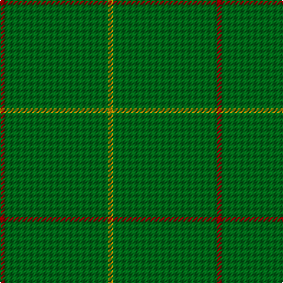

In pattern [RGGGGGY](/stripes/rgggggy/).

This was sourced from register-of-tartans.  It is a [7 stripe tartan](/stripes/stripes7/).

Original link https://www.tartanregister.gov.uk/tartanDetails.aspx?ref=1941

## Register references

External register numbers recorded for this tartan.

- Scottish Register of Tartans: [1941](https://www.tartanregister.gov.uk/tartanDetails.aspx?ref=1941)
- Scottish Tartans Authority (ITI): 2234
- Scottish Tartans World Register: 2234

## Thread count
DR/4 G38 G4 G4 G38 G4 DY/4

## Palette
Each colour and the base-6 reference it is a variant of.

| Colour | Shade | Base |
|---|---|---|
| DR | <code style="background-color:#880000;">#880000</code> `oklch(39.4% 0.162 29.2)` <small>#880000</small> | R <code style="background-color:#CC0000;">#CC0000</code> |
| DY | <code style="background-color:#D09800;">#D09800</code> `oklch(71.4% 0.147 82.1)` <small>#D09800</small> | Y <code style="background-color:#F2BF00;">#F2BF00</code> |
| G | <code style="background-color:#006818;">#006818</code> `oklch(45.0% 0.142 145.0)` <small>#006818</small> | G <code style="background-color:#006100;">#006100</code> |

# Sample pattern

## Nearest tartans

The nearest existing variants by ΔTartan distance, with this tartan at the top so the swatches line up against it.

ΔTartan

Tartan

Sett

—

<a href="/ttd/edit/#slug=r2g19g2g2g19g2lo2~x2">Kenmore Hunting</a> <a class="nn-out" href="/setts/s7/r2g19g2g2g19g2lo2~x2/" title="open its dictionary page">↗</a>

1.51

<a href="/setts/s10/g2dp2g20g2g2g1~x4/">Walters (Personal)</a>

1.53

<a href="/ttd/edit/#slug=k2g2g19g2g2g19r2~x2">Kenmore Hunting (Fashion)</a> <a class="nn-out" href="/setts/s7/k2g2g19g2g2g19r2~x2/" title="open its dictionary page">↗</a>

1.78

<a href="/ttd/edit/#slug=g2dp2g20g2g2dp1~x4">Walters (Personal)</a> <a class="nn-out" href="/setts/s6/g2dp2g20g2g2dp1~x4/" title="open its dictionary page">↗</a>

1.87

<a href="/ttd/edit/#slug=g2o2g15o1w1g15o2g2~x2">Bannockbane, hunting</a> <a class="nn-out" href="/setts/s8/g2o2g15o1w1g15o2g2~x2/" title="open its dictionary page">↗</a>

1.99

<a href="/ttd/edit/#slug=dg62r7k4r4dg62~x2">MacNab, Ancient</a> <a class="nn-out" href="/setts/s5/dg62r7k4r4dg62~x2/" title="open its dictionary page">↗</a>

2.10

<a href="/ttd/edit/#slug=g2dy2g15dy1w1g15dy2g2~x2">Bannockbane Hunting Trade Tartan Tartan Number: 909. Earliest known date: c.1984 Nothing See products available Copyright © Blair Urquhart, Comrie, 2015</a> <a class="nn-out" href="/setts/s8/g2dy2g15dy1w1g15dy2g2~x2/" title="open its dictionary page">↗</a>

2.57

<a href="/ttd/edit/#slug=dg22k3dg25k4~x2">Campbell Simpson</a> <a class="nn-out" href="/setts/s4/dg22k3dg25k4~x2/" title="open its dictionary page">↗</a>

2.67

<a href="/ttd/edit/#slug=lo3g14dy1g14lo3~x4">Pearson Family Tartan Tartan Number: 1734. Earliest known date: 1951 Nothing See products available Copyright © Blair Urquhart, Comrie, 2015</a> <a class="nn-out" href="/setts/s5/lo3g14dy1g14lo3~x4/" title="open its dictionary page">↗</a>

2.80

<a href="/ttd/edit/#slug=dg20r1dg4~x3">Castle Fraser Check</a> <a class="nn-out" href="/setts/s3/dg20r1dg4~x3/" title="open its dictionary page">↗</a>

2.91

<a href="/ttd/edit/#slug=dg2dy2dg15dy1w1dg15dy2dg2~x2">Bannockbane Hunting</a> <a class="nn-out" href="/setts/s8/dg2dy2dg15dy1w1dg15dy2dg2~x2/" title="open its dictionary page">↗</a>

## Neighbour map

Every grey dot is one of 14299 variants placed by the first two principal components of the ΔTartan feature space (44% of its variance). Red is this tartan; blue dots are its nearest — click one to open its page.

<svg viewBox="0 0 640 380" role="img" style="max-width:100%;height:auto;border:1px solid #e0e0e0;border-radius:4px;display:block" xmlns="http://www.w3.org/2000/svg"><image href="/nn/cloud.v1.png" width="640" height="380"/><a href="/setts/s10/g2dp2g20g2g2g1~x4/"><circle cx="626.0" cy="219.1" r="4" fill="#3465a4"><title>Walters (Personal)</title></circle></a><a href="/setts/s7/k2g2g19g2g2g19r2~x2/"><circle cx="626.0" cy="256.6" r="4" fill="#3465a4"><title>Kenmore Hunting (Fashion)</title></circle></a><a href="/setts/s6/g2dp2g20g2g2dp1~x4/"><circle cx="626.0" cy="226.1" r="4" fill="#3465a4"><title>Walters (Personal)</title></circle></a><a href="/setts/s8/g2o2g15o1w1g15o2g2~x2/"><circle cx="626.0" cy="249.1" r="4" fill="#3465a4"><title>Bannockbane, hunting</title></circle></a><a href="/setts/s5/dg62r7k4r4dg62~x2/"><circle cx="626.0" cy="264.4" r="4" fill="#3465a4"><title>MacNab, Ancient</title></circle></a><a href="/setts/s8/g2dy2g15dy1w1g15dy2g2~x2/"><circle cx="626.0" cy="258.6" r="4" fill="#3465a4"><title>Bannockbane Hunting Trade Tartan Tartan Number: 909. Earliest known date: c.1984 Nothing See products available Copyright © Blair Urquhart, Comrie, 2015</title></circle></a><a href="/setts/s4/dg22k3dg25k4~x2/"><circle cx="626.0" cy="362.6" r="4" fill="#3465a4"><title>Campbell Simpson</title></circle></a><a href="/setts/s5/lo3g14dy1g14lo3~x4/"><circle cx="609.2" cy="298.2" r="4" fill="#3465a4"><title>Pearson Family Tartan Tartan Number: 1734. Earliest known date: 1951 Nothing See products available Copyright © Blair Urquhart, Comrie, 2015</title></circle></a><a href="/setts/s3/dg20r1dg4~x3/"><circle cx="626.0" cy="326.5" r="4" fill="#3465a4"><title>Castle Fraser Check</title></circle></a><a href="/setts/s8/dg2dy2dg15dy1w1dg15dy2dg2~x2/"><circle cx="626.0" cy="241.7" r="4" fill="#3465a4"><title>Bannockbane Hunting</title></circle></a><circle cx="626.0" cy="276.2" r="5" fill="#c00000"/></svg>

ID: /setts/s7/r2g19g2g2g19g2lo2~x2/
