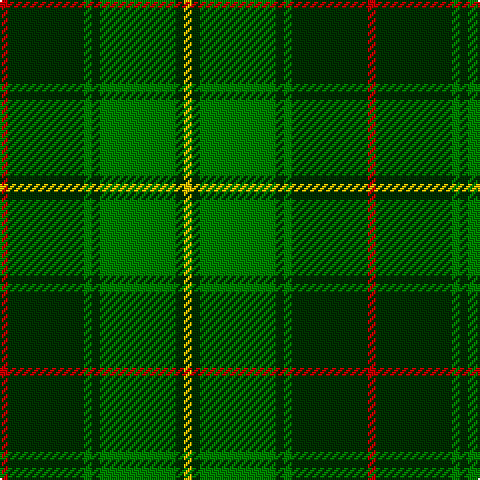

In pattern [RGGGGGY](/patterns/rgggggy/).

This was sourced from weddslist.  It is a [7 stripes tartan](/stripes/stripes7/).

Original link http://www.weddslist.com/cgi-bin/tartans/pg.pl?source=sts

## Thread count
R/4 DG38 G4 DG4 G38 DG4 Y/4

## Palette
Each colour and its ΔE from the base-6 reference it is a variant of.

| Colour | Shade | Base | ΔE (OKLab) |
|---|---|---|---|
| DG | <code style="background-color:#003000;">#003000</code> `#003000` | G <code style="background-color:#006100;">#006100</code> | 0.17 |
| G | <code style="background-color:#008000;">#008000</code> `#008000` | G <code style="background-color:#006100;">#006100</code> | 0.10 |
| R | <code style="background-color:#C00000;">#C00000</code> `#C00000` | R <code style="background-color:#CC0000;">#CC0000</code> | 0.03 |
| Y | <code style="background-color:#F0C000;">#F0C000</code> `#F0C000` | Y <code style="background-color:#F2BF00;">#F2BF00</code> | 0.00 |

# Sample pattern

## Nearest tartans

The nearest existing variants by ΔTartan distance.

1. [Armagh](/setts/s9/g4y2g17ga2r4ga2g3ga11g2~g008000-ga003000-rc00000-yf0c000~x2/) — ΔT 1.00
1. [Daks, Muted Loden](/setts/s8/r5g12ga4ra4ga27g3ga4r5~g30a010-ga003000-r806050-rac00000/) — ΔT 1.13
1. [Doyle/O'Dubhghaill](/setts/s7/g24r9g4ga19y2ga6g7~g008000-ga003000-rc00000-yf0c000~x2/) — ΔT 1.34
1. [Paton Family Tartan Tartan Number: 2127. Earliest known date: 1930 Discovered in 1993 at P and J Haggart, weavers in Aberfeldy. It was possibly designed by the late Mr John Robertson around the 1930's, but the sample appears to have been woven in 1952. The Paton family associated with the tartan come from Aberdeenshire. Apart from the red stripe this sett resembles the Gordon of Abergeldy previously known as Ancient Gordon. See products available Copyright © Blair Urquhart, Comrie, 2015](/setts/s7/r3g24k28g19y3g3y3~g006818-k101010-rc80000-ye8c000~x2/) — ΔT 1.45
1. [Hartmann (Personal)](/setts/s8/b4k8w3k8g4k4g32k4~b2888c4-g006818-k101010-we0e0e0~x2/) — ΔT 1.47
1. [Paton (Personal)](/setts/s7/r3g20k20g20y2g2y2~g006818-k101010-r880000-yd09800~x2/) — ΔT 1.48
1. [Daks (Muted Loden)](/setts/s8/g3ga6gb2r2gb14ga2gb2g3~g604000-ga289c18-gb003820-rb03000~x2/) — ΔT 1.51
1. [MacSporran, Rejected design](/setts/s6/g30ga13g7ga30g2y4~g003000-ga008000-yf0c000~x2/) — ΔT 1.55
1. [Cranstoun Clan Tartan Tartan Number: 706. Earliest known date: 1842 References: The Setts No: 35. W & A K Johnston, 1906. D.C.Stewart (The Setts of the Scottish Tartans, 1950) would have the light green and dark green transposed but this does not correspond to the Vestiarium Scoticum, the only known source for the tartan. The VS version is shown. See products available Copyright © Blair Urquhart, Comrie, 2015](/setts/s8/g14b1g1b1g3b6ga12r2~b2c2c80-g289c18-ga006818-rc80000~x2/) — ΔT 1.56
1. [Valley, of the Green. (The )](/setts/s7/b4g26ga8b8ga8gb3b2~b5480b0-g003000-ga008000-gb30a010~x2/) — ΔT 1.58

## Neighbour map

Every grey dot is one of 15726 variants placed by the first two principal components of the ΔTartan feature space (44% of its variance). Red is this tartan; blue dots are its nearest — click one to open its page.

<svg viewBox="0 0 640 380" role="img" style="max-width:100%;height:auto;border:1px solid #e0e0e0;border-radius:4px;display:block" xmlns="http://www.w3.org/2000/svg"><image href="/nn/cloud.v1.png" width="640" height="380"/><a href="/setts/s9/g4y2g17ga2r4ga2g3ga11g2~g008000-ga003000-rc00000-yf0c000~x2/"><circle cx="301.7" cy="206.7" r="4" fill="#3465a4"><title>Armagh</title></circle></a><a href="/setts/s8/r5g12ga4ra4ga27g3ga4r5~g30a010-ga003000-r806050-rac00000/"><circle cx="289.9" cy="205.7" r="4" fill="#3465a4"><title>Daks, Muted Loden</title></circle></a><a href="/setts/s7/g24r9g4ga19y2ga6g7~g008000-ga003000-rc00000-yf0c000~x2/"><circle cx="271.8" cy="219.1" r="4" fill="#3465a4"><title>Doyle/O'Dubhghaill</title></circle></a><a href="/setts/s7/r3g24k28g19y3g3y3~g006818-k101010-rc80000-ye8c000~x2/"><circle cx="294.2" cy="213.2" r="4" fill="#3465a4"><title>Paton Family Tartan Tartan Number: 2127. Earliest known date: 1930 Discovered in 1993 at P and J Haggart, weavers in Aberfeldy. It was possibly designed by the late Mr John Robertson around the 1930's, but the sample appears to have been woven in 1952. The Paton family associated with the tartan come from Aberdeenshire. Apart from the red stripe this sett resembles the Gordon of Abergeldy previously known as Ancient Gordon. See products available Copyright © Blair Urquhart, Comrie, 2015</title></circle></a><a href="/setts/s8/b4k8w3k8g4k4g32k4~b2888c4-g006818-k101010-we0e0e0~x2/"><circle cx="302.1" cy="190.1" r="4" fill="#3465a4"><title>Hartmann (Personal)</title></circle></a><a href="/setts/s7/r3g20k20g20y2g2y2~g006818-k101010-r880000-yd09800~x2/"><circle cx="345.4" cy="220.2" r="4" fill="#3465a4"><title>Paton (Personal)</title></circle></a><a href="/setts/s8/g3ga6gb2r2gb14ga2gb2g3~g604000-ga289c18-gb003820-rb03000~x2/"><circle cx="294.6" cy="228.7" r="4" fill="#3465a4"><title>Daks (Muted Loden)</title></circle></a><a href="/setts/s6/g30ga13g7ga30g2y4~g003000-ga008000-yf0c000~x2/"><circle cx="340.5" cy="239.5" r="4" fill="#3465a4"><title>MacSporran, Rejected design</title></circle></a><a href="/setts/s8/g14b1g1b1g3b6ga12r2~b2c2c80-g289c18-ga006818-rc80000~x2/"><circle cx="263.2" cy="189.6" r="4" fill="#3465a4"><title>Cranstoun Clan Tartan Tartan Number: 706. Earliest known date: 1842 References: The Setts No: 35. W &amp; A K Johnston, 1906. D.C.Stewart (The Setts of the Scottish Tartans, 1950) would have the light green and dark green transposed but this does not correspond to the Vestiarium Scoticum, the only known source for the tartan. The VS version is shown. See products available Copyright © Blair Urquhart, Comrie, 2015</title></circle></a><a href="/setts/s7/b4g26ga8b8ga8gb3b2~b5480b0-g003000-ga008000-gb30a010~x2/"><circle cx="249.6" cy="205.8" r="4" fill="#3465a4"><title>Valley, of the Green. (The )</title></circle></a><circle cx="303.4" cy="205.4" r="5" fill="#c00000"/></svg>

ID: /setts/s7/r2g19ga2g2ga19g2y2~g003000-ga008000-rc00000-yf0c000~x2/
