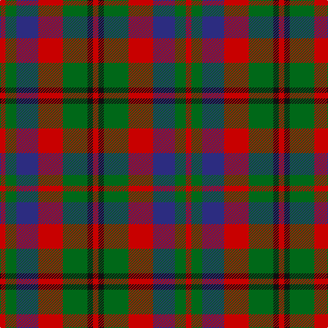

In pattern [RGBRGKR](/patterns/rgbrgkr/).

This was sourced from tartans-authority.  It is a [7 stripes tartan](/stripes/stripes7/).

Original link http://www.tartansauthority.com/tartan-ferret/display/1452/

## Thread count
R/8 G16 DB32 R36 G36 K8 R/8

## Palette
Each colour and its ΔE from the base-6 reference it is a variant of.

| Colour | Shade | Base | ΔE (OKLab) |
|---|---|---|---|
| DB | <code style="background-color:#2C2C80;">#2C2C80</code> `#2C2C80` | B <code style="background-color:#2A418A;">#2A418A</code> | 0.06 |
| G | <code style="background-color:#006818;">#006818</code> `#006818` | G <code style="background-color:#006100;">#006100</code> | 0.02 |
| K | <code style="background-color:#101010;">#101010</code> `#101010` | K <code style="background-color:#000000;">#000000</code> | 0.17 |
| R | <code style="background-color:#C80000;">#C80000</code> `#C80000` | R <code style="background-color:#CC0000;">#CC0000</code> | 0.01 |

# Sample pattern

## Nearest tartans

The nearest existing variants by ΔTartan distance.

1. [Stewart, Plaid](/setts/s7/r2g4b8r9g9k2r2x2~b304080-g008000-k000000-rc00000/) — ΔT 0.61
1. [Holden Monaro Corporate Tartan Tartan Number: 8700. Earliest known date: 1831 Holden Monaro GTS 1978 car seats. Reproduction colours. Warp 162 threads Weft 202 threads. Last weaving went through with slight difference. Sett size = 4 3/8th - 4 3/4 inch (112mm - 120mm) See products available Copyright © Blair Urquhart, Comrie, 2015](/setts/s8/y10b3y3b3y3b11g11r3x2~b282828-g54381c-r9c4048-yb0a488/) — ΔT 0.65
1. [Wilson's No.214](/setts/s8/b3k1b1r3g4r3b1k1x4~b2888c4-g006818-k101010-rc80000/) — ΔT 0.82
1. [Carnegie](/setts/s8/r33g17b50g17r11g17r9k7~b304080-g008000-k000000-rc00000/) — ΔT 0.93
1. [Carnegie #3](/setts/s8/r33g17b50g17r11g17r9k7~b2c4084-g005020-k101010-rdc0000/) — ΔT 0.95
1. [Chaudhri (Name)](/setts/s8/b13r8w5g24w5r10w5r10x2~b440044-g285800-r800028-we8ccb8/) — ΔT 0.96
1. [Londonderry, County](/setts/s7/r6k2g12y8r5k2g3x4~g003820-k101010-rb84c00-ybc8c00/) — ΔT 1.01
1. [Chivas Regal](/setts/s5/b6k6b6r14y3x2~b003c64-k101010-rb03000-ye8c000/) — ΔT 1.03
1. [Chivas Regal (Corporate)](/setts/s5/b2k2b2r5y1x12~b003c64-k101010-rb03000-ye8c000/) — ΔT 1.03
1. [MacTavish #2](/setts/s6/b1r6ba1b3k3b1x8~b5c8ca8-ba1c0070-k101010-r880000/) — ΔT 1.14

## Neighbour map

Every grey dot is one of 15726 variants placed by the first two principal components of the ΔTartan feature space (44% of its variance). Red is this tartan; blue dots are its nearest — click one to open its page.

<svg viewBox="0 0 640 380" role="img" style="max-width:100%;height:auto;border:1px solid #e0e0e0;border-radius:4px;display:block" xmlns="http://www.w3.org/2000/svg"><image href="/nn/cloud.v1.png" width="640" height="380"/><a href="/setts/s7/r2g4b8r9g9k2r2x2~b304080-g008000-k000000-rc00000/"><circle cx="144.0" cy="246.6" r="4" fill="#3465a4"><title>Stewart, Plaid</title></circle></a><a href="/setts/s8/y10b3y3b3y3b11g11r3x2~b282828-g54381c-r9c4048-yb0a488/"><circle cx="139.3" cy="248.7" r="4" fill="#3465a4"><title>Holden Monaro Corporate Tartan Tartan Number: 8700. Earliest known date: 1831 Holden Monaro GTS 1978 car seats. Reproduction colours. Warp 162 threads Weft 202 threads. Last weaving went through with slight difference. Sett size = 4 3/8th - 4 3/4 inch (112mm - 120mm) See products available Copyright © Blair Urquhart, Comrie, 2015</title></circle></a><a href="/setts/s8/b3k1b1r3g4r3b1k1x4~b2888c4-g006818-k101010-rc80000/"><circle cx="115.2" cy="249.2" r="4" fill="#3465a4"><title>Wilson's No.214</title></circle></a><a href="/setts/s8/r33g17b50g17r11g17r9k7~b304080-g008000-k000000-rc00000/"><circle cx="155.9" cy="220.0" r="4" fill="#3465a4"><title>Carnegie</title></circle></a><a href="/setts/s8/r33g17b50g17r11g17r9k7~b2c4084-g005020-k101010-rdc0000/"><circle cx="169.9" cy="223.8" r="4" fill="#3465a4"><title>Carnegie #3</title></circle></a><a href="/setts/s8/b13r8w5g24w5r10w5r10x2~b440044-g285800-r800028-we8ccb8/"><circle cx="118.4" cy="231.8" r="4" fill="#3465a4"><title>Chaudhri (Name)</title></circle></a><a href="/setts/s7/r6k2g12y8r5k2g3x4~g003820-k101010-rb84c00-ybc8c00/"><circle cx="168.6" cy="239.5" r="4" fill="#3465a4"><title>Londonderry, County</title></circle></a><a href="/setts/s5/b6k6b6r14y3x2~b003c64-k101010-rb03000-ye8c000/"><circle cx="159.1" cy="269.3" r="4" fill="#3465a4"><title>Chivas Regal</title></circle></a><a href="/setts/s5/b2k2b2r5y1x12~b003c64-k101010-rb03000-ye8c000/"><circle cx="174.4" cy="262.5" r="4" fill="#3465a4"><title>Chivas Regal (Corporate)</title></circle></a><a href="/setts/s6/b1r6ba1b3k3b1x8~b5c8ca8-ba1c0070-k101010-r880000/"><circle cx="190.7" cy="234.6" r="4" fill="#3465a4"><title>MacTavish #2</title></circle></a><circle cx="158.3" cy="251.4" r="5" fill="#c00000"/></svg>

ID: /setts/s7/r2g4b8r9g9k2r2x4~b2c2c80-g006818-k101010-rc80000/
