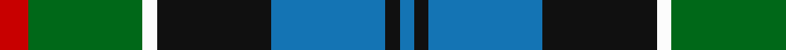
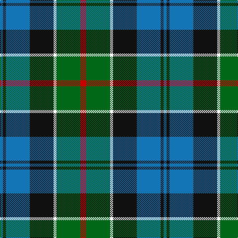

This page is one **sett** — a single exact thread-count. It belongs to the [tartan](/tartans/r2g8w1k8b8k1b1/)
(the same proportion at any scale), whose colour order is pattern [BKBKWGR](/stripes/bkbkwgr/).

Sourced from register-of-tartans.  It is a [7 stripe tartan](/stripes/stripes7/).

Original link https://www.tartanregister.gov.uk/tartanDetails.aspx?ref=715

## Register references

External register numbers recorded for this tartan.

- Scottish Register of Tartans: [715](https://www.tartanregister.gov.uk/tartanDetails.aspx?ref=715)
- Scottish Tartans Authority (ITI): 274
- Scottish Tartans World Register: 274

## Thread count
R/12 G48 W6 K48 B48 K6 B/6

## Palette
Each colour and the base-6 reference it is a variant of.

| Colour | Shade | Base |
|---|---|---|
| B | <code style="background-color:#1474B4;">#1474B4</code> `oklch(54.0% 0.129 245.1)` <small>#1474B4</small> | B <code style="background-color:#2A418A;">#2A418A</code> |
| DB | <code style="background-color:#2C2C80;">#2C2C80</code> `oklch(35.0% 0.138 276.6)` <small>#2C2C80</small> | B <code style="background-color:#2A418A;">#2A418A</code> |
| DG | <code style="background-color:#003820;">#003820</code> `oklch(30.0% 0.070 158.3)` <small>#003820</small> | G <code style="background-color:#006100;">#006100</code> |
| G | <code style="background-color:#006818;">#006818</code> `oklch(45.0% 0.142 145.0)` <small>#006818</small> | G <code style="background-color:#006100;">#006100</code> |
| Ga | <code style="background-color:#285800;">#285800</code> `oklch(41.0% 0.122 135.8)` <small>#285800</small> | G <code style="background-color:#006100;">#006100</code> |
| K | <code style="background-color:#101010;">#101010</code> `oklch(17.3% 0.000 89.9)` <small>#101010</small> | K <code style="background-color:#000000;">#000000</code> |
| N | <code style="background-color:#C0C0C0;">#C0C0C0</code> `oklch(80.8% 0.000 89.9)` <small>#C0C0C0</small> | W <code style="background-color:#F7F7F7;">#F7F7F7</code> |
| R | <code style="background-color:#C80000;">#C80000</code> `oklch(52.3% 0.215 29.2)` <small>#C80000</small> | R <code style="background-color:#CC0000;">#CC0000</code> |
| W | <code style="background-color:#FCFCFC;">#FCFCFC</code> `oklch(99.1% 0.000 89.9)` <small>#FCFCFC</small> | W <code style="background-color:#F7F7F7;">#F7F7F7</code> |

# Sample pattern

## Nearest tartans

The nearest existing variants by ΔTartan distance, with this tartan at the top so the swatches line up against it.

ΔTartan

Tartan

Sett

—

<a href="/ttd/edit/#slug=r2g8w1k8b8k1b1~x6">Colquhoun #2</a> <a class="nn-out" href="/setts/s7/r2g8w1k8b8k1b1~x6/" title="open its dictionary page">↗</a>

0.58

<a href="/ttd/edit/#slug=ly4k2b20k10g15k2r3~x2">Green MacLeod</a> <a class="nn-out" href="/setts/s7/ly4k2b20k10g15k2r3~x2/" title="open its dictionary page">↗</a>

0.74

<a href="/ttd/edit/#slug=db27g5ly8k20ly3g15r3~x2">Nelson Mandela (Personal)</a> <a class="nn-out" href="/setts/s7/db27g5ly8k20ly3g15r3~x2/" title="open its dictionary page">↗</a>

0.79

<a href="/ttd/edit/#slug=k2g17k16r2db17w2~x2">Galbraith</a> <a class="nn-out" href="/setts/s6/k2g17k16r2db17w2~x2/" title="open its dictionary page">↗</a>

0.85

<a href="/ttd/edit/#slug=r3g16w2k16db16k2db2~x2">Colquhoun Clan Tartan Tartan Number: 274. Earliest known date: 1810-15 The Bonnie Banks and Braes of Loch Lomand were the setting for the interesting and sometimes violent history of the Colquhouns of Luss. Their tartan is well documented, appearing in the earliest collections, and certified by the Chief, with his seal and signature, in the archives of the Highland Society of London. (c.1816). The Clan tartan, in its present form, was woven by Wilson's of Bannockburn at the beginning of the 19th century and recorded in the firms pattern books dated 1819. Wilson often used purple in place of blue and produced proportionately equivalent patterns in different weights of cloth. Logan recorded a similar sett in 1831. The Vestiarium Scoticum shows a pattern with the white stripe next to the blue but this is regarded as an error. See products available Copyright © Blair Urquhart, Comrie, 2015</a> <a class="nn-out" href="/setts/s7/r3g16w2k16db16k2db2~x2/" title="open its dictionary page">↗</a>

0.85

<a href="/ttd/edit/#slug=r3k2g20k10b20ly2~x2">MacLeod of Assynt</a> <a class="nn-out" href="/setts/s6/r3k2g20k10b20ly2~x2/" title="open its dictionary page">↗</a>

0.86

<a href="/ttd/edit/#slug=db24k4r3k4g24k4lo4~x2">Skene</a> <a class="nn-out" href="/setts/s7/db24k4r3k4g24k4lo4~x2/" title="open its dictionary page">↗</a>

0.87

<a href="/ttd/edit/#slug=t4g14ly2k14db14k2db3~x2">Hogarth of Firhill (Clan)</a> <a class="nn-out" href="/setts/s7/t4g14ly2k14db14k2db3~x2/" title="open its dictionary page">↗</a>

0.87

<a href="/ttd/edit/#slug=r3db20g3k20db3g20w3g3~x2">MacFrog (Personal)</a> <a class="nn-out" href="/setts/s8/r3db20g3k20db3g20w3g3~x2/" title="open its dictionary page">↗</a>

0.88

<a href="/ttd/edit/#slug=t2g6ly1k6db6k1db1~x2">Hogarth of Firhill</a> <a class="nn-out" href="/setts/s7/t2g6ly1k6db6k1db1~x2/" title="open its dictionary page">↗</a>

0.92

<a href="/ttd/edit/#slug=g2k2g17k16r2db17ly2~x2">Greenock</a> <a class="nn-out" href="/setts/s7/g2k2g17k16r2db17ly2~x2/" title="open its dictionary page">↗</a>

## Neighbour map

Every grey dot is one of 14299 variants placed by the first two principal components of the ΔTartan feature space (44% of its variance). Red is this tartan; blue dots are its nearest — click one to open its page.

<svg viewBox="0 0 640 380" role="img" style="max-width:100%;height:auto;border:1px solid #e0e0e0;border-radius:4px;display:block" xmlns="http://www.w3.org/2000/svg"><image href="/nn/cloud.v1.png" width="640" height="380"/><a href="/setts/s7/ly4k2b20k10g15k2r3~x2/"><circle cx="148.4" cy="188.3" r="4" fill="#3465a4"><title>Green MacLeod</title></circle></a><a href="/setts/s7/db27g5ly8k20ly3g15r3~x2/"><circle cx="121.4" cy="196.0" r="4" fill="#3465a4"><title>Nelson Mandela (Personal)</title></circle></a><a href="/setts/s6/k2g17k16r2db17w2~x2/"><circle cx="151.3" cy="213.2" r="4" fill="#3465a4"><title>Galbraith</title></circle></a><a href="/setts/s7/r3g16w2k16db16k2db2~x2/"><circle cx="150.2" cy="205.8" r="4" fill="#3465a4"><title>Colquhoun Clan Tartan Tartan Number: 274. Earliest known date: 1810-15 The Bonnie Banks and Braes of Loch Lomand were the setting for the interesting and sometimes violent history of the Colquhouns of Luss. Their tartan is well documented, appearing in the earliest collections, and certified by the Chief, with his seal and signature, in the archives of the Highland Society of London. (c.1816). The Clan tartan, in its present form, was woven by Wilson's of Bannockburn at the beginning of the 19th century and recorded in the firms pattern books dated 1819. Wilson often used purple in place of blue and produced proportionately equivalent patterns in different weights of cloth. Logan recorded a similar sett in 1831. The Vestiarium Scoticum shows a pattern with the white stripe next to the blue but this is regarded as an error. See products available Copyright © Blair Urquhart, Comrie, 2015</title></circle></a><a href="/setts/s6/r3k2g20k10b20ly2~x2/"><circle cx="169.5" cy="202.8" r="4" fill="#3465a4"><title>MacLeod of Assynt</title></circle></a><a href="/setts/s7/db24k4r3k4g24k4lo4~x2/"><circle cx="149.5" cy="182.5" r="4" fill="#3465a4"><title>Skene</title></circle></a><a href="/setts/s7/t4g14ly2k14db14k2db3~x2/"><circle cx="134.8" cy="220.9" r="4" fill="#3465a4"><title>Hogarth of Firhill (Clan)</title></circle></a><a href="/setts/s8/r3db20g3k20db3g20w3g3~x2/"><circle cx="143.6" cy="199.0" r="4" fill="#3465a4"><title>MacFrog (Personal)</title></circle></a><a href="/setts/s7/t2g6ly1k6db6k1db1~x2/"><circle cx="116.1" cy="225.7" r="4" fill="#3465a4"><title>Hogarth of Firhill</title></circle></a><a href="/setts/s7/g2k2g17k16r2db17ly2~x2/"><circle cx="166.9" cy="204.0" r="4" fill="#3465a4"><title>Greenock</title></circle></a><circle cx="125.1" cy="198.4" r="5" fill="#c00000"/></svg>

ID: /setts/s7/r2g8w1k8b8k1b1~x6/
