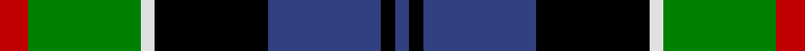
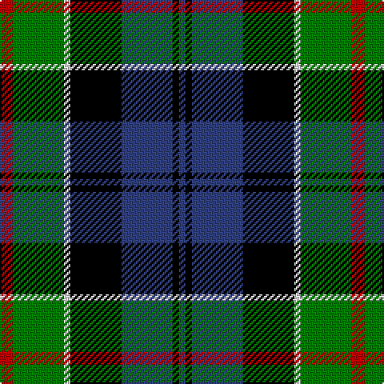

In pattern [BKBKWGR](/stripes/bkbkwgr/).

This was sourced from weddslist.  It is a [7 stripe tartan](/stripes/stripes7/).

Original link http://www.weddslist.com/cgi-bin/tartans/pg.pl?source=sts

## Thread count
R/8 G32 LN4 K32 B32 K4 B/4

## Palette
Each colour and the base-6 reference it is a variant of.

| Colour | Shade | Base |
|---|---|---|
| B | <code style="background-color:#304080;">#304080</code> `oklch(39.4% 0.109 270.2)` <small>#304080</small> | B <code style="background-color:#2A418A;">#2A418A</code> |
| G | <code style="background-color:#008000;">#008000</code> `oklch(52.0% 0.177 142.5)` <small>#008000</small> | G <code style="background-color:#006100;">#006100</code> |
| K | <code style="background-color:#000000;">#000000</code> `oklch(0.0% 0.000 0.0)` <small>#000000</small> | K <code style="background-color:#000000;">#000000</code> |
| LN | <code style="background-color:#E0E0E0;">#E0E0E0</code> `oklch(90.7% 0.000 89.9)` <small>#E0E0E0</small> | W <code style="background-color:#F7F7F7;">#F7F7F7</code> |
| R | <code style="background-color:#C00000;">#C00000</code> `oklch(50.7% 0.208 29.2)` <small>#C00000</small> | R <code style="background-color:#CC0000;">#CC0000</code> |

# Sample pattern

## Nearest tartans

The nearest existing variants by ΔTartan distance, with this tartan at the top so the swatches line up against it.

ΔTartan

Tartan

Sett

—

<a href="/ttd/edit/#slug=r2g8w1k8db8k1db1~x4">Colquhoun</a> <a class="nn-out" href="/setts/s7/r2g8w1k8db8k1db1~x4/" title="open its dictionary page">↗</a>

0.48

<a href="/ttd/edit/#slug=r2db8k8w1g8k1~x2">Leslie, hunting</a> <a class="nn-out" href="/setts/s6/r2db8k8w1g8k1~x2/" title="open its dictionary page">↗</a>

0.51

<a href="/ttd/edit/#slug=g17ly2k14r2db9r2db10~x2">MacDonald, (Flora.. )</a> <a class="nn-out" href="/setts/s7/g17ly2k14r2db9r2db10~x2/" title="open its dictionary page">↗</a>

0.56

<a href="/ttd/edit/#slug=r4g16k16db4g3db12ly2~x2">Junior Chamber International</a> <a class="nn-out" href="/setts/s7/r4g16k16db4g3db12ly2~x2/" title="open its dictionary page">↗</a>

0.63

<a href="/ttd/edit/#slug=b2g6ly1k6db6k1db1~x2">Hogarth, of Firhill</a> <a class="nn-out" href="/setts/s7/b2g6ly1k6db6k1db1~x2/" title="open its dictionary page">↗</a>

0.63

<a href="/ttd/edit/#slug=r5db3r3db29k29g29w4r4~x2">Borrodale</a> <a class="nn-out" href="/setts/s8/r5db3r3db29k29g29w4r4~x2/" title="open its dictionary page">↗</a>

0.64

<a href="/ttd/edit/#slug=w1db8k9g9k1ly1~x4">MacNeil 4</a> <a class="nn-out" href="/setts/s6/w1db8k9g9k1ly1~x4/" title="open its dictionary page">↗</a>

0.67

<a href="/ttd/edit/#slug=r3k2g15k10db20k2ly2~x2">MacLeod, Macleod of Harris</a> <a class="nn-out" href="/setts/s7/r3k2g15k10db20k2ly2~x2/" title="open its dictionary page">↗</a>

0.69

<a href="/ttd/edit/#slug=db1r1db6k6g6w1~x2">Wellington</a> <a class="nn-out" href="/setts/s6/db1r1db6k6g6w1~x2/" title="open its dictionary page">↗</a>

0.74

<a href="/ttd/edit/#slug=r10db24r4k30g36db5">MacWilliam</a> <a class="nn-out" href="/setts/s6/r10db24r4k30g36db5/" title="open its dictionary page">↗</a>

0.78

<a href="/ttd/edit/#slug=k2g11ly1k8db9r2~x4">Forsyth</a> <a class="nn-out" href="/setts/s6/k2g11ly1k8db9r2~x4/" title="open its dictionary page">↗</a>

## Neighbour map

Every grey dot is one of 14299 variants placed by the first two principal components of the ΔTartan feature space (44% of its variance). Red is this tartan; blue dots are its nearest — click one to open its page.

<svg viewBox="0 0 640 380" role="img" style="max-width:100%;height:auto;border:1px solid #e0e0e0;border-radius:4px;display:block" xmlns="http://www.w3.org/2000/svg"><image href="/nn/cloud.v1.png" width="640" height="380"/><a href="/setts/s6/r2db8k8w1g8k1~x2/"><circle cx="107.6" cy="206.5" r="4" fill="#3465a4"><title>Leslie, hunting</title></circle></a><a href="/setts/s7/g17ly2k14r2db9r2db10~x2/"><circle cx="116.7" cy="199.0" r="4" fill="#3465a4"><title>MacDonald, (Flora.. )</title></circle></a><a href="/setts/s7/r4g16k16db4g3db12ly2~x2/"><circle cx="109.6" cy="200.9" r="4" fill="#3465a4"><title>Junior Chamber International</title></circle></a><a href="/setts/s7/b2g6ly1k6db6k1db1~x2/"><circle cx="83.2" cy="209.8" r="4" fill="#3465a4"><title>Hogarth, of Firhill</title></circle></a><a href="/setts/s8/r5db3r3db29k29g29w4r4~x2/"><circle cx="114.3" cy="167.9" r="4" fill="#3465a4"><title>Borrodale</title></circle></a><a href="/setts/s6/w1db8k9g9k1ly1~x4/"><circle cx="129.1" cy="196.5" r="4" fill="#3465a4"><title>MacNeil 4</title></circle></a><a href="/setts/s7/r3k2g15k10db20k2ly2~x2/"><circle cx="151.4" cy="179.5" r="4" fill="#3465a4"><title>MacLeod, Macleod of Harris</title></circle></a><a href="/setts/s6/db1r1db6k6g6w1~x2/"><circle cx="101.9" cy="217.1" r="4" fill="#3465a4"><title>Wellington</title></circle></a><a href="/setts/s6/r10db24r4k30g36db5/"><circle cx="109.5" cy="206.2" r="4" fill="#3465a4"><title>MacWilliam</title></circle></a><a href="/setts/s6/k2g11ly1k8db9r2~x4/"><circle cx="127.4" cy="197.0" r="4" fill="#3465a4"><title>Forsyth</title></circle></a><circle cx="110.8" cy="192.2" r="5" fill="#c00000"/></svg>

ID: /setts/s7/r2g8w1k8db8k1db1~x4/
