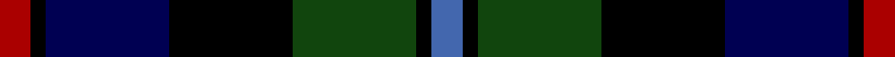
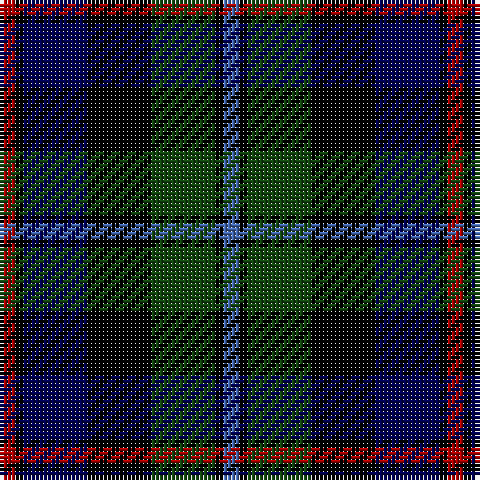

In pattern [BKGKBKR](/stripes/bkgkbkr/).

This was sourced from weddslist.  It is a [7 stripe tartan](/stripes/stripes7/).

Original link http://www.weddslist.com/cgi-bin/tartans/pg.pl?source=tinsel

## Attestations

This cloth appears in 2 source records; the oldest owns this page.

- undated — Campbell of Cawdor (weddslist, [record](http://www.weddslist.com/cgi-bin/tartans/pg.pl?source=tinsel))
- undated — Campbell of Cawdor (weddslist, [record](http://www.weddslist.com/cgi-bin/tartans/pg.pl?source=x))

## Thread count
DR/4 K2 DB16 K16 DG16 K2 B/4

## Palette
Each colour and the base-6 reference it is a variant of.

| Colour | Shade | Base |
|---|---|---|
| B | <code style="background-color:#4367AE;">#4367AE</code> `oklch(52.2% 0.120 262.7)` <small>#4367AE</small> | B <code style="background-color:#2A418A;">#2A418A</code> |
| DB | <code style="background-color:#000052;">#000052</code> `oklch(19.8% 0.137 264.1)` <small>#000052</small> | B <code style="background-color:#2A418A;">#2A418A</code> |
| DG | <code style="background-color:#11450D;">#11450D</code> `oklch(34.4% 0.101 142.1)` <small>#11450D</small> | G <code style="background-color:#006100;">#006100</code> |
| DR | <code style="background-color:#AA0000;">#AA0000</code> `oklch(46.3% 0.190 29.2)` <small>#AA0000</small> | R <code style="background-color:#CC0000;">#CC0000</code> |
| K | <code style="background-color:#000000;">#000000</code> `oklch(0.0% 0.000 0.0)` <small>#000000</small> | K <code style="background-color:#000000;">#000000</code> |

# Sample pattern

## Nearest tartans

The nearest existing variants by ΔTartan distance.

1. [Colquhoun](/setts/s7/r2dg8lr1k8db8k1db1~x2/) — ΔT 0.32
1. [Leslie Hunting](/setts/s6/r2db8k8lr1dg8k1~x2/) — ΔT 0.43
1. [Leslie Hunting](/setts/s6/r2db8k8lr1dg8k1/) — ΔT 0.43
1. [MacLeod](/setts/s7/r3k2dg15k10db20k2ly2~x2/) — ΔT 0.69
1. [MacLeod](/setts/s7/r3k2dg15k10db20k2ly2/) — ΔT 0.69
1. [Leslie Hunting](/setts/s6/r2db8k8lb1dg8k1/) — ΔT 0.76
1. [Royal College of Physicians of Edinburgh](/setts/s6/db28r4k14r4dg33ly4~x2/) — ΔT 0.78
1. [Mitchell](/setts/s6/k2dg12k12r1db12lr2~x2/) — ΔT 0.78
1. [Mitchell](/setts/s6/k2dg12k12r1db12lr2/) — ΔT 0.78
1. [Herd](/setts/s6/dp4dg25k24w3db24w4~x2/) — ΔT 0.78

## Neighbour map

Every grey dot is one of 14299 variants placed by the first two principal components of the ΔTartan feature space (44% of its variance). Red is this tartan; blue dots are its nearest — click one to open its page.

<svg viewBox="0 0 640 380" role="img" style="max-width:100%;height:auto;border:1px solid #e0e0e0;border-radius:4px;display:block" xmlns="http://www.w3.org/2000/svg"><image href="/nn/cloud.v1.png" width="640" height="380"/><a href="/setts/s7/r2dg8lr1k8db8k1db1~x2/"><circle cx="142.7" cy="212.7" r="4" fill="#3465a4"><title>Colquhoun</title></circle></a><a href="/setts/s6/r2db8k8lr1dg8k1~x2/"><circle cx="139.2" cy="226.5" r="4" fill="#3465a4"><title>Leslie Hunting</title></circle></a><a href="/setts/s6/r2db8k8lr1dg8k1/"><circle cx="139.2" cy="226.5" r="4" fill="#3465a4"><title>Leslie Hunting</title></circle></a><a href="/setts/s7/r3k2dg15k10db20k2ly2~x2/"><circle cx="182.3" cy="200.6" r="4" fill="#3465a4"><title>MacLeod</title></circle></a><a href="/setts/s7/r3k2dg15k10db20k2ly2/"><circle cx="182.3" cy="200.6" r="4" fill="#3465a4"><title>MacLeod</title></circle></a><a href="/setts/s6/r2db8k8lb1dg8k1/"><circle cx="124.9" cy="219.0" r="4" fill="#3465a4"><title>Leslie Hunting</title></circle></a><a href="/setts/s6/db28r4k14r4dg33ly4~x2/"><circle cx="169.2" cy="213.2" r="4" fill="#3465a4"><title>Royal College of Physicians of Edinburgh</title></circle></a><a href="/setts/s6/k2dg12k12r1db12lr2~x2/"><circle cx="170.4" cy="211.3" r="4" fill="#3465a4"><title>Mitchell</title></circle></a><a href="/setts/s6/k2dg12k12r1db12lr2/"><circle cx="170.4" cy="211.3" r="4" fill="#3465a4"><title>Mitchell</title></circle></a><a href="/setts/s6/dp4dg25k24w3db24w4~x2/"><circle cx="115.8" cy="217.3" r="4" fill="#3465a4"><title>Herd</title></circle></a><circle cx="143.9" cy="219.1" r="5" fill="#c00000"/></svg>

ID: /setts/s7/r2k1db8k8dg8k1b2~x2/
