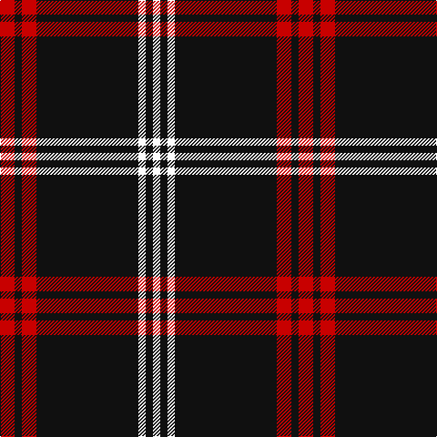

In pattern [RKRKWKW](/stripes/rkrkwkw/).

This was sourced from register-of-tartans.  It is a [7 stripe tartan](/stripes/stripes7/).

Original link https://www.tartanregister.gov.uk/tartanDetails.aspx?ref=4614

## Attestations

This cloth appears in 2 source records; the oldest owns this page.

- 01/06/2007 — White Stripes Hunting (register-of-tartans, [record](https://www.tartanregister.gov.uk/tartanDetails.aspx?ref=4614))
- June 2007 — White Stripes Hunting (Corporate) (tartans-authority, [record](http://www.tartansauthority.com/tartan-ferret/display/7206/))

## Register references

External register numbers recorded for this tartan.

- Scottish Register of Tartans: [4614](https://www.tartanregister.gov.uk/tartanDetails.aspx?ref=4614)
- Scottish Tartans Authority (ITI): 7206

## Thread count
R/16 K8 R16 K112 W8 K8 W/8

## Palette
Each colour and its ΔE from the base-6 reference it is a variant of.

| Colour | Shade | Base | ΔE (OKLab) |
|---|---|---|---|
| K | <code style="background-color:#101010;">#101010</code> `#101010` | K <code style="background-color:#000000;">#000000</code> | 0.17 |
| R | <code style="background-color:#C80000;">#C80000</code> `#C80000` | R <code style="background-color:#CC0000;">#CC0000</code> | 0.01 |
| W | <code style="background-color:#FCFCFC;">#FCFCFC</code> `#FCFCFC` | W <code style="background-color:#F7F7F7;">#F7F7F7</code> | 0.01 |

# Sample pattern

## Nearest tartans

The nearest existing variants by ΔTartan distance.

1. [Reiver Check](/setts/s10/k27w2k2w2k2w2k2w2k4r5~x4/) — ΔT 0.86
1. [Tweedside Variation (silk sample)](/setts/s9/k50w3k3r4w3r3w5r3k3~x2/) — ΔT 0.87
1. [Gwynn (Name)](/setts/s5/ly9k4ly4k45r4~x2/) — ΔT 1.14
1. [Welsh National #3](/setts/s5/ly7k4ly4k39r4~x2/) — ΔT 1.22
1. [State University of New York College at Buffalo](/setts/s8/k70r5k3lb4dp4lb4k3r12/) — ΔT 1.26
1. [Bunnahabhain](/setts/s9/lo8k7r3k7r3k38w2k3lo6~x2/) — ΔT 1.29
1. [Northern Kentucky University](/setts/s7/w5k3ly6k5w3k30ly2~x2/) — ΔT 1.32
1. [Lundy Reform](/setts/s7/k2lb5k1lb1k10r1k1~x4/) — ΔT 1.42
1. [Brockton](/setts/s8/k2w1k2r6k6r3k28w2~x2/) — ΔT 1.42
1. [Knights Templar Dress (Corporate)](/setts/s12/k50w4k10r2k2w2r2k14r11k2r4w2~x2/) — ΔT 1.43

## Neighbour map

Every grey dot is one of 14299 variants placed by the first two principal components of the ΔTartan feature space (44% of its variance). Red is this tartan; blue dots are its nearest — click one to open its page.

<svg viewBox="0 0 640 380" role="img" style="max-width:100%;height:auto;border:1px solid #e0e0e0;border-radius:4px;display:block" xmlns="http://www.w3.org/2000/svg"><image href="/nn/cloud.v1.png" width="640" height="380"/><a href="/setts/s10/k27w2k2w2k2w2k2w2k4r5~x4/"><circle cx="453.0" cy="150.7" r="4" fill="#3465a4"><title>Reiver Check</title></circle></a><a href="/setts/s9/k50w3k3r4w3r3w5r3k3~x2/"><circle cx="458.9" cy="134.4" r="4" fill="#3465a4"><title>Tweedside Variation (silk sample)</title></circle></a><a href="/setts/s5/ly9k4ly4k45r4~x2/"><circle cx="453.3" cy="201.2" r="4" fill="#3465a4"><title>Gwynn (Name)</title></circle></a><a href="/setts/s5/ly7k4ly4k39r4~x2/"><circle cx="445.0" cy="207.2" r="4" fill="#3465a4"><title>Welsh National #3</title></circle></a><a href="/setts/s8/k70r5k3lb4dp4lb4k3r12/"><circle cx="464.0" cy="120.3" r="4" fill="#3465a4"><title>State University of New York College at Buffalo</title></circle></a><a href="/setts/s9/lo8k7r3k7r3k38w2k3lo6~x2/"><circle cx="430.4" cy="144.4" r="4" fill="#3465a4"><title>Bunnahabhain</title></circle></a><a href="/setts/s7/w5k3ly6k5w3k30ly2~x2/"><circle cx="405.4" cy="167.7" r="4" fill="#3465a4"><title>Northern Kentucky University</title></circle></a><a href="/setts/s7/k2lb5k1lb1k10r1k1~x4/"><circle cx="377.0" cy="195.3" r="4" fill="#3465a4"><title>Lundy Reform</title></circle></a><a href="/setts/s8/k2w1k2r6k6r3k28w2~x2/"><circle cx="521.9" cy="156.1" r="4" fill="#3465a4"><title>Brockton</title></circle></a><a href="/setts/s12/k50w4k10r2k2w2r2k14r11k2r4w2~x2/"><circle cx="487.5" cy="124.5" r="4" fill="#3465a4"><title>Knights Templar Dress (Corporate)</title></circle></a><circle cx="456.3" cy="167.2" r="5" fill="#c00000"/></svg>

ID: /setts/s7/r2k1r2k14w1k1w1~x8/
