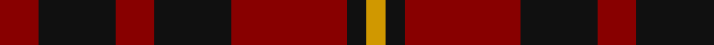

**Bands:** [RKRKRKY](/stripes/rkrkrky/) · **Stripes:** [R K R K R K LO](/stripes/stripes7/) R K R K R K LO

This was sourced from register-of-tartans.  It is a [7 band tartan](/bands/bands7/).

Original link https://www.tartanregister.gov.uk/tartanDetails.aspx?ref=5214

## Register references

External register numbers recorded for this tartan.

- Scottish Register of Tartans: [5214](https://www.tartanregister.gov.uk/tartanDetails.aspx?ref=5214)
- Scottish Tartans Authority (ITI): 3390

## Thread count
DR/8 K16 DR8 K16 DR24 K4 DY/4

## Palette
Each colour and its ΔE from the base-6 reference it is a variant of.

| Colour | Shade | Base | ΔE (OKLab) |
|---|---|---|---|
| DR | <code style="background-color:#880000;">#880000</code> `#880000` | R <code style="background-color:#CC0000;">#CC0000</code> | 0.15 |
| DY | <code style="background-color:#D09800;">#D09800</code> `#D09800` | Y <code style="background-color:#F2BF00;">#F2BF00</code> | 0.12 |
| K | <code style="background-color:#101010;">#101010</code> `#101010` | K <code style="background-color:#000000;">#000000</code> | 0.17 |

# Sample pattern

## Nearest tartans

The nearest existing variants by ΔTartan distance.

1. [bodog.com Corporate Tartan Tartan Number: 6889. Earliest known date: 2006 Corporate brand name and colours, red, black and silver grey used to support brand identification. Company owner and executive is Scottish. First tartan to be name after a web site and first ever tartan for Costa Rica. See products available Copyright © Blair Urquhart, Comrie, 2015](/setts/s8/k25r25k10lb3k10r25k25r3~x2/) — ΔT 1.45
1. [Lumsden Boghead](/setts/s9/dg1r5dg4r1dg1r1dt4r5dt1~x14/) — ΔT 1.51
1. [Wotherspoon](/setts/s5/r5dg3r18db18dg3~x4/) — ΔT 1.51
1. [Unidentified #59](/setts/s7/r1dg4r1lr1r4dg1r1~x4/) — ΔT 1.53
1. [Haig & Haig Whisky](/setts/s8/r26k18r7k4ly4k4r7k18~x2/) — ΔT 1.56
1. [Clanton (Personal)](/setts/s9/dp1k2r7o4r2k4r7o2dp1~x4/) — ΔT 1.59
1. [MacDonald of Sleat](/setts/s5/dg16r5dg2r18k2/) — ΔT 1.59
1. [Lumsden of Kintore (Clan?)](/setts/s9/dt1r5dt4r1g1r1g4r5g1~x12/) — ΔT 1.60
1. [Rajput](/setts/s6/db6r39db10r10db21ly5~x2/) — ΔT 1.60
1. [MacBean of Tomatin (Clan)](/setts/s7/db3r19db13r5g21r8db3~x2/) — ΔT 1.62

## Neighbour map

Every grey dot is one of 14313 variants placed by the first two principal components of the ΔTartan feature space (44% of its variance). Red is this tartan; blue dots are its nearest — click one to open its page.

<svg viewBox="0 0 640 380" role="img" style="max-width:100%;height:auto;border:1px solid #e0e0e0;border-radius:4px;display:block" xmlns="http://www.w3.org/2000/svg"><image href="/nn/cloud.v1.png" width="640" height="380"/><a href="/setts/s8/k25r25k10lb3k10r25k25r3~x2/"><circle cx="314.6" cy="236.3" r="4" fill="#3465a4"><title>bodog.com Corporate Tartan Tartan Number: 6889. Earliest known date: 2006 Corporate brand name and colours, red, black and silver grey used to support brand identification. Company owner and executive is Scottish. First tartan to be name after a web site and first ever tartan for Costa Rica. See products available Copyright © Blair Urquhart, Comrie, 2015</title></circle></a><a href="/setts/s9/dg1r5dg4r1dg1r1dt4r5dt1~x14/"><circle cx="280.1" cy="246.3" r="4" fill="#3465a4"><title>Lumsden Boghead</title></circle></a><a href="/setts/s5/r5dg3r18db18dg3~x4/"><circle cx="290.5" cy="255.9" r="4" fill="#3465a4"><title>Wotherspoon</title></circle></a><a href="/setts/s7/r1dg4r1lr1r4dg1r1~x4/"><circle cx="316.4" cy="274.7" r="4" fill="#3465a4"><title>Unidentified #59</title></circle></a><a href="/setts/s8/r26k18r7k4ly4k4r7k18~x2/"><circle cx="284.1" cy="227.6" r="4" fill="#3465a4"><title>Haig &amp; Haig Whisky</title></circle></a><a href="/setts/s9/dp1k2r7o4r2k4r7o2dp1~x4/"><circle cx="274.7" cy="225.4" r="4" fill="#3465a4"><title>Clanton (Personal)</title></circle></a><a href="/setts/s5/dg16r5dg2r18k2/"><circle cx="363.3" cy="249.7" r="4" fill="#3465a4"><title>MacDonald of Sleat</title></circle></a><a href="/setts/s9/dt1r5dt4r1g1r1g4r5g1~x12/"><circle cx="273.0" cy="243.6" r="4" fill="#3465a4"><title>Lumsden of Kintore (Clan?)</title></circle></a><a href="/setts/s6/db6r39db10r10db21ly5~x2/"><circle cx="349.1" cy="247.5" r="4" fill="#3465a4"><title>Rajput</title></circle></a><a href="/setts/s7/db3r19db13r5g21r8db3~x2/"><circle cx="256.4" cy="257.5" r="4" fill="#3465a4"><title>MacBean of Tomatin (Clan)</title></circle></a><circle cx="309.7" cy="272.7" r="5" fill="#c00000"/></svg>

ID: /setts/s7/r2k4r2k4r6k1lo1~x4/
