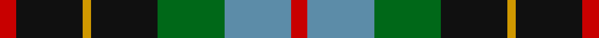
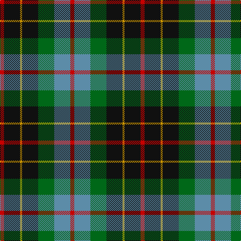

In pattern [RBGKYKR](/stripes/rbgkykr/).

This was sourced from register-of-tartans.  It is a [7 stripe tartan](/stripes/stripes7/).

Original link https://www.tartanregister.gov.uk/tartanDetails.aspx?ref=372

## Attestations

This cloth appears in 2 source records; the oldest owns this page.

- 01/01/1880 — Brodie Hunting (register-of-tartans, [record](https://www.tartanregister.gov.uk/tartanDetails.aspx?ref=372))
- 1880 — Brodie Hunting (Clan) (tartans-authority, [record](http://www.tartansauthority.com/tartan-ferret/display/1334/))

## Register references

External register numbers recorded for this tartan.

- Scottish Register of Tartans: [372](https://www.tartanregister.gov.uk/tartanDetails.aspx?ref=372)
- Scottish Tartans Authority (ITI): 1334
- Scottish Tartans World Register: 1334

## Thread count
R/8 K32 DY4 K32 G32 B32 R/8

## Palette
Each colour and the base-6 reference it is a variant of.

| Colour | Shade | Base |
|---|---|---|
| B | <code style="background-color:#5C8CA8;">#5C8CA8</code> `oklch(61.7% 0.067 235.0)` <small>#5C8CA8</small> | B <code style="background-color:#2A418A;">#2A418A</code> |
| DY | <code style="background-color:#D09800;">#D09800</code> `oklch(71.4% 0.147 82.1)` <small>#D09800</small> | Y <code style="background-color:#F2BF00;">#F2BF00</code> |
| G | <code style="background-color:#006818;">#006818</code> `oklch(45.0% 0.142 145.0)` <small>#006818</small> | G <code style="background-color:#006100;">#006100</code> |
| K | <code style="background-color:#101010;">#101010</code> `oklch(17.3% 0.000 89.9)` <small>#101010</small> | K <code style="background-color:#000000;">#000000</code> |
| R | <code style="background-color:#C80000;">#C80000</code> `oklch(52.3% 0.215 29.2)` <small>#C80000</small> | R <code style="background-color:#CC0000;">#CC0000</code> |

# Sample pattern

## Nearest tartans

The nearest existing variants by ΔTartan distance.

1. [Wilson's No.176](/setts/s8/k8t3g13dp12ly2~x2/) — ΔT 0.82
1. [MacLeish](/setts/s8/k18db12k5g4r6g12k2lo4~x2/) — ΔT 0.85
1. [Scottish Odyssey Commemorative Tartan Tartan Number: 4071. Earliest known date: 01/01/2002 The Scottish Odyssey tartan from Lochcarron is a 'celebration of the wonderful experiences to be gained' from a visit to Scotland and some of the most spectacularly contrasting landscapes to be seen in Europe. See products available Copyright © Blair Urquhart, Comrie, 2015](/setts/s7/k7db11k3db11dy11g22db3~x2/) — ΔT 0.89
1. [Soutar (Name)](/setts/s9/k20w3t20k3r3dg20r10w3k20~x2/) — ΔT 0.90
1. [Unidentified No 79](/setts/s6/r5dg18ly2k14t5k4~x2/) — ΔT 0.91
1. [Brodie Hunting](/setts/s7/r2dg8ly1k8dg8db8r2/) — ΔT 0.94
1. [Lanark](/setts/s6/dg31ly4dg6k19db18t9~x2/) — ΔT 0.97
1. [Wilson's No.124](/setts/s8/g14dp11y3k5y3dp11g14ly2~x2/) — ΔT 0.99
1. [Selkirk (Personal) Original](/setts/s8/dp11y2k10g10lo2~x2/) — ΔT 0.99
1. [CSCA (Corporate)](/setts/s8/g5r4g19k10g8w4db18r4~x2/) — ΔT 1.01

## Neighbour map

Every grey dot is one of 14299 variants placed by the first two principal components of the ΔTartan feature space (44% of its variance). Red is this tartan; blue dots are its nearest — click one to open its page.

<svg viewBox="0 0 640 380" role="img" style="max-width:100%;height:auto;border:1px solid #e0e0e0;border-radius:4px;display:block" xmlns="http://www.w3.org/2000/svg"><image href="/nn/cloud.v1.png" width="640" height="380"/><a href="/setts/s8/k8t3g13dp12ly2~x2/"><circle cx="150.4" cy="233.5" r="4" fill="#3465a4"><title>Wilson's No.176</title></circle></a><a href="/setts/s8/k18db12k5g4r6g12k2lo4~x2/"><circle cx="156.5" cy="209.9" r="4" fill="#3465a4"><title>MacLeish</title></circle></a><a href="/setts/s7/k7db11k3db11dy11g22db3~x2/"><circle cx="127.9" cy="223.8" r="4" fill="#3465a4"><title>Scottish Odyssey Commemorative Tartan Tartan Number: 4071. Earliest known date: 01/01/2002 The Scottish Odyssey tartan from Lochcarron is a 'celebration of the wonderful experiences to be gained' from a visit to Scotland and some of the most spectacularly contrasting landscapes to be seen in Europe. See products available Copyright © Blair Urquhart, Comrie, 2015</title></circle></a><a href="/setts/s9/k20w3t20k3r3dg20r10w3k20~x2/"><circle cx="135.0" cy="195.5" r="4" fill="#3465a4"><title>Soutar (Name)</title></circle></a><a href="/setts/s6/r5dg18ly2k14t5k4~x2/"><circle cx="171.0" cy="212.9" r="4" fill="#3465a4"><title>Unidentified No 79</title></circle></a><a href="/setts/s7/r2dg8ly1k8dg8db8r2/"><circle cx="154.1" cy="224.2" r="4" fill="#3465a4"><title>Brodie Hunting</title></circle></a><a href="/setts/s6/dg31ly4dg6k19db18t9~x2/"><circle cx="154.1" cy="228.0" r="4" fill="#3465a4"><title>Lanark</title></circle></a><a href="/setts/s8/g14dp11y3k5y3dp11g14ly2~x2/"><circle cx="184.9" cy="220.5" r="4" fill="#3465a4"><title>Wilson's No.124</title></circle></a><a href="/setts/s8/dp11y2k10g10lo2~x2/"><circle cx="119.0" cy="236.2" r="4" fill="#3465a4"><title>Selkirk (Personal) Original</title></circle></a><a href="/setts/s8/g5r4g19k10g8w4db18r4~x2/"><circle cx="140.9" cy="224.8" r="4" fill="#3465a4"><title>CSCA (Corporate)</title></circle></a><circle cx="155.6" cy="218.0" r="5" fill="#c00000"/></svg>

ID: /setts/s7/r2k8lo1k8g8t8r2~x4/
