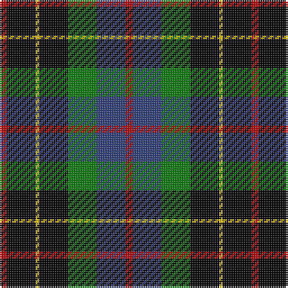

In pattern [RBGKYKR](/stripes/rbgkykr/).

This was sourced from weddslist.  It is a [7 stripe tartan](/stripes/stripes7/).

Original link http://www.weddslist.com/cgi-bin/tartans/pg.pl?source=sts

## Also known as

This cloth is also recorded under:

- Brodie hunting

## Attestations

This cloth appears in 2 source records; the oldest owns this page.

- undated — Brodie hunting (weddslist, [record](http://www.weddslist.com/cgi-bin/tartans/pg.pl?source=sts))
- undated — Brodie Hunting Clan Tartan Tartan Number: 1334. Earliest known date: 1891 The Hunting Brodie first appears in Whyte's first edition of 1891, published by W. and A.K. Johnston, at which time it seems to have been a recent design. D.W. Stewart remarks in his book, 'Old And Rare..'(1893), "of late a green tartan has been sold as undress or hunting Brodie..." See products available Copyright © Blair Urquhart, Comrie, 2015 (house-of-tartan, [record](http://www.house-of-tartan.scotland.net/house/TartanViewjs.asp?colr=Def&tnam=1334))

## Thread count
R/4 K16 Y2 K16 G16 B16 R/4

## Palette
Each colour and the base-6 reference it is a variant of.

| Colour | Shade | Base |
|---|---|---|
| B | <code style="background-color:#304080;">#304080</code> `oklch(39.4% 0.109 270.2)` <small>#304080</small> | B <code style="background-color:#2A418A;">#2A418A</code> |
| G | <code style="background-color:#008000;">#008000</code> `oklch(52.0% 0.177 142.5)` <small>#008000</small> | G <code style="background-color:#006100;">#006100</code> |
| K | <code style="background-color:#000000;">#000000</code> `oklch(0.0% 0.000 0.0)` <small>#000000</small> | K <code style="background-color:#000000;">#000000</code> |
| R | <code style="background-color:#C00000;">#C00000</code> `oklch(50.7% 0.208 29.2)` <small>#C00000</small> | R <code style="background-color:#CC0000;">#CC0000</code> |
| Y | <code style="background-color:#F0C000;">#F0C000</code> `oklch(82.7% 0.169 90.5)` <small>#F0C000</small> | Y <code style="background-color:#F2BF00;">#F2BF00</code> |

# Sample pattern

## Nearest tartans

The nearest existing variants by ΔTartan distance.

1. [BlackRock (Asymmetrical)](/setts/s7/w8r4k8k20k6k3k5~x2/) — ΔT 0.69
1. [Brodie Hunting](/setts/s7/r2dg8ly1k8dg8db8r2/) — ΔT 0.69
1. [Vosko](/setts/s9/db25k12ly4k9r6k9ly4k12g25~x2/) — ΔT 0.84
1. [MacCallum, of Berwick](/setts/s9/db10r7db31k25g23k8db7k8ly5~x2/) — ΔT 1.01
1. [Wilson's, No 233](/setts/s7/k6g6w1g6k6p6g1~x4/) — ΔT 1.01
1. [Wilson's, No 120](/setts/s7/k12g12w2g12k12p12r3~x2/) — ΔT 1.05
1. [Hislop hunting](/setts/s8/r2k8ly1k8g8db8k2w2~x2/) — ΔT 1.06
1. [Wilson's, No 108](/setts/s8/k7g7k1g7k7t1p7k1~x4/) — ΔT 1.08
1. [Dahlonega (District)](/setts/s6/r5g18ly2k14t5k4~x2/) — ΔT 1.09
1. [Dyce](/setts/s6/k2ly1g6k6db6w1~x4/) — ΔT 1.11

## Neighbour map

Every grey dot is one of 14299 variants placed by the first two principal components of the ΔTartan feature space (44% of its variance). Red is this tartan; blue dots are its nearest — click one to open its page.

<svg viewBox="0 0 640 380" role="img" style="max-width:100%;height:auto;border:1px solid #e0e0e0;border-radius:4px;display:block" xmlns="http://www.w3.org/2000/svg"><image href="/nn/cloud.v1.png" width="640" height="380"/><a href="/setts/s7/w8r4k8k20k6k3k5~x2/"><circle cx="132.2" cy="209.7" r="4" fill="#3465a4"><title>BlackRock (Asymmetrical)</title></circle></a><a href="/setts/s7/r2dg8ly1k8dg8db8r2/"><circle cx="154.1" cy="224.2" r="4" fill="#3465a4"><title>Brodie Hunting</title></circle></a><a href="/setts/s9/db25k12ly4k9r6k9ly4k12g25~x2/"><circle cx="105.6" cy="203.8" r="4" fill="#3465a4"><title>Vosko</title></circle></a><a href="/setts/s9/db10r7db31k25g23k8db7k8ly5~x2/"><circle cx="120.2" cy="206.3" r="4" fill="#3465a4"><title>MacCallum, of Berwick</title></circle></a><a href="/setts/s7/k6g6w1g6k6p6g1~x4/"><circle cx="99.6" cy="233.3" r="4" fill="#3465a4"><title>Wilson's, No 233</title></circle></a><a href="/setts/s7/k12g12w2g12k12p12r3~x2/"><circle cx="92.8" cy="235.6" r="4" fill="#3465a4"><title>Wilson's, No 120</title></circle></a><a href="/setts/s8/r2k8ly1k8g8db8k2w2~x2/"><circle cx="131.8" cy="190.1" r="4" fill="#3465a4"><title>Hislop hunting</title></circle></a><a href="/setts/s8/k7g7k1g7k7t1p7k1~x4/"><circle cx="163.8" cy="228.5" r="4" fill="#3465a4"><title>Wilson's, No 108</title></circle></a><a href="/setts/s6/r5g18ly2k14t5k4~x2/"><circle cx="140.5" cy="200.8" r="4" fill="#3465a4"><title>Dahlonega (District)</title></circle></a><a href="/setts/s6/k2ly1g6k6db6w1~x4/"><circle cx="100.9" cy="223.2" r="4" fill="#3465a4"><title>Dyce</title></circle></a><circle cx="138.4" cy="213.8" r="5" fill="#c00000"/></svg>

ID: /setts/s7/r2k8ly1k8g8db8r2~x2/
