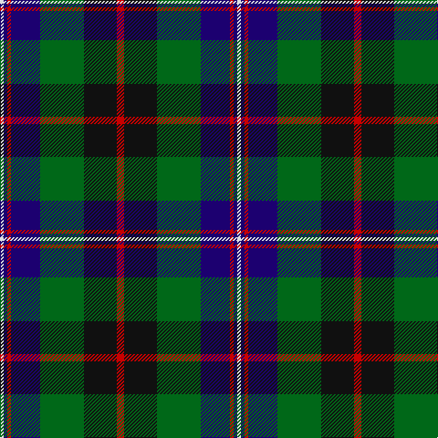

In pattern [RKGBRBW](/patterns/rkgbrbw/).

This was sourced from tartans-authority.  It is a [7 stripes tartan](/stripes/stripes7/).

Original link http://www.tartansauthority.com/tartan-ferret/display/10218/

## Thread count
LN/4 DB4 R4 DB32 G48 K36 R/8

## Palette
Each colour and its ΔE from the base-6 reference it is a variant of.

| Colour | Shade | Base | ΔE (OKLab) |
|---|---|---|---|
| DB | <code style="background-color:#1C0070;">#1C0070</code> `#1C0070` | B <code style="background-color:#2A418A;">#2A418A</code> | 0.14 |
| G | <code style="background-color:#006818;">#006818</code> `#006818` | G <code style="background-color:#006100;">#006100</code> | 0.02 |
| K | <code style="background-color:#101010;">#101010</code> `#101010` | K <code style="background-color:#000000;">#000000</code> | 0.17 |
| LN | <code style="background-color:#E0E0E0;">#E0E0E0</code> `#E0E0E0` | W <code style="background-color:#F7F7F7;">#F7F7F7</code> | 0.07 |
| R | <code style="background-color:#C80000;">#C80000</code> `#C80000` | R <code style="background-color:#CC0000;">#CC0000</code> | 0.01 |

# Sample pattern

## Nearest tartans

The nearest existing variants by ΔTartan distance.

1. [Rhun (Fashion)](/setts/s7/r12b68w7k39g75r6g6~b1c1c50-g006818-k101010-rc80000-we0e0e0/) — ΔT 0.54
1. [MacLeod Clan Tartan Tartan Number: 1583. Earliest known date: 1831 This design appears in many early collections including Logans 'The Scottish Gael'(1831) and Smibert (1850). The sett has its source in the MacKenzie tartan used in 1777 by John MacKenzie called Lord MacLeod when he raised a regiment called 'Lord MacLeod's Highlanders'. The family claimed to be heirs of the last chief of Lewis, Roderick, who had died in 1595. (Tartans of Clan MacLeod. Rhuairidh MacLeod (1990).) This tartan was approved by Chief Norman Magnus, 26th Chief, in 1910, and has been the usual modern sett since then. The present Chief, John MacLeod, lives in Dunvegan Castle, Skye. See products available Copyright © Blair Urquhart, Comrie, 2015](/setts/s7/r3k2g15k10b20k2y2x2~b2c2c80-g006818-k101010-rc80000-ye8c000/) — ΔT 0.56
1. [Russell Clan Tartan Tartan Number: 1094. Earliest known date: c.1815 It seems certain that the tartan was first known as Galbraith. William Wilson and Sons of Bannockburn recorded the pattern as Russell in their pattern book of 1847, although it was named Hunter in the earlier book of 1819. See products available Copyright © Blair Urquhart, Comrie, 2015](/setts/s6/k2g12k12r1b12w2x2~b2c2c80-g006818-k101010-rc80000-we0e0e0/) — ΔT 0.64
1. [Sandberg of Greenock (Personal)](/setts/s8/y3k12b1g5b12r1k2r1x4~b2c2c80-g006818-k101010-rc80000-ye8c000/) — ΔT 0.66
1. [Curry (Personal)](/setts/s8/r3g2r6g20k15g3b18w2x2~b2c2c80-g00643c-k101010-rc80000-wfcfcfc/) — ΔT 0.67
1. [MacLeod Small Clan Tartan Tartan Number: 15833. Earliest known date: See products available Copyright © Blair Urquhart, Comrie, 2015](/setts/s7/r1k1g7k5b10k1y1x2~b2c2c80-g006818-k101010-rc80000-ye8c000/) — ΔT 0.69
1. [Tait #1](/setts/s8/r5k2b19g4k19g28k2y5x2~b2c2c80-g006818-k101010-rc80000-ye8c000/) — ΔT 0.70
1. [Colquhoun (Clan)](/setts/s7/b5k10b48k72w12g48r5~b1c1c50-g285800-k101010-rc80000-wfcfcfc/) — ΔT 0.73
1. [Greenock](/setts/s7/g2k2g17k16r2b17y2x2~b2c2c80-g006818-k101010-rc80000-ye8c000/) — ΔT 0.74
1. [MacLeod of Assynt Clan Tartan Tartan Number: 1582. Earliest known date: 1906 In a portrait of the 24th chief, John Norman, painted posthumously (perhaps by Julius Jacobson, born 1811) in 1835, John Norman is shown in the costume worn for the visit of George IV to Edinburgh in 1822. The snuff-box may be evidence that the Vestiarium 'loud' design, which is very similar to that of the snuff box, had particular significance for John Norman or his wife, Ann Stephenson. (Ruairidh MacLeod, Tartans of Clan MacLeod, 1990.) See products available Copyright © Blair Urquhart, Comrie, 2015](/setts/s6/r3k2g15k10b20y2x2~b2c2c80-g006818-k101010-rc80000-ye8c000/) — ΔT 0.75

## Neighbour map

Every grey dot is one of 15726 variants placed by the first two principal components of the ΔTartan feature space (44% of its variance). Red is this tartan; blue dots are its nearest — click one to open its page.

<svg viewBox="0 0 640 380" role="img" style="max-width:100%;height:auto;border:1px solid #e0e0e0;border-radius:4px;display:block" xmlns="http://www.w3.org/2000/svg"><image href="/nn/cloud.v1.png" width="640" height="380"/><a href="/setts/s7/r12b68w7k39g75r6g6~b1c1c50-g006818-k101010-rc80000-we0e0e0/"><circle cx="193.7" cy="179.5" r="4" fill="#3465a4"><title>Rhun (Fashion)</title></circle></a><a href="/setts/s7/r3k2g15k10b20k2y2x2~b2c2c80-g006818-k101010-rc80000-ye8c000/"><circle cx="181.3" cy="190.8" r="4" fill="#3465a4"><title>MacLeod Clan Tartan Tartan Number: 1583. Earliest known date: 1831 This design appears in many early collections including Logans 'The Scottish Gael'(1831) and Smibert (1850). The sett has its source in the MacKenzie tartan used in 1777 by John MacKenzie called Lord MacLeod when he raised a regiment called 'Lord MacLeod's Highlanders'. The family claimed to be heirs of the last chief of Lewis, Roderick, who had died in 1595. (Tartans of Clan MacLeod. Rhuairidh MacLeod (1990).) This tartan was approved by Chief Norman Magnus, 26th Chief, in 1910, and has been the usual modern sett since then. The present Chief, John MacLeod, lives in Dunvegan Castle, Skye. See products available Copyright © Blair Urquhart, Comrie, 2015</title></circle></a><a href="/setts/s6/k2g12k12r1b12w2x2~b2c2c80-g006818-k101010-rc80000-we0e0e0/"><circle cx="164.7" cy="200.8" r="4" fill="#3465a4"><title>Russell Clan Tartan Tartan Number: 1094. Earliest known date: c.1815 It seems certain that the tartan was first known as Galbraith. William Wilson and Sons of Bannockburn recorded the pattern as Russell in their pattern book of 1847, although it was named Hunter in the earlier book of 1819. See products available Copyright © Blair Urquhart, Comrie, 2015</title></circle></a><a href="/setts/s8/y3k12b1g5b12r1k2r1x4~b2c2c80-g006818-k101010-rc80000-ye8c000/"><circle cx="184.8" cy="167.4" r="4" fill="#3465a4"><title>Sandberg of Greenock (Personal)</title></circle></a><a href="/setts/s8/r3g2r6g20k15g3b18w2x2~b2c2c80-g00643c-k101010-rc80000-wfcfcfc/"><circle cx="160.4" cy="184.1" r="4" fill="#3465a4"><title>Curry (Personal)</title></circle></a><a href="/setts/s7/r1k1g7k5b10k1y1x2~b2c2c80-g006818-k101010-rc80000-ye8c000/"><circle cx="192.9" cy="190.3" r="4" fill="#3465a4"><title>MacLeod Small Clan Tartan Tartan Number: 15833. Earliest known date: See products available Copyright © Blair Urquhart, Comrie, 2015</title></circle></a><a href="/setts/s8/r5k2b19g4k19g28k2y5x2~b2c2c80-g006818-k101010-rc80000-ye8c000/"><circle cx="181.2" cy="168.9" r="4" fill="#3465a4"><title>Tait #1</title></circle></a><a href="/setts/s7/b5k10b48k72w12g48r5~b1c1c50-g285800-k101010-rc80000-wfcfcfc/"><circle cx="204.4" cy="178.9" r="4" fill="#3465a4"><title>Colquhoun (Clan)</title></circle></a><a href="/setts/s7/g2k2g17k16r2b17y2x2~b2c2c80-g006818-k101010-rc80000-ye8c000/"><circle cx="163.4" cy="199.4" r="4" fill="#3465a4"><title>Greenock</title></circle></a><a href="/setts/s6/r3k2g15k10b20y2x2~b2c2c80-g006818-k101010-rc80000-ye8c000/"><circle cx="182.8" cy="204.3" r="4" fill="#3465a4"><title>MacLeod of Assynt Clan Tartan Tartan Number: 1582. Earliest known date: 1906 In a portrait of the 24th chief, John Norman, painted posthumously (perhaps by Julius Jacobson, born 1811) in 1835, John Norman is shown in the costume worn for the visit of George IV to Edinburgh in 1822. The snuff-box may be evidence that the Vestiarium 'loud' design, which is very similar to that of the snuff box, had particular significance for John Norman or his wife, Ann Stephenson. (Ruairidh MacLeod, Tartans of Clan MacLeod, 1990.) See products available Copyright © Blair Urquhart, Comrie, 2015</title></circle></a><circle cx="167.4" cy="180.1" r="5" fill="#c00000"/></svg>

ID: /setts/s7/r2k9g12b8r1b1w1x4~b1c0070-g006818-k101010-rc80000-we0e0e0/
