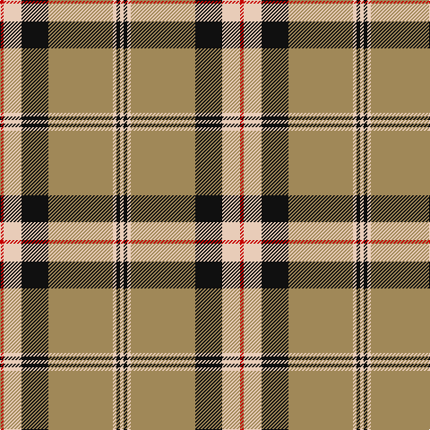

**Bands:** [RWKYWKW](/stripes/rwkywkw/) · **Stripes:** [R LB K LO LB K LB](/stripes/stripes7/) R LB K LO LB K LB

This was sourced from tartans-authority.  It is a [7 band tartan](/bands/bands7/).

Original link http://www.tartansauthority.com/tartan-ferret/display/8885/

## Thread count
R/4 LR20 K30 LT72 LR4 K4 LR/4

## Palette
Each colour and its ΔE from the base-6 reference it is a variant of.

| Colour | Shade | Base | ΔE (OKLab) |
|---|---|---|---|
| K | <code style="background-color:#101010;">#101010</code> `#101010` | K <code style="background-color:#000000;">#000000</code> | 0.17 |
| LR | <code style="background-color:#E8CCB8;">#E8CCB8</code> `#E8CCB8` | W <code style="background-color:#F7F7F7;">#F7F7F7</code> | 0.12 |
| LT | <code style="background-color:#A08858;">#A08858</code> `#A08858` | Y <code style="background-color:#F2BF00;">#F2BF00</code> | 0.21 |
| R | <code style="background-color:#C80000;">#C80000</code> `#C80000` | R <code style="background-color:#CC0000;">#CC0000</code> | 0.01 |

# Sample pattern

## Nearest tartans

The nearest existing variants by ΔTartan distance.

1. [Merrick, Camel](/setts/s7/r1lb5k8o18lb1k1lb1~x4/) — ΔT 0.43
1. [Bracken](/setts/s9/ly5db9r3db5ly2db4ly26t3r4~x2/) — ΔT 1.08
1. [Pittsburgh St Andrew's Society](/setts/s8/t1r1lo1k15lo15r1t1lo1~x4/) — ΔT 1.09
1. [Thomson Camel (Jedburgh Mill)](/setts/s6/r4k2lb10k10y28k3~x2/) — ΔT 1.12
1. [Brisbane (Artefact)](/setts/s8/g18w3ly1r2ly1r3ly1r10~x4/) — ΔT 1.13
1. [Braemar or Blair Atholl](/setts/s8/do2w2k6do3k2o14k1o1~x4/) — ΔT 1.18
1. [Tiree Grey](/setts/s6/lb3k3lb3k3o15r1~x4/) — ΔT 1.19
1. [Hannay Dress (Dance)](/setts/s10/k9lr4k2lr4k2lr29k9lr4lg14ly2~x2/) — ΔT 1.20
1. [Bracken](/setts/s9/ly20db27r6db15ly8db11ly78db10r12/) — ΔT 1.21
1. [Hughes (USA) (Name)](/setts/s10/b4k12db3b4db3k3ly36db3b2ly3~x2/) — ΔT 1.21

## Neighbour map

Every grey dot is one of 14299 variants placed by the first two principal components of the ΔTartan feature space (44% of its variance). Red is this tartan; blue dots are its nearest — click one to open its page.

<svg viewBox="0 0 640 380" role="img" style="max-width:100%;height:auto;border:1px solid #e0e0e0;border-radius:4px;display:block" xmlns="http://www.w3.org/2000/svg"><image href="/nn/cloud.v1.png" width="640" height="380"/><a href="/setts/s7/r1lb5k8o18lb1k1lb1~x4/"><circle cx="295.4" cy="142.8" r="4" fill="#3465a4"><title>Merrick, Camel</title></circle></a><a href="/setts/s9/ly5db9r3db5ly2db4ly26t3r4~x2/"><circle cx="270.0" cy="139.4" r="4" fill="#3465a4"><title>Bracken</title></circle></a><a href="/setts/s8/t1r1lo1k15lo15r1t1lo1~x4/"><circle cx="284.0" cy="129.0" r="4" fill="#3465a4"><title>Pittsburgh St Andrew's Society</title></circle></a><a href="/setts/s6/r4k2lb10k10y28k3~x2/"><circle cx="261.2" cy="176.9" r="4" fill="#3465a4"><title>Thomson Camel (Jedburgh Mill)</title></circle></a><a href="/setts/s8/g18w3ly1r2ly1r3ly1r10~x4/"><circle cx="282.8" cy="138.0" r="4" fill="#3465a4"><title>Brisbane (Artefact)</title></circle></a><a href="/setts/s8/do2w2k6do3k2o14k1o1~x4/"><circle cx="256.5" cy="154.6" r="4" fill="#3465a4"><title>Braemar or Blair Atholl</title></circle></a><a href="/setts/s6/lb3k3lb3k3o15r1~x4/"><circle cx="291.5" cy="170.8" r="4" fill="#3465a4"><title>Tiree Grey</title></circle></a><a href="/setts/s10/k9lr4k2lr4k2lr29k9lr4lg14ly2~x2/"><circle cx="268.0" cy="139.0" r="4" fill="#3465a4"><title>Hannay Dress (Dance)</title></circle></a><a href="/setts/s9/ly20db27r6db15ly8db11ly78db10r12/"><circle cx="275.0" cy="139.8" r="4" fill="#3465a4"><title>Bracken</title></circle></a><a href="/setts/s10/b4k12db3b4db3k3ly36db3b2ly3~x2/"><circle cx="270.4" cy="102.6" r="4" fill="#3465a4"><title>Hughes (USA) (Name)</title></circle></a><circle cx="292.3" cy="137.7" r="5" fill="#c00000"/></svg>

ID: /setts/s7/r2lb10k15lo36lb2k2lb2~x2/
