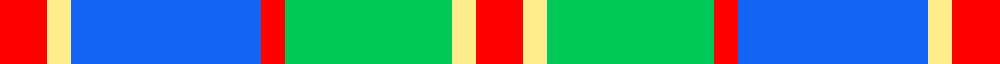

In pattern [RYBRYYR](/stripes/rybryyr/).

This was sourced from register-of-tartans.  It is a [7 stripe tartan](/stripes/stripes7/).

Original link https://www.tartanregister.gov.uk/tartanDetails.aspx?ref=10392

## Register references

External register numbers recorded for this tartan.

- Scottish Register of Tartans: [10392](https://www.tartanregister.gov.uk/tartanDetails.aspx?ref=10392)

## Thread count
R/12 LY6 B48 R6 Ba42 LY6 R/12

## Palette
Each colour and the base-6 reference it is a variant of.

| Colour | Shade | Base |
|---|---|---|
| B | <code style="background-color:#1464F4;">#1464F4</code> `oklch(55.2% 0.228 261.5)` <small>#1464F4</small> | B <code style="background-color:#2A418A;">#2A418A</code> |
| Ba | <code style="background-color:#00C957;">#00C957</code> `oklch(73.0% 0.206 148.9)` <small>#00C957</small> | Y <code style="background-color:#F2BF00;">#F2BF00</code> |
| LY | <code style="background-color:#FFEC8B;">#FFEC8B</code> `oklch(93.8% 0.120 98.5)` <small>#FFEC8B</small> | Y <code style="background-color:#F2BF00;">#F2BF00</code> |
| R | <code style="background-color:#FF0000;">#FF0000</code> `oklch(62.8% 0.258 29.2)` <small>#FF0000</small> | R <code style="background-color:#CC0000;">#CC0000</code> |

# Sample pattern

## Nearest tartans

The nearest existing variants by ΔTartan distance, with this tartan at the top so the swatches line up against it.

ΔTartan

Tartan

Sett

—

<a href="/ttd/edit/#slug=r2ly1b8r1lg7ly1r2~x6">Cercle de Fermières de Saint-Élie d'Orford</a> <a class="nn-out" href="/setts/s7/r2ly1b8r1lg7ly1r2~x6/" title="open its dictionary page">↗</a>

0.90

<a href="/ttd/edit/#slug=k3w25g16w3n25w3~x2">Birnham, Blue (Dance)</a> <a class="nn-out" href="/setts/s6/k3w25g16w3n25w3~x2/" title="open its dictionary page">↗</a>

0.91

<a href="/ttd/edit/#slug=k2lb16w2dt16w15k2w2~x2">Strathclyde District Tartan Tartan Number: 1072. Earliest known date: 1975 The navy blue and white are said to represent the 'Scottish Sporting Colours'. This sett is also produced with light blue in place of white. See products available Copyright © Blair Urquhart, Comrie, 2015</a> <a class="nn-out" href="/setts/s7/k2lb16w2dt16w15k2w2~x2/" title="open its dictionary page">↗</a>

0.94

<a href="/ttd/edit/#slug=k4t2w11t5o5w2k1t2~x2">Conquergood (Name)</a> <a class="nn-out" href="/setts/s8/k4t2w11t5o5w2k1t2~x2/" title="open its dictionary page">↗</a>

0.95

<a href="/ttd/edit/#slug=ly8db4t23w3db22w25db3w6~x2">Culloden, Blue Dress (Dance)</a> <a class="nn-out" href="/setts/s8/ly8db4t23w3db22w25db3w6~x2/" title="open its dictionary page">↗</a>

1.13

<a href="/ttd/edit/#slug=t8w28lo3g3t8k9t4~x2">MacTavish of Dunardry (Clan)</a> <a class="nn-out" href="/setts/s7/t8w28lo3g3t8k9t4~x2/" title="open its dictionary page">↗</a>

1.16

<a href="/ttd/edit/#slug=do4ly2do13ly1w13t13ly2t4~x2">Bannockbane Tan</a> <a class="nn-out" href="/setts/s8/do4ly2do13ly1w13t13ly2t4~x2/" title="open its dictionary page">↗</a>

1.20

<a href="/ttd/edit/#slug=g5ly2t20w2k20w20k2w5~x2">Alexander Brothers - 2007? (Corp.)</a> <a class="nn-out" href="/setts/s8/g5ly2t20w2k20w20k2w5~x2/" title="open its dictionary page">↗</a>

1.27

<a href="/ttd/edit/#slug=n8w28o3g3n8k9n4~x2">MacTavish of Dunardry Dress</a> <a class="nn-out" href="/setts/s7/n8w28o3g3n8k9n4~x2/" title="open its dictionary page">↗</a>

1.29

<a href="/ttd/edit/#slug=r5w2t20ly2k16w18k2w5~x2">Ailsa Craig (District)</a> <a class="nn-out" href="/setts/s8/r5w2t20ly2k16w18k2w5~x2/" title="open its dictionary page">↗</a>

1.30

<a href="/ttd/edit/#slug=db24r4g24r4db4w20r10g3w4~x2">Robertson, dress</a> <a class="nn-out" href="/setts/s9/db24r4g24r4db4w20r10g3w4~x2/" title="open its dictionary page">↗</a>

## Neighbour map

Every grey dot is one of 14299 variants placed by the first two principal components of the ΔTartan feature space (44% of its variance). Red is this tartan; blue dots are its nearest — click one to open its page.

<svg viewBox="0 0 640 380" role="img" style="max-width:100%;height:auto;border:1px solid #e0e0e0;border-radius:4px;display:block" xmlns="http://www.w3.org/2000/svg"><image href="/nn/cloud.v1.png" width="640" height="380"/><a href="/setts/s6/k3w25g16w3n25w3~x2/"><circle cx="180.6" cy="199.4" r="4" fill="#3465a4"><title>Birnham, Blue (Dance)</title></circle></a><a href="/setts/s7/k2lb16w2dt16w15k2w2~x2/"><circle cx="139.4" cy="183.5" r="4" fill="#3465a4"><title>Strathclyde District Tartan Tartan Number: 1072. Earliest known date: 1975 The navy blue and white are said to represent the 'Scottish Sporting Colours'. This sett is also produced with light blue in place of white. See products available Copyright © Blair Urquhart, Comrie, 2015</title></circle></a><a href="/setts/s8/k4t2w11t5o5w2k1t2~x2/"><circle cx="159.7" cy="178.1" r="4" fill="#3465a4"><title>Conquergood (Name)</title></circle></a><a href="/setts/s8/ly8db4t23w3db22w25db3w6~x2/"><circle cx="130.6" cy="178.8" r="4" fill="#3465a4"><title>Culloden, Blue Dress (Dance)</title></circle></a><a href="/setts/s7/t8w28lo3g3t8k9t4~x2/"><circle cx="177.0" cy="161.3" r="4" fill="#3465a4"><title>MacTavish of Dunardry (Clan)</title></circle></a><a href="/setts/s8/do4ly2do13ly1w13t13ly2t4~x2/"><circle cx="142.3" cy="167.9" r="4" fill="#3465a4"><title>Bannockbane Tan</title></circle></a><a href="/setts/s8/g5ly2t20w2k20w20k2w5~x2/"><circle cx="120.7" cy="153.5" r="4" fill="#3465a4"><title>Alexander Brothers - 2007? (Corp.)</title></circle></a><a href="/setts/s7/n8w28o3g3n8k9n4~x2/"><circle cx="163.8" cy="152.1" r="4" fill="#3465a4"><title>MacTavish of Dunardry Dress</title></circle></a><a href="/setts/s8/r5w2t20ly2k16w18k2w5~x2/"><circle cx="116.4" cy="147.8" r="4" fill="#3465a4"><title>Ailsa Craig (District)</title></circle></a><a href="/setts/s9/db24r4g24r4db4w20r10g3w4~x2/"><circle cx="110.5" cy="182.4" r="4" fill="#3465a4"><title>Robertson, dress</title></circle></a><circle cx="150.7" cy="182.5" r="5" fill="#c00000"/></svg>

ID: /setts/s7/r2ly1b8r1lg7ly1r2~x6/
