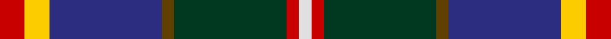
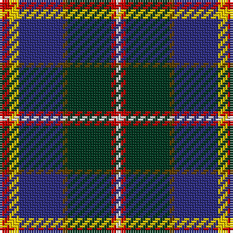

In pattern [RYBGGRW](/stripes/rybggrw/).

This was sourced from tartans-authority.  It is a [7 stripe tartan](/stripes/stripes7/).

Original link http://www.tartansauthority.com/tartan-ferret/display/8867/

## Thread count
R/4 Y4 DB18 T2 DG18 R2 LN/2

## Palette
Each colour and the base-6 reference it is a variant of.

| Colour | Shade | Base |
|---|---|---|
| DB | <code style="background-color:#2C2C80;">#2C2C80</code> `oklch(35.0% 0.138 276.6)` <small>#2C2C80</small> | B <code style="background-color:#2A418A;">#2A418A</code> |
| DG | <code style="background-color:#003820;">#003820</code> `oklch(30.0% 0.070 158.3)` <small>#003820</small> | G <code style="background-color:#006100;">#006100</code> |
| LN | <code style="background-color:#E0E0E0;">#E0E0E0</code> `oklch(90.7% 0.000 89.9)` <small>#E0E0E0</small> | W <code style="background-color:#F7F7F7;">#F7F7F7</code> |
| R | <code style="background-color:#C80000;">#C80000</code> `oklch(52.3% 0.215 29.2)` <small>#C80000</small> | R <code style="background-color:#CC0000;">#CC0000</code> |
| T | <code style="background-color:#604000;">#604000</code> `oklch(39.8% 0.083 76.8)` <small>#604000</small> | G <code style="background-color:#006100;">#006100</code> |
| Y | <code style="background-color:#FCCC00;">#FCCC00</code> `oklch(86.2% 0.176 91.5)` <small>#FCCC00</small> | Y <code style="background-color:#F2BF00;">#F2BF00</code> |

# Sample pattern

## Nearest tartans

The nearest existing variants by ΔTartan distance.

1. [Harvey of Cornwall (Personal)](/setts/s7/w10k52db52dg24ly10dg5r5/) — ΔT 0.74
1. [Dunedin](/setts/s9/k3r3g21r8r3r4k3db26w3~x2/) — ΔT 0.75
1. [Souza Nery (Personal)](/setts/s7/ly4g22r3k17r3db37w3~x2/) — ΔT 0.80
1. [Morris of Balgonie (Personal)](/setts/s6/w2dp20r3k10g20lo2~x2/) — ΔT 0.80
1. [State Seal of Utah (Fashion)](/setts/s8/dt48lo25dy15r7lb5dt7k10lb10~x2/) — ΔT 0.88
1. [Morris of Eddergoll (Personal)](/setts/s6/w2db20r3k10g20lo2~x2/) — ΔT 0.95
1. [Loch Awe](/setts/s9/ly3k2r3db20k24g20r3k2lb3~x2/) — ΔT 0.96
1. [Leung (Personal)](/setts/s9/m4k7m2db25k19w2g13k2ly3~x2/) — ΔT 0.99
1. [Mary, Queen of Scots](/setts/s9/r5w1db10g10w1ly1g2t2w1~x2/) — ΔT 0.99
1. [Wallace Memorial Centenary](/setts/s7/lg2r20g2dt15k2lg19lb2~x2/) — ΔT 1.00

## Neighbour map

Every grey dot is one of 14299 variants placed by the first two principal components of the ΔTartan feature space (44% of its variance). Red is this tartan; blue dots are its nearest — click one to open its page.

<svg viewBox="0 0 640 380" role="img" style="max-width:100%;height:auto;border:1px solid #e0e0e0;border-radius:4px;display:block" xmlns="http://www.w3.org/2000/svg"><image href="/nn/cloud.v1.png" width="640" height="380"/><a href="/setts/s7/w10k52db52dg24ly10dg5r5/"><circle cx="123.6" cy="167.4" r="4" fill="#3465a4"><title>Harvey of Cornwall (Personal)</title></circle></a><a href="/setts/s9/k3r3g21r8r3r4k3db26w3~x2/"><circle cx="128.7" cy="146.9" r="4" fill="#3465a4"><title>Dunedin</title></circle></a><a href="/setts/s7/ly4g22r3k17r3db37w3~x2/"><circle cx="176.3" cy="155.4" r="4" fill="#3465a4"><title>Souza Nery (Personal)</title></circle></a><a href="/setts/s6/w2dp20r3k10g20lo2~x2/"><circle cx="151.6" cy="178.9" r="4" fill="#3465a4"><title>Morris of Balgonie (Personal)</title></circle></a><a href="/setts/s8/dt48lo25dy15r7lb5dt7k10lb10~x2/"><circle cx="157.9" cy="163.0" r="4" fill="#3465a4"><title>State Seal of Utah (Fashion)</title></circle></a><a href="/setts/s6/w2db20r3k10g20lo2~x2/"><circle cx="138.9" cy="181.3" r="4" fill="#3465a4"><title>Morris of Eddergoll (Personal)</title></circle></a><a href="/setts/s9/ly3k2r3db20k24g20r3k2lb3~x2/"><circle cx="145.2" cy="144.4" r="4" fill="#3465a4"><title>Loch Awe</title></circle></a><a href="/setts/s9/m4k7m2db25k19w2g13k2ly3~x2/"><circle cx="152.4" cy="147.8" r="4" fill="#3465a4"><title>Leung (Personal)</title></circle></a><a href="/setts/s9/r5w1db10g10w1ly1g2t2w1~x2/"><circle cx="136.3" cy="142.8" r="4" fill="#3465a4"><title>Mary, Queen of Scots</title></circle></a><a href="/setts/s7/lg2r20g2dt15k2lg19lb2~x2/"><circle cx="139.1" cy="152.7" r="4" fill="#3465a4"><title>Wallace Memorial Centenary</title></circle></a><circle cx="148.6" cy="162.0" r="5" fill="#c00000"/></svg>

ID: /setts/s7/r2ly2db9dy1dg9r1w1~x2/
