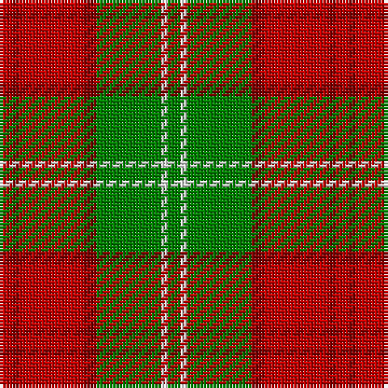

This page is one **sett** — a single exact thread-count. It belongs to the [tartan](/tartans/r2r1r10r2g10w1g2/)
(the same proportion at any scale), whose colour order is pattern [GWGRRRR](/stripes/gwgrrrr/).

Sourced from weddslist.  It is a [7 stripe tartan](/stripes/stripes7/).

Original link http://www.weddslist.com/cgi-bin/tartans/pg.pl?source=sts

2 attestations — the source records this cloth was collapsed from (oldest owns this page)

<ul>
<li>undated — Lennox (weddslist, <a href="http://www.weddslist.com/cgi-bin/tartans/pg.pl?source=sts">record</a>)</li>
<li>undated — Lennox District Tartan Tartan Number: 935. Earliest known date: pre 1600 Families with the surname 'Lennox' are usually considered related to Clans Stewart or MacFarlane. Some of this surname also choose to wear the distinctive and ancient 'Lennox' tartan. D W Stewart reproduced the sett from a 'lost' portrait of the Countess of Lennox dating from the 16th century. See products available Copyright © Blair Urquhart, Comrie, 2015 (house-of-tartan, <a href="http://www.house-of-tartan.scotland.net/house/TartanViewjs.asp?colr=Def&tnam=935">record</a>)</li>
</ul>

## Thread count
R/4 DR2 R20 DR4 G20 LN2 G/4

## Palette

Palette: <strong>Tartan Dictionary</strong> <small style="color:#888">(1 of 4 colours)</small>
<table><thead><tr><th>Colour</th><th>Threads</th><th>Shade</th><th>Base</th><th>OKLCh</th></tr></thead><tbody><tr><td>R/</td><td style="text-align:right;font-variant-numeric:tabular-nums">4</td><td><code style="background-color:#C00000;">#C00000</code> <small style="color:#888">#C00000</small></td><td>R <code style="background-color:#CC0000;">#CC0000</code></td><td><small style="color:#888">oklch(50.7% 0.208 29.2)</small></td></tr><tr><td>DR</td><td style="text-align:right;font-variant-numeric:tabular-nums">2</td><td><code style="background-color:#800000;">#800000</code> <small style="color:#888">#800000</small></td><td>R <code style="background-color:#CC0000;">#CC0000</code></td><td><small style="color:#888">oklch(37.7% 0.155 29.2)</small></td></tr><tr><td>R</td><td style="text-align:right;font-variant-numeric:tabular-nums">20</td><td><code style="background-color:#C00000;">#C00000</code> <small style="color:#888">#C00000</small></td><td>R <code style="background-color:#CC0000;">#CC0000</code></td><td><small style="color:#888">oklch(50.7% 0.208 29.2)</small></td></tr><tr><td>DR</td><td style="text-align:right;font-variant-numeric:tabular-nums">4</td><td><code style="background-color:#800000;">#800000</code> <small style="color:#888">#800000</small></td><td>R <code style="background-color:#CC0000;">#CC0000</code></td><td><small style="color:#888">oklch(37.7% 0.155 29.2)</small></td></tr><tr><td>G</td><td style="text-align:right;font-variant-numeric:tabular-nums">20</td><td><code style="background-color:#008000;">#008000</code> <small style="color:#888">#008000</small></td><td>G <code style="background-color:#006100;">#006100</code></td><td><small style="color:#888">oklch(52.0% 0.177 142.5)</small></td></tr><tr><td>LN</td><td style="text-align:right;font-variant-numeric:tabular-nums">2</td><td><code style="background-color:#E0E0E0;">#E0E0E0</code> <small style="color:#888">#E0E0E0</small></td><td>W <code style="background-color:#F7F7F7;">#F7F7F7</code></td><td><small style="color:#888">oklch(90.7% 0.000 89.9)</small></td></tr><tr><td>G/</td><td style="text-align:right;font-variant-numeric:tabular-nums">4</td><td><code style="background-color:#008000;">#008000</code> <small style="color:#888">#008000</small></td><td>G <code style="background-color:#006100;">#006100</code></td><td><small style="color:#888">oklch(52.0% 0.177 142.5)</small></td></tr></tbody></table>

# Sample pattern

## Nearest tartans

The nearest existing variants by ΔTartan distance, with this tartan at the top so the swatches line up against it.

ΔTartan

Tartan

Sett

—

<a href="/ttd/edit/#slug=r2r1r10r2g10w1g2~x2">Lennox</a> <a class="nn-out" href="/setts/s7/r2r1r10r2g10w1g2~x2/" title="open its dictionary page">↗</a>

0.60

<a href="/ttd/edit/#slug=r2r1r10r2g10lr1g2~x4">Lennox</a> <a class="nn-out" href="/setts/s7/r2r1r10r2g10lr1g2~x4/" title="open its dictionary page">↗</a>

0.69

<a href="/ttd/edit/#slug=db1r12g6ly1g6db1~x4">Cetoloni (Personal)</a> <a class="nn-out" href="/setts/s6/db1r12g6ly1g6db1~x4/" title="open its dictionary page">↗</a>

0.73

<a href="/ttd/edit/#slug=g28r7m7g14m7r48k4~x2">MacNab 6</a> <a class="nn-out" href="/setts/s7/g28r7m7g14m7r48k4~x2/" title="open its dictionary page">↗</a>

0.79

<a href="/ttd/edit/#slug=r4g14ly3g14r4g3r29y4~x2">Burnett</a> <a class="nn-out" href="/setts/s8/r4g14ly3g14r4g3r29y4~x2/" title="open its dictionary page">↗</a>

0.92

<a href="/ttd/edit/#slug=g6r2r2g4r2r12k1~x2">MacNab 5</a> <a class="nn-out" href="/setts/s7/g6r2r2g4r2r12k1~x2/" title="open its dictionary page">↗</a>

1.00

<a href="/ttd/edit/#slug=r3o14g8r2g2w2g2r1~x2">Scott, hunting</a> <a class="nn-out" href="/setts/s8/r3o14g8r2g2w2g2r1~x2/" title="open its dictionary page">↗</a>

1.04

<a href="/ttd/edit/#slug=k2r4w1r10g12r2w2~x4">Starr (1978) (Name)</a> <a class="nn-out" href="/setts/s7/k2r4w1r10g12r2w2~x4/" title="open its dictionary page">↗</a>

1.09

<a href="/ttd/edit/#slug=r15k1y2db3r2k1y15~x6">Scrymgeour</a> <a class="nn-out" href="/setts/s7/r15k1y2db3r2k1y15~x6/" title="open its dictionary page">↗</a>

1.15

<a href="/ttd/edit/#slug=dy24g2dy5o14g2o5lo17dy2~x2">Loch Rannoch #2</a> <a class="nn-out" href="/setts/s8/dy24g2dy5o14g2o5lo17dy2~x2/" title="open its dictionary page">↗</a>

1.15

<a href="/ttd/edit/#slug=g9r2g9r14k1w2~x2">MacGregor of Balquidder (Logan)</a> <a class="nn-out" href="/setts/s6/g9r2g9r14k1w2~x2/" title="open its dictionary page">↗</a>

## Neighbour map

Every grey dot is one of 14299 variants placed by the first two principal components of the ΔTartan feature space (44% of its variance). Red is this tartan; blue dots are its nearest — click one to open its page.

<svg viewBox="0 0 640 380" role="img" style="max-width:100%;height:auto;border:1px solid #e0e0e0;border-radius:4px;display:block" xmlns="http://www.w3.org/2000/svg"><image href="/nn/cloud.v1.png" width="640" height="380"/><a href="/setts/s7/r2r1r10r2g10lr1g2~x4/"><circle cx="285.0" cy="198.1" r="4" fill="#3465a4"><title>Lennox</title></circle></a><a href="/setts/s6/db1r12g6ly1g6db1~x4/"><circle cx="288.3" cy="197.8" r="4" fill="#3465a4"><title>Cetoloni (Personal)</title></circle></a><a href="/setts/s7/g28r7m7g14m7r48k4~x2/"><circle cx="289.3" cy="186.9" r="4" fill="#3465a4"><title>MacNab 6</title></circle></a><a href="/setts/s8/r4g14ly3g14r4g3r29y4~x2/"><circle cx="308.6" cy="193.9" r="4" fill="#3465a4"><title>Burnett</title></circle></a><a href="/setts/s7/g6r2r2g4r2r12k1~x2/"><circle cx="288.0" cy="190.4" r="4" fill="#3465a4"><title>MacNab 5</title></circle></a><a href="/setts/s8/r3o14g8r2g2w2g2r1~x2/"><circle cx="262.2" cy="178.4" r="4" fill="#3465a4"><title>Scott, hunting</title></circle></a><a href="/setts/s7/k2r4w1r10g12r2w2~x4/"><circle cx="264.8" cy="177.1" r="4" fill="#3465a4"><title>Starr (1978) (Name)</title></circle></a><a href="/setts/s7/r15k1y2db3r2k1y15~x6/"><circle cx="305.7" cy="166.4" r="4" fill="#3465a4"><title>Scrymgeour</title></circle></a><a href="/setts/s8/dy24g2dy5o14g2o5lo17dy2~x2/"><circle cx="268.8" cy="188.2" r="4" fill="#3465a4"><title>Loch Rannoch #2</title></circle></a><a href="/setts/s6/g9r2g9r14k1w2~x2/"><circle cx="298.1" cy="198.9" r="4" fill="#3465a4"><title>MacGregor of Balquidder (Logan)</title></circle></a><circle cx="270.0" cy="191.3" r="5" fill="#c00000"/></svg>

ID: /setts/s7/r2r1r10r2g10w1g2~x2/
