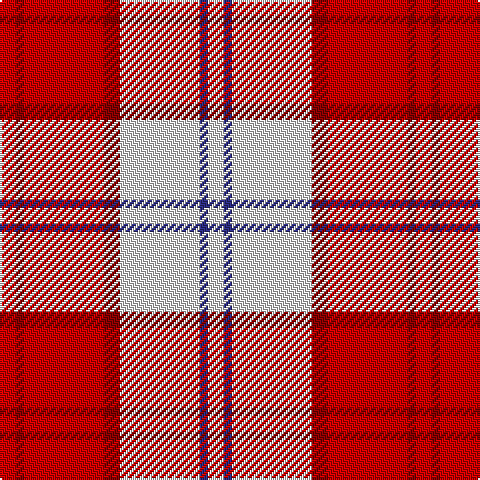

**Bands:** [RRRRWBW](/stripes/rrrrwbw/) · **Stripes:** [R R R R W DB W](/stripes/stripes7/) R R R R W DB W

This was sourced from register-of-tartans.  It is a [7 band tartan](/bands/bands7/).

Original link https://www.tartanregister.gov.uk/tartanDetails.aspx?ref=2098

## Also known as

This cloth is also recorded under:

- Lennox Dress, Red

## Attestations

This cloth appears in 2 source records; the oldest owns this page.

- 01/01/1986 — Lennox Dress #2 (register-of-tartans, [record](https://www.tartanregister.gov.uk/tartanDetails.aspx?ref=2098))
- 1986 — Lennox Dress, Red (Dance) (tartans-authority, [record](http://www.tartansauthority.com/tartan-ferret/display/1649/))

## Register references

External register numbers recorded for this tartan.

- Scottish Register of Tartans: [2098](https://www.tartanregister.gov.uk/tartanDetails.aspx?ref=2098)
- Scottish Tartans Authority (ITI): 1649
- Scottish Tartans World Register: 1649

## Thread count
R/8 DR4 R40 DR8 LN40 DB4 LN/8

## Palette
Each colour and its ΔE from the base-6 reference it is a variant of.

| Colour | Shade | Base | ΔE (OKLab) |
|---|---|---|---|
| DB | <code style="background-color:#2C2C80;">#2C2C80</code> `#2C2C80` | B <code style="background-color:#2A418A;">#2A418A</code> | 0.06 |
| DR | <code style="background-color:#880000;">#880000</code> `#880000` | R <code style="background-color:#CC0000;">#CC0000</code> | 0.15 |
| LN | <code style="background-color:#E0E0E0;">#E0E0E0</code> `#E0E0E0` | W <code style="background-color:#F7F7F7;">#F7F7F7</code> | 0.07 |
| R | <code style="background-color:#C80000;">#C80000</code> `#C80000` | R <code style="background-color:#CC0000;">#CC0000</code> | 0.01 |

# Sample pattern

## Nearest tartans

The nearest existing variants by ΔTartan distance.

1. [Lennox Dress District Tartan Tartan Number: 1649. Earliest known date: 1986 Families with the surname 'Lennox' are usually considered related to Clans Stewart or MacFarlane. Some of this surname also choose to wear the distinctive and ancient 'Lennox' tartan. D W Stewart reproduced the sett from a 'lost' portrait of the Countess of Lennox dating from the 16th century. See products available Copyright © Blair Urquhart, Comrie, 2015](/setts/s7/r8m2r24m5w25dy2w8~x2/) — ΔT 0.53
1. [Lennox, dress](/setts/s7/r8p2r24p5w25o2w8~x2/) — ΔT 0.57
1. [MacGiboney (Personal)](/setts/s7/r8dp2r24dp5w25dy2w8~x2/) — ΔT 0.60
1. [Cameron Hose](/setts/s7/k1r8dg1r1w8r1k1~x6/) — ΔT 0.69
1. [MacPherson, Red](/setts/s7/w5p3w26r20w3r8ly3~x2/) — ΔT 0.91
1. [MacPherson Dress Red (Dance)](/setts/s7/w5dp3w26r20w3r8ly3~x2/) — ΔT 0.93
1. [Cameron, Hose](/setts/s7/k1r8g1r1w8r1k1~x6/) — ΔT 0.99
1. [MacPherson Dress Red](/setts/s7/w4r2w25r21w3r8ly3~x2/) — ΔT 1.04
1. [Torridon, Cherry (Dance)](/setts/s7/r3r2db2r30w30db2w3~x2/) — ΔT 1.04
1. [Lennox Dress](/setts/s7/r8dp2r24db5w26dy2w8~x2/) — ΔT 1.06

## Neighbour map

Every grey dot is one of 14299 variants placed by the first two principal components of the ΔTartan feature space (44% of its variance). Red is this tartan; blue dots are its nearest — click one to open its page.

<svg viewBox="0 0 640 380" role="img" style="max-width:100%;height:auto;border:1px solid #e0e0e0;border-radius:4px;display:block" xmlns="http://www.w3.org/2000/svg"><image href="/nn/cloud.v1.png" width="640" height="380"/><a href="/setts/s7/r8m2r24m5w25dy2w8~x2/"><circle cx="253.7" cy="158.8" r="4" fill="#3465a4"><title>Lennox Dress District Tartan Tartan Number: 1649. Earliest known date: 1986 Families with the surname 'Lennox' are usually considered related to Clans Stewart or MacFarlane. Some of this surname also choose to wear the distinctive and ancient 'Lennox' tartan. D W Stewart reproduced the sett from a 'lost' portrait of the Countess of Lennox dating from the 16th century. See products available Copyright © Blair Urquhart, Comrie, 2015</title></circle></a><a href="/setts/s7/r8p2r24p5w25o2w8~x2/"><circle cx="249.8" cy="158.4" r="4" fill="#3465a4"><title>Lennox, dress</title></circle></a><a href="/setts/s7/r8dp2r24dp5w25dy2w8~x2/"><circle cx="248.3" cy="156.4" r="4" fill="#3465a4"><title>MacGiboney (Personal)</title></circle></a><a href="/setts/s7/k1r8dg1r1w8r1k1~x6/"><circle cx="244.6" cy="156.4" r="4" fill="#3465a4"><title>Cameron Hose</title></circle></a><a href="/setts/s7/w5p3w26r20w3r8ly3~x2/"><circle cx="265.2" cy="168.6" r="4" fill="#3465a4"><title>MacPherson, Red</title></circle></a><a href="/setts/s7/w5dp3w26r20w3r8ly3~x2/"><circle cx="266.7" cy="168.8" r="4" fill="#3465a4"><title>MacPherson Dress Red (Dance)</title></circle></a><a href="/setts/s7/k1r8g1r1w8r1k1~x6/"><circle cx="236.5" cy="156.4" r="4" fill="#3465a4"><title>Cameron, Hose</title></circle></a><a href="/setts/s7/w4r2w25r21w3r8ly3~x2/"><circle cx="289.3" cy="154.3" r="4" fill="#3465a4"><title>MacPherson Dress Red</title></circle></a><a href="/setts/s7/r3r2db2r30w30db2w3~x2/"><circle cx="284.7" cy="126.3" r="4" fill="#3465a4"><title>Torridon, Cherry (Dance)</title></circle></a><a href="/setts/s7/r8dp2r24db5w26dy2w8~x2/"><circle cx="234.2" cy="139.9" r="4" fill="#3465a4"><title>Lennox Dress</title></circle></a><circle cx="237.2" cy="158.1" r="5" fill="#c00000"/></svg>

ID: /setts/s7/r2r1r10r2w10db1w2~x4/
