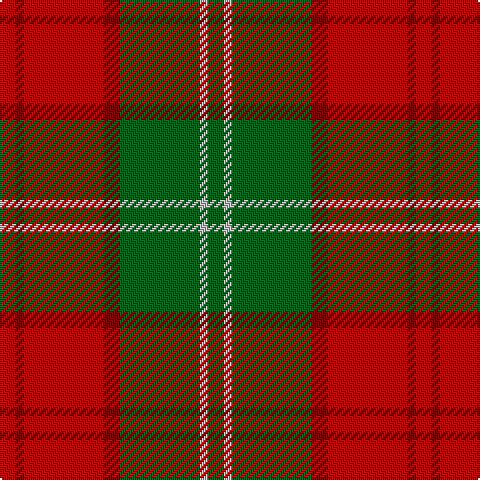

This page is one **sett** — a single exact thread-count. It belongs to the [tartan](/tartans/r2ri1r10ri2g10lr1g2/)
(the same proportion at any scale), whose colour order is pattern [GYGRRRR](/stripes/gygrrrr/).

Sourced from register-of-tartans.  It is a [7 stripe tartan](/stripes/stripes7/).

Original link https://www.tartanregister.gov.uk/tartanDetails.aspx?ref=2096

2 attestations — the source records this cloth was collapsed from (oldest owns this page)

<ul>
<li>01/01/1893 — Lennox (register-of-tartans, <a href="https://www.tartanregister.gov.uk/tartanDetails.aspx?ref=2096">record</a>)</li>
<li>1893 — Lennox (District & Clan) (tartans-authority, <a href="http://www.tartansauthority.com/tartan-ferret/display/935/">record</a>)</li>
</ul>

## Register references

External register numbers recorded for this tartan.

- Scottish Register of Tartans: [2096](https://www.tartanregister.gov.uk/tartanDetails.aspx?ref=2096)
- Scottish Tartans Authority (ITI): 935
- Scottish Tartans World Register: 935

## Thread count
R/8 DR4 R40 DR8 G40 N4 G/8

## Palette

Palette: <strong>Tartan Register</strong> <small style="color:#888">(3 of 4 colours)</small>
<table><thead><tr><th>Colour</th><th>Threads</th><th>Shade</th><th>Base</th><th>OKLCh</th></tr></thead><tbody><tr><td>R/</td><td style="text-align:right;font-variant-numeric:tabular-nums">8</td><td><code style="background-color:#C80000;">#C80000</code> <small style="color:#888">#C80000</small></td><td>R <code style="background-color:#CC0000;">#CC0000</code></td><td><small style="color:#888">oklch(52.3% 0.215 29.2)</small></td></tr><tr><td>DR</td><td style="text-align:right;font-variant-numeric:tabular-nums">4</td><td><code style="background-color:#880000;">#880000</code> <small style="color:#888">#880000</small></td><td>R <code style="background-color:#CC0000;">#CC0000</code></td><td><small style="color:#888">oklch(39.4% 0.162 29.2)</small></td></tr><tr><td>R</td><td style="text-align:right;font-variant-numeric:tabular-nums">40</td><td><code style="background-color:#C80000;">#C80000</code> <small style="color:#888">#C80000</small></td><td>R <code style="background-color:#CC0000;">#CC0000</code></td><td><small style="color:#888">oklch(52.3% 0.215 29.2)</small></td></tr><tr><td>DR</td><td style="text-align:right;font-variant-numeric:tabular-nums">8</td><td><code style="background-color:#880000;">#880000</code> <small style="color:#888">#880000</small></td><td>R <code style="background-color:#CC0000;">#CC0000</code></td><td><small style="color:#888">oklch(39.4% 0.162 29.2)</small></td></tr><tr><td>G</td><td style="text-align:right;font-variant-numeric:tabular-nums">40</td><td><code style="background-color:#006818;">#006818</code> <small style="color:#888">#006818</small></td><td>G <code style="background-color:#006100;">#006100</code></td><td><small style="color:#888">oklch(45.0% 0.142 145.0)</small></td></tr><tr><td>N</td><td style="text-align:right;font-variant-numeric:tabular-nums">4</td><td><code style="background-color:#B8B8B8;">#B8B8B8</code> <small style="color:#888">#B8B8B8</small></td><td>Y <code style="background-color:#F2BF00;">#F2BF00</code></td><td><small style="color:#888">oklch(78.3% 0.000 89.9)</small></td></tr><tr><td>G/</td><td style="text-align:right;font-variant-numeric:tabular-nums">8</td><td><code style="background-color:#006818;">#006818</code> <small style="color:#888">#006818</small></td><td>G <code style="background-color:#006100;">#006100</code></td><td><small style="color:#888">oklch(45.0% 0.142 145.0)</small></td></tr></tbody></table>

# Sample pattern

## Nearest tartans

The nearest existing variants by ΔTartan distance, with this tartan at the top so the swatches line up against it.

ΔTartan

Tartan

Sett

—

<a href="/ttd/edit/#slug=r2ri1r10ri2g10lr1g2~x4">Lennox</a> <a class="nn-out" href="/setts/s7/r2ri1r10ri2g10lr1g2~x4/" title="open its dictionary page">↗</a>

0.60

<a href="/ttd/edit/#slug=r2ri1r10ri2g10w1g2~x2">Lennox</a> <a class="nn-out" href="/setts/s7/r2ri1r10ri2g10w1g2~x2/" title="open its dictionary page">↗</a>

0.73

<a href="/ttd/edit/#slug=g28r7m7g14m7r48k4~x2">MacNab 6</a> <a class="nn-out" href="/setts/s7/g28r7m7g14m7r48k4~x2/" title="open its dictionary page">↗</a>

0.75

<a href="/ttd/edit/#slug=r4g14ly3g14r4g3r29y4~x2">Burnett</a> <a class="nn-out" href="/setts/s8/r4g14ly3g14r4g3r29y4~x2/" title="open its dictionary page">↗</a>

0.80

<a href="/ttd/edit/#slug=db1r12g6ly1g6db1~x4">Cetoloni (Personal)</a> <a class="nn-out" href="/setts/s6/db1r12g6ly1g6db1~x4/" title="open its dictionary page">↗</a>

0.82

<a href="/ttd/edit/#slug=g6r2ri2g4ri2r12k1~x2">MacNab 5</a> <a class="nn-out" href="/setts/s7/g6r2ri2g4ri2r12k1~x2/" title="open its dictionary page">↗</a>

0.95

<a href="/ttd/edit/#slug=ri8r1g4r1g1t2~x2">Moray of Abercairney</a> <a class="nn-out" href="/setts/s6/ri8r1g4r1g1t2~x2/" title="open its dictionary page">↗</a>

0.96

<a href="/ttd/edit/#slug=r15k1y2db3r2k1y15~x6">Scrymgeour</a> <a class="nn-out" href="/setts/s7/r15k1y2db3r2k1y15~x6/" title="open its dictionary page">↗</a>

1.00

<a href="/ttd/edit/#slug=dg28r7m7dg14m7r48k4~x2">MacNab (Crimson)</a> <a class="nn-out" href="/setts/s7/dg28r7m7dg14m7r48k4~x2/" title="open its dictionary page">↗</a>

1.05

<a href="/ttd/edit/#slug=dy24g2dy5o14g2o5lo17dy2~x2">Loch Rannoch #2</a> <a class="nn-out" href="/setts/s8/dy24g2dy5o14g2o5lo17dy2~x2/" title="open its dictionary page">↗</a>

1.06

<a href="/ttd/edit/#slug=o18dt2o2dt2o2dt14r14ly3~x2">Talladale</a> <a class="nn-out" href="/setts/s8/o18dt2o2dt2o2dt14r14ly3~x2/" title="open its dictionary page">↗</a>

## Neighbour map

Every grey dot is one of 14359 variants placed by the first two principal components of the ΔTartan feature space (44% of its variance). Red is this tartan; blue dots are its nearest — click one to open its page.

<svg viewBox="0 0 640 380" role="img" style="max-width:100%;height:auto;border:1px solid #e0e0e0;border-radius:4px;display:block" xmlns="http://www.w3.org/2000/svg"><image href="/nn/cloud.v1.png" width="640" height="380"/><a href="/setts/s7/r2ri1r10ri2g10w1g2~x2/"><circle cx="269.2" cy="192.0" r="4" fill="#3465a4"><title>Lennox</title></circle></a><a href="/setts/s7/g28r7m7g14m7r48k4~x2/"><circle cx="288.4" cy="187.7" r="4" fill="#3465a4"><title>MacNab 6</title></circle></a><a href="/setts/s8/r4g14ly3g14r4g3r29y4~x2/"><circle cx="307.7" cy="194.6" r="4" fill="#3465a4"><title>Burnett</title></circle></a><a href="/setts/s6/db1r12g6ly1g6db1~x4/"><circle cx="287.5" cy="198.5" r="4" fill="#3465a4"><title>Cetoloni (Personal)</title></circle></a><a href="/setts/s7/g6r2ri2g4ri2r12k1~x2/"><circle cx="287.1" cy="191.2" r="4" fill="#3465a4"><title>MacNab 5</title></circle></a><a href="/setts/s6/ri8r1g4r1g1t2~x2/"><circle cx="277.4" cy="215.3" r="4" fill="#3465a4"><title>Moray of Abercairney</title></circle></a><a href="/setts/s7/r15k1y2db3r2k1y15~x6/"><circle cx="304.7" cy="166.9" r="4" fill="#3465a4"><title>Scrymgeour</title></circle></a><a href="/setts/s7/dg28r7m7dg14m7r48k4~x2/"><circle cx="297.3" cy="188.5" r="4" fill="#3465a4"><title>MacNab (Crimson)</title></circle></a><a href="/setts/s8/dy24g2dy5o14g2o5lo17dy2~x2/"><circle cx="268.0" cy="188.8" r="4" fill="#3465a4"><title>Loch Rannoch #2</title></circle></a><a href="/setts/s8/o18dt2o2dt2o2dt14r14ly3~x2/"><circle cx="220.9" cy="192.4" r="4" fill="#3465a4"><title>Talladale</title></circle></a><circle cx="284.3" cy="198.8" r="5" fill="#c00000"/></svg>

ID: /setts/s7/r2ri1r10ri2g10lr1g2~x4/
