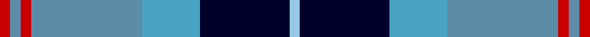
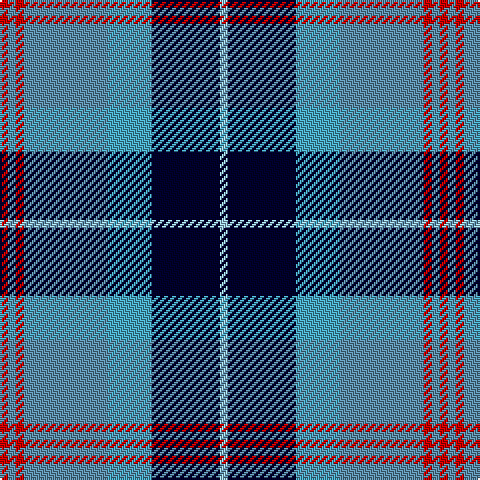

This page is one **sett** — a single exact thread-count. It belongs to the [tartan](/tartans/r2t2r2t21lg11k17lb2/)
(the same proportion at any scale), whose colour order is pattern [RBRBYKW](/stripes/rbrbykw/).

Sourced from tartans-authority.  It is a [7 stripe tartan](/stripes/stripes7/).

Original link http://www.tartansauthority.com/tartan-ferret/display/5450/

## Also known as

This cloth is also recorded under:

- Loch Ness #2

2 attestations — the source records this cloth was collapsed from (oldest owns this page)

<ul>
<li>1995 — Loch Ness (Fashion) (tartans-authority, <a href="http://www.tartansauthority.com/tartan-ferret/display/5450/">record</a>)</li>
<li>undated — Loch Ness #2 (register-of-tartans, <a href="https://www.tartanregister.gov.uk/tartanDetails.aspx?ref=5423">record</a>)</li>
</ul>

## Register references

External register numbers recorded for this tartan.

- Scottish Register of Tartans: [5423](https://www.tartanregister.gov.uk/tartanDetails.aspx?ref=5423)
- Scottish Tartans Authority (ITI): 5450
- Scottish Tartans World Register: 3039

## Thread count
R/4 B4 R4 B42 Ba22 DB34 LB/4

## Palette

Palette: <strong>Tartan Register</strong> <small style="color:#888">(4 of 5 colours)</small>
<table><thead><tr><th>Colour</th><th>Threads</th><th>Shade</th><th>Base</th><th>OKLCh</th></tr></thead><tbody><tr><td>R/</td><td style="text-align:right;font-variant-numeric:tabular-nums">4</td><td><code style="background-color:#C80000;">#C80000</code> <small style="color:#888">#C80000</small></td><td>R <code style="background-color:#CC0000;">#CC0000</code></td><td><small style="color:#888">oklch(52.3% 0.215 29.2)</small></td></tr><tr><td>B</td><td style="text-align:right;font-variant-numeric:tabular-nums">4</td><td><code style="background-color:#5C8CA8;">#5C8CA8</code> <small style="color:#888">#5C8CA8</small></td><td>B <code style="background-color:#2A418A;">#2A418A</code></td><td><small style="color:#888">oklch(61.7% 0.067 235.0)</small></td></tr><tr><td>R</td><td style="text-align:right;font-variant-numeric:tabular-nums">4</td><td><code style="background-color:#C80000;">#C80000</code> <small style="color:#888">#C80000</small></td><td>R <code style="background-color:#CC0000;">#CC0000</code></td><td><small style="color:#888">oklch(52.3% 0.215 29.2)</small></td></tr><tr><td>B</td><td style="text-align:right;font-variant-numeric:tabular-nums">42</td><td><code style="background-color:#5C8CA8;">#5C8CA8</code> <small style="color:#888">#5C8CA8</small></td><td>B <code style="background-color:#2A418A;">#2A418A</code></td><td><small style="color:#888">oklch(61.7% 0.067 235.0)</small></td></tr><tr><td>Ba</td><td style="text-align:right;font-variant-numeric:tabular-nums">22</td><td><code style="background-color:#48A4C0;">#48A4C0</code> <small style="color:#888">#48A4C0</small></td><td>Y <code style="background-color:#F2BF00;">#F2BF00</code></td><td><small style="color:#888">oklch(67.5% 0.096 221.0)</small></td></tr><tr><td>DB</td><td style="text-align:right;font-variant-numeric:tabular-nums">34</td><td><code style="background-color:#00002C;">#00002C</code> <small style="color:#888">#00002C</small></td><td>K <code style="background-color:#000000;">#000000</code></td><td><small style="color:#888">oklch(13.2% 0.092 264.1)</small></td></tr><tr><td>LB/</td><td style="text-align:right;font-variant-numeric:tabular-nums">4</td><td><code style="background-color:#98C8E8;">#98C8E8</code> <small style="color:#888">#98C8E8</small></td><td>W <code style="background-color:#F7F7F7;">#F7F7F7</code></td><td><small style="color:#888">oklch(81.0% 0.068 237.9)</small></td></tr></tbody></table>

# Sample pattern

## Nearest tartans

The nearest existing variants by ΔTartan distance, with this tartan at the top so the swatches line up against it.

ΔTartan

Tartan

Sett

—

<a href="/ttd/edit/#slug=r2t2r2t21lg11k17lb2~x2">Loch Ness (Fashion)</a> <a class="nn-out" href="/setts/s7/r2t2r2t21lg11k17lb2~x2/" title="open its dictionary page">↗</a>

0.72

<a href="/ttd/edit/#slug=g2db14lg6lr1g1lr6r1~x4">Loch Ness in Scotland</a> <a class="nn-out" href="/setts/s7/g2db14lg6lr1g1lr6r1~x4/" title="open its dictionary page">↗</a>

0.77

<a href="/ttd/edit/#slug=t12k1t1k1t1db8w9y2~x4">Arran (Pendleton)</a> <a class="nn-out" href="/setts/s8/t12k1t1k1t1db8w9y2~x4/" title="open its dictionary page">↗</a>

0.80

<a href="/ttd/edit/#slug=w4k24ly2n24t5k4ly4~x2">Mina Perhonen</a> <a class="nn-out" href="/setts/s7/w4k24ly2n24t5k4ly4~x2/" title="open its dictionary page">↗</a>

0.89

<a href="/ttd/edit/#slug=b15k2w2k2w2k16lr22ly2~x4">Sneddon, Jonathan Taylor (Personal)</a> <a class="nn-out" href="/setts/s8/b15k2w2k2w2k16lr22ly2~x4/" title="open its dictionary page">↗</a>

0.89

<a href="/ttd/edit/#slug=r1b10k2w4k4ly1~x6">Thomson Dress (Blue)</a> <a class="nn-out" href="/setts/s6/r1b10k2w4k4ly1~x6/" title="open its dictionary page">↗</a>

0.97

<a href="/ttd/edit/#slug=r15t98db72ly25db8w15">Afternoon Tea / Earl Grey</a> <a class="nn-out" href="/setts/s6/r15t98db72ly25db8w15/" title="open its dictionary page">↗</a>

1.01

<a href="/ttd/edit/#slug=r3dt25k6lb20ly2lb2w3~x2">Madras College (Corporate)</a> <a class="nn-out" href="/setts/s7/r3dt25k6lb20ly2lb2w3~x2/" title="open its dictionary page">↗</a>

1.02

<a href="/ttd/edit/#slug=w7b10k7b7t7b45k21g21t4k4w7~x2">Utah State University</a> <a class="nn-out" href="/setts/s11/w7b10k7b7t7b45k21g21t4k4w7~x2/" title="open its dictionary page">↗</a>

1.07

<a href="/ttd/edit/#slug=db6ly2db22g7r2w11g11db3~x2">Bahamas District Tartan Tartan Number: 2089. Earliest known date: 1966 Designed by Gordon Rees of the Scottish Shop in Nassau, now owned by Colin and Beverley Honnes. It was intended to perpetuate the memory of early Scottish settlers in the Bahamas including Thompson, Sands, Forsythe, Munroe, Johnston, Russell, Christie, Roberts, Kelly, MacKinney, Saunders, Malcolm, Crawford, MacPherson, Clark and Rae. The tartan was formally approved by the Bahamas Government in 1966. See products available Copyright © Blair Urquhart, Comrie, 2015</a> <a class="nn-out" href="/setts/s8/db6ly2db22g7r2w11g11db3~x2/" title="open its dictionary page">↗</a>

1.08

<a href="/ttd/edit/#slug=db3t24k11db20w2db5lo3~x2">Icelandair</a> <a class="nn-out" href="/setts/s7/db3t24k11db20w2db5lo3~x2/" title="open its dictionary page">↗</a>

## Neighbour map

Every grey dot is one of 14359 variants placed by the first two principal components of the ΔTartan feature space (44% of its variance). Red is this tartan; blue dots are its nearest — click one to open its page.

<svg viewBox="0 0 640 380" role="img" style="max-width:100%;height:auto;border:1px solid #e0e0e0;border-radius:4px;display:block" xmlns="http://www.w3.org/2000/svg"><image href="/nn/cloud.v1.png" width="640" height="380"/><a href="/setts/s7/g2db14lg6lr1g1lr6r1~x4/"><circle cx="199.8" cy="157.5" r="4" fill="#3465a4"><title>Loch Ness in Scotland</title></circle></a><a href="/setts/s8/t12k1t1k1t1db8w9y2~x4/"><circle cx="157.8" cy="149.0" r="4" fill="#3465a4"><title>Arran (Pendleton)</title></circle></a><a href="/setts/s7/w4k24ly2n24t5k4ly4~x2/"><circle cx="187.2" cy="169.4" r="4" fill="#3465a4"><title>Mina Perhonen</title></circle></a><a href="/setts/s8/b15k2w2k2w2k16lr22ly2~x4/"><circle cx="134.4" cy="148.3" r="4" fill="#3465a4"><title>Sneddon, Jonathan Taylor (Personal)</title></circle></a><a href="/setts/s6/r1b10k2w4k4ly1~x6/"><circle cx="179.4" cy="179.3" r="4" fill="#3465a4"><title>Thomson Dress (Blue)</title></circle></a><a href="/setts/s6/r15t98db72ly25db8w15/"><circle cx="185.4" cy="169.2" r="4" fill="#3465a4"><title>Afternoon Tea / Earl Grey</title></circle></a><a href="/setts/s7/r3dt25k6lb20ly2lb2w3~x2/"><circle cx="171.5" cy="140.8" r="4" fill="#3465a4"><title>Madras College (Corporate)</title></circle></a><a href="/setts/s11/w7b10k7b7t7b45k21g21t4k4w7~x2/"><circle cx="168.8" cy="151.8" r="4" fill="#3465a4"><title>Utah State University</title></circle></a><a href="/setts/s8/db6ly2db22g7r2w11g11db3~x2/"><circle cx="200.4" cy="175.4" r="4" fill="#3465a4"><title>Bahamas District Tartan Tartan Number: 2089. Earliest known date: 1966 Designed by Gordon Rees of the Scottish Shop in Nassau, now owned by Colin and Beverley Honnes. It was intended to perpetuate the memory of early Scottish settlers in the Bahamas including Thompson, Sands, Forsythe, Munroe, Johnston, Russell, Christie, Roberts, Kelly, MacKinney, Saunders, Malcolm, Crawford, MacPherson, Clark and Rae. The tartan was formally approved by the Bahamas Government in 1966. See products available Copyright © Blair Urquhart, Comrie, 2015</title></circle></a><a href="/setts/s7/db3t24k11db20w2db5lo3~x2/"><circle cx="206.7" cy="188.5" r="4" fill="#3465a4"><title>Icelandair</title></circle></a><circle cx="169.2" cy="171.4" r="5" fill="#c00000"/></svg>

ID: /setts/s7/r2t2r2t21lg11k17lb2~x2/
