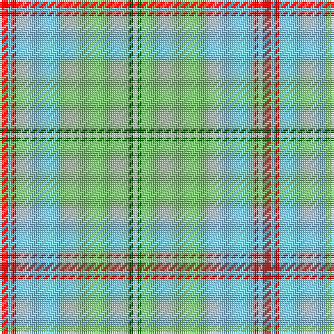

In pattern [RWRWYGW](/patterns/rwrwygw/).

This was sourced from register-of-tartans.  It is a [7 stripes tartan](/stripes/stripes7/).

Original link https://www.tartanregister.gov.uk/tartanDetails.aspx?ref=10354

## Thread count
R/4 LB2 R2 LB22 LG32 G2 W/2

## Palette
Each colour and its ΔE from the base-6 reference it is a variant of.

| Colour | Shade | Base | ΔE (OKLab) |
|---|---|---|---|
| G | <code style="background-color:#006400;">#006400</code> `#006400` | G <code style="background-color:#006100;">#006100</code> | 0.01 |
| LB | <code style="background-color:#82CFFD;">#82CFFD</code> `#82CFFD` | W <code style="background-color:#F7F7F7;">#F7F7F7</code> | 0.18 |
| LG | <code style="background-color:#86C67C;">#86C67C</code> `#86C67C` | Y <code style="background-color:#F2BF00;">#F2BF00</code> | 0.15 |
| R | <code style="background-color:#FF0000;">#FF0000</code> `#FF0000` | R <code style="background-color:#CC0000;">#CC0000</code> | 0.11 |
| W | <code style="background-color:#FFFFFF;">#FFFFFF</code> `#FFFFFF` | W <code style="background-color:#F7F7F7;">#F7F7F7</code> | 0.02 |

# Sample pattern

## Nearest tartans

The nearest existing variants by ΔTartan distance.

1. [South Aiken Presby Church (Corporate](/setts/s6/y30g3b2w2b30ya4x2~b2888c4-g00a424-w98c8e8-yd0b06c-yad87c00/) — ΔT 1.13
1. [Postcode Lottery](/setts/s7/g3r1g12w4wa15y1wa3x4~g309c18-rdc0000-we0e0e0-wa98d0f0-yfadc00/) — ΔT 1.15
1. [Longniddry Turquoise (Dance)](/setts/s8/w38k2wa2k2w5g10wa30w4x2~g006818-k101010-w98c8e8-wae0e0e0/) — ΔT 1.71
1. [Los Angeles (District)](/setts/s8/b4b24y5g2b3ba5y33ba2x2~b6098b8-ba2c2c80-g289c18-ye8c000/) — ΔT 1.75
1. [Gift of Life Michigan (Corporate)](/setts/s7/r2b1r1b11g16ga1w1x2~b2888c4-g289c18-ga003820-rc80000-wfcfcfc/) — ΔT 1.79
1. [Boucherville](/setts/s9/g20y2r5w4g2r2g2r2b6x2~b1474b4-g289c18-r888888-wfcfcfc-ye8c000/) — ΔT 1.88
1. [Pardo, Luis Alejandro Aguilar](/setts/s8/g4y3r2y22w22wa2w3k2x2~g006818-k101010-rc80000-w98c8e8-wafcfcfc-yd8b000/) — ΔT 1.90
1. [Johore](/setts/s8/r57w5g20r5y10r5g20w5x2~g006818-r888888-we0e0e0-yd09800/) — ΔT 1.90
1. [Alloway Primary (Corporate)](/setts/s8/y18r10w4b1wa30b1w4r10x2~b2c2c80-r888888-we0e0e0-wa98c8e8-yd8d458/) — ΔT 1.93
1. [Irving of Glentulchan (Personal)](/setts/s6/r1y9ya9k1ya1w1x6~k101010-rc80000-we0e0e0-y70a880-ya80a0b4/) — ΔT 1.96

## Neighbour map

Every grey dot is one of 15726 variants placed by the first two principal components of the ΔTartan feature space (44% of its variance). Red is this tartan; blue dots are its nearest — click one to open its page.

<svg viewBox="0 0 640 380" role="img" style="max-width:100%;height:auto;border:1px solid #e0e0e0;border-radius:4px;display:block" xmlns="http://www.w3.org/2000/svg"><image href="/nn/cloud.v1.png" width="640" height="380"/><a href="/setts/s6/y30g3b2w2b30ya4x2~b2888c4-g00a424-w98c8e8-yd0b06c-yad87c00/"><circle cx="303.5" cy="171.6" r="4" fill="#3465a4"><title>South Aiken Presby Church (Corporate</title></circle></a><a href="/setts/s7/g3r1g12w4wa15y1wa3x4~g309c18-rdc0000-we0e0e0-wa98d0f0-yfadc00/"><circle cx="256.8" cy="166.3" r="4" fill="#3465a4"><title>Postcode Lottery</title></circle></a><a href="/setts/s8/w38k2wa2k2w5g10wa30w4x2~g006818-k101010-w98c8e8-wae0e0e0/"><circle cx="302.8" cy="145.2" r="4" fill="#3465a4"><title>Longniddry Turquoise (Dance)</title></circle></a><a href="/setts/s8/b4b24y5g2b3ba5y33ba2x2~b6098b8-ba2c2c80-g289c18-ye8c000/"><circle cx="253.8" cy="118.0" r="4" fill="#3465a4"><title>Los Angeles (District)</title></circle></a><a href="/setts/s7/r2b1r1b11g16ga1w1x2~b2888c4-g289c18-ga003820-rc80000-wfcfcfc/"><circle cx="286.8" cy="153.1" r="4" fill="#3465a4"><title>Gift of Life Michigan (Corporate)</title></circle></a><a href="/setts/s9/g20y2r5w4g2r2g2r2b6x2~b1474b4-g289c18-r888888-wfcfcfc-ye8c000/"><circle cx="269.6" cy="165.9" r="4" fill="#3465a4"><title>Boucherville</title></circle></a><a href="/setts/s8/g4y3r2y22w22wa2w3k2x2~g006818-k101010-rc80000-w98c8e8-wafcfcfc-yd8b000/"><circle cx="211.3" cy="130.0" r="4" fill="#3465a4"><title>Pardo, Luis Alejandro Aguilar</title></circle></a><a href="/setts/s8/r57w5g20r5y10r5g20w5x2~g006818-r888888-we0e0e0-yd09800/"><circle cx="327.8" cy="191.0" r="4" fill="#3465a4"><title>Johore</title></circle></a><a href="/setts/s8/y18r10w4b1wa30b1w4r10x2~b2c2c80-r888888-we0e0e0-wa98c8e8-yd8d458/"><circle cx="257.3" cy="137.4" r="4" fill="#3465a4"><title>Alloway Primary (Corporate)</title></circle></a><a href="/setts/s6/r1y9ya9k1ya1w1x6~k101010-rc80000-we0e0e0-y70a880-ya80a0b4/"><circle cx="298.1" cy="205.1" r="4" fill="#3465a4"><title>Irving of Glentulchan (Personal)</title></circle></a><circle cx="306.0" cy="149.5" r="5" fill="#c00000"/></svg>

ID: /setts/s7/r2w1r1w11y16g1wa1x2~g006400-rff0000-w82cffd-waffffff-y86c67c/
