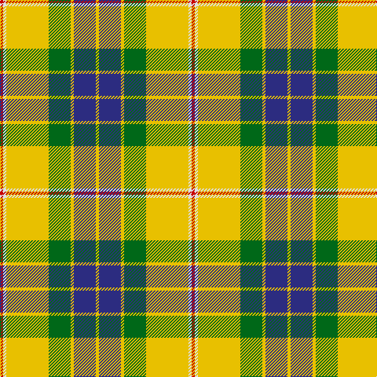

In pattern [RWYGYBY](/patterns/rwygyby/).

This was sourced from house-of-tartan.  It is a [7 stripes tartan](/stripes/stripes7/).

Original link http://www.house-of-tartan.scotland.net/house/TartanViewjs.asp?colr=Def&tnam=1709

## Thread count
R/4 LN4 Y54 G28 Y4 DB28 Y/4

## Palette
Each colour and its ΔE from the base-6 reference it is a variant of.

| Colour | Shade | Base | ΔE (OKLab) |
|---|---|---|---|
| DB | <code style="background-color:#2C2C80;">#2C2C80</code> `#2C2C80` | B <code style="background-color:#2A418A;">#2A418A</code> | 0.06 |
| G | <code style="background-color:#006818;">#006818</code> `#006818` | G <code style="background-color:#006100;">#006100</code> | 0.02 |
| LN | <code style="background-color:#E0E0E0;">#E0E0E0</code> `#E0E0E0` | W <code style="background-color:#F7F7F7;">#F7F7F7</code> | 0.07 |
| R | <code style="background-color:#C80000;">#C80000</code> `#C80000` | R <code style="background-color:#CC0000;">#CC0000</code> | 0.01 |
| Y | <code style="background-color:#E8C000;">#E8C000</code> `#E8C000` | Y <code style="background-color:#F2BF00;">#F2BF00</code> | 0.02 |

# Sample pattern

## Nearest tartans

The nearest existing variants by ΔTartan distance.

1. [Fraser Yellow](/setts/s7/r2w2y27g14y2b14y2x2~b2c4084-g005020-rdc0000-we0e0e0-ye8c000/) — ΔT 0.07
1. [Fraser, Yellow](/setts/s7/r2w2y27g14y2b14y2x2~b304080-g008000-rc00000-we0e0e0-yf0c000/) — ΔT 0.45
1. [Regalia](/setts/s7/g1ga7g7r2ga1y15w1x4~g003820-ga604000-r888888-wf8f8f8-yd0b87c/) — ΔT 0.84
1. [Shepherd Piping (Personal)](/setts/s6/k5y2g7ya18g2w2x4~g604000-k101010-we0e0e0-yf0e490-yad8bc0c/) — ΔT 1.03
1. [Drummond of Perth Dress (Dance)](/setts/s9/g41y3ga7b3w24g10ga7b7w3x2~b5c5c5c-g285800-ga408060-wfcfcfc-ybc8c00/) — ΔT 1.05
1. [Shepherd, Derek (Piping)](/setts/s6/k5y2g7ya18g2w2x4~g603311-k101010-wffffff-yfee885-yaffec8b/) — ΔT 1.19
1. [Hamilton of Brandon (Fashion)](/setts/s6/y16k7w1g7k1ya3x4~g006818-k101010-we0e0e0-ya08858-yae8c000/) — ΔT 1.23
1. [Nova Scotia, dress](/setts/s9/g3w29g3b3g3b6g13y3r2x2~b304080-g008000-rc00000-we0e0e0-yf0c000/) — ΔT 1.33
1. [Uist, Green (Dance)](/setts/s7/g3r2g27ga3w30ga2w3x2~g006818-ga003820-rc80000-wf0e0c8/) — ΔT 1.36
1. [MacDuck (Corporate)](/setts/s6/k4r5k2y21g8k2x2~g006818-k101010-rc80000-ye8c000/) — ΔT 1.37

## Neighbour map

Every grey dot is one of 15726 variants placed by the first two principal components of the ΔTartan feature space (44% of its variance). Red is this tartan; blue dots are its nearest — click one to open its page.

<svg viewBox="0 0 640 380" role="img" style="max-width:100%;height:auto;border:1px solid #e0e0e0;border-radius:4px;display:block" xmlns="http://www.w3.org/2000/svg"><image href="/nn/cloud.v1.png" width="640" height="380"/><a href="/setts/s7/r2w2y27g14y2b14y2x2~b2c4084-g005020-rdc0000-we0e0e0-ye8c000/"><circle cx="222.2" cy="145.0" r="4" fill="#3465a4"><title>Fraser Yellow</title></circle></a><a href="/setts/s7/r2w2y27g14y2b14y2x2~b304080-g008000-rc00000-we0e0e0-yf0c000/"><circle cx="227.2" cy="145.9" r="4" fill="#3465a4"><title>Fraser, Yellow</title></circle></a><a href="/setts/s7/g1ga7g7r2ga1y15w1x4~g003820-ga604000-r888888-wf8f8f8-yd0b87c/"><circle cx="209.3" cy="145.5" r="4" fill="#3465a4"><title>Regalia</title></circle></a><a href="/setts/s6/k5y2g7ya18g2w2x4~g604000-k101010-we0e0e0-yf0e490-yad8bc0c/"><circle cx="206.7" cy="166.2" r="4" fill="#3465a4"><title>Shepherd Piping (Personal)</title></circle></a><a href="/setts/s9/g41y3ga7b3w24g10ga7b7w3x2~b5c5c5c-g285800-ga408060-wfcfcfc-ybc8c00/"><circle cx="209.9" cy="137.8" r="4" fill="#3465a4"><title>Drummond of Perth Dress (Dance)</title></circle></a><a href="/setts/s6/k5y2g7ya18g2w2x4~g603311-k101010-wffffff-yfee885-yaffec8b/"><circle cx="191.2" cy="156.6" r="4" fill="#3465a4"><title>Shepherd, Derek (Piping)</title></circle></a><a href="/setts/s6/y16k7w1g7k1ya3x4~g006818-k101010-we0e0e0-ya08858-yae8c000/"><circle cx="213.8" cy="163.5" r="4" fill="#3465a4"><title>Hamilton of Brandon (Fashion)</title></circle></a><a href="/setts/s9/g3w29g3b3g3b6g13y3r2x2~b304080-g008000-rc00000-we0e0e0-yf0c000/"><circle cx="208.2" cy="121.9" r="4" fill="#3465a4"><title>Nova Scotia, dress</title></circle></a><a href="/setts/s7/g3r2g27ga3w30ga2w3x2~g006818-ga003820-rc80000-wf0e0c8/"><circle cx="265.1" cy="148.9" r="4" fill="#3465a4"><title>Uist, Green (Dance)</title></circle></a><a href="/setts/s6/k4r5k2y21g8k2x2~g006818-k101010-rc80000-ye8c000/"><circle cx="226.5" cy="177.1" r="4" fill="#3465a4"><title>MacDuck (Corporate)</title></circle></a><circle cx="221.0" cy="144.6" r="5" fill="#c00000"/></svg>

ID: /setts/s7/r2w2y27g14y2b14y2x2~b2c2c80-g006818-rc80000-we0e0e0-ye8c000/
