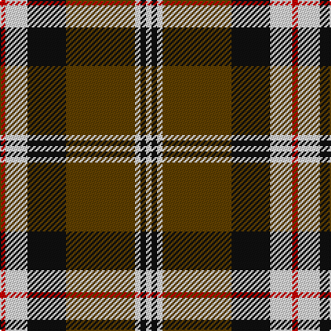

In pattern [RWKGWKW](/stripes/rwkgwkw/).

This was sourced from house-of-tartan.  It is a [7 stripe tartan](/stripes/stripes7/).

Original link http://www.house-of-tartan.scotland.net/house/TartanViewjs.asp?colr=Def&tnam=1688

## Thread count
R/4 LN16 K28 T50 LN4 K4 LN/4

## Palette
Each colour and its ΔE from the base-6 reference it is a variant of.

| Colour | Shade | Base | ΔE (OKLab) |
|---|---|---|---|
| K | <code style="background-color:#101010;">#101010</code> `#101010` | K <code style="background-color:#000000;">#000000</code> | 0.17 |
| LN | <code style="background-color:#E0E0E0;">#E0E0E0</code> `#E0E0E0` | W <code style="background-color:#F7F7F7;">#F7F7F7</code> | 0.07 |
| R | <code style="background-color:#C80000;">#C80000</code> `#C80000` | R <code style="background-color:#CC0000;">#CC0000</code> | 0.01 |
| T | <code style="background-color:#604000;">#604000</code> `#604000` | G <code style="background-color:#006100;">#006100</code> | 0.14 |

# Sample pattern

## Nearest tartans

The nearest existing variants by ΔTartan distance.

1. [Braemar or Blair Atholl](/setts/s8/do2w2k6do3k2o14k1o1~x4/) — ΔT 0.49
1. [Merric, Dark Camel..](/setts/s7/r2w8k14o25w2k2w2~x2/) — ΔT 0.62
1. [Blair Atholl (Fashion)](/setts/s8/do2lr2k6do3k2o14k1o1~x4/) — ΔT 0.75
1. [Thomson Camel (Jedburgh Mill)](/setts/s6/r4k2lb10k10y28k3~x2/) — ΔT 0.89
1. [Distripress Annual Congress 2012](/setts/s8/r12k2w8k4n16r2k31n2/) — ΔT 0.89
1. [Virginia Commonwealth University](/setts/s7/k30w2lr4lo10w9k3lr5~x2/) — ΔT 0.90
1. [Loch Ness](/setts/s6/r10w2k10w10dy35k5~x2/) — ΔT 0.90
1. [Bro-Leon](/setts/s9/k4lo17k2lo2g7k2lo2k22db4~x2/) — ΔT 0.92
1. [Burberry (Counterfeit #4)](/setts/s9/k10w10k10o32k2w2k2w2r5~x2/) — ΔT 0.92
1. [Longford County Crest (Fashion)](/setts/s8/k44lo9k3lo8lo16lo15lo6k7~x2/) — ΔT 0.95

## Neighbour map

Every grey dot is one of 14299 variants placed by the first two principal components of the ΔTartan feature space (44% of its variance). Red is this tartan; blue dots are its nearest — click one to open its page.

<svg viewBox="0 0 640 380" role="img" style="max-width:100%;height:auto;border:1px solid #e0e0e0;border-radius:4px;display:block" xmlns="http://www.w3.org/2000/svg"><image href="/nn/cloud.v1.png" width="640" height="380"/><a href="/setts/s8/do2w2k6do3k2o14k1o1~x4/"><circle cx="256.5" cy="154.6" r="4" fill="#3465a4"><title>Braemar or Blair Atholl</title></circle></a><a href="/setts/s7/r2w8k14o25w2k2w2~x2/"><circle cx="221.6" cy="156.4" r="4" fill="#3465a4"><title>Merric, Dark Camel..</title></circle></a><a href="/setts/s8/do2lr2k6do3k2o14k1o1~x4/"><circle cx="268.1" cy="161.1" r="4" fill="#3465a4"><title>Blair Atholl (Fashion)</title></circle></a><a href="/setts/s6/r4k2lb10k10y28k3~x2/"><circle cx="261.2" cy="176.9" r="4" fill="#3465a4"><title>Thomson Camel (Jedburgh Mill)</title></circle></a><a href="/setts/s8/r12k2w8k4n16r2k31n2/"><circle cx="237.8" cy="150.1" r="4" fill="#3465a4"><title>Distripress Annual Congress 2012</title></circle></a><a href="/setts/s7/k30w2lr4lo10w9k3lr5~x2/"><circle cx="248.2" cy="152.4" r="4" fill="#3465a4"><title>Virginia Commonwealth University</title></circle></a><a href="/setts/s6/r10w2k10w10dy35k5~x2/"><circle cx="253.1" cy="169.2" r="4" fill="#3465a4"><title>Loch Ness</title></circle></a><a href="/setts/s9/k4lo17k2lo2g7k2lo2k22db4~x2/"><circle cx="249.0" cy="168.6" r="4" fill="#3465a4"><title>Bro-Leon</title></circle></a><a href="/setts/s9/k10w10k10o32k2w2k2w2r5~x2/"><circle cx="213.2" cy="130.5" r="4" fill="#3465a4"><title>Burberry (Counterfeit #4)</title></circle></a><a href="/setts/s8/k44lo9k3lo8lo16lo15lo6k7~x2/"><circle cx="212.7" cy="165.8" r="4" fill="#3465a4"><title>Longford County Crest (Fashion)</title></circle></a><circle cx="234.2" cy="162.9" r="5" fill="#c00000"/></svg>

ID: /setts/s7/r2w8k14dy25w2k2w2~x2/
