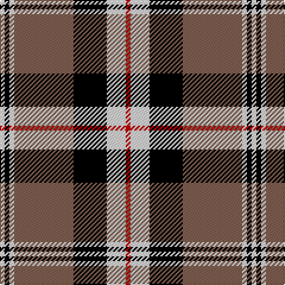

This page is one **sett** — a single exact thread-count. It belongs to the [tartan](/tartans/r2w8k14o25w2k2w2/)
(the same proportion at any scale), whose colour order is pattern [RWKRWKW](/stripes/rwkrwkw/).

Sourced from weddslist.  It is a [7 stripe tartan](/stripes/stripes7/).

Original link http://www.weddslist.com/cgi-bin/tartans/pg.pl?source=sts

## Thread count
R/4 LN16 K28 LT50 LN4 K4 LN/4

## Palette

Palette: <strong>Tartan Register</strong> <small style="color:#888">(2 of 4 colours)</small>
<table><thead><tr><th>Colour</th><th>Threads</th><th>Shade</th><th>Base</th><th>OKLCh</th></tr></thead><tbody><tr><td>R/</td><td style="text-align:right;font-variant-numeric:tabular-nums">4</td><td><code style="background-color:#C00000;">#C00000</code> <small style="color:#888">#C00000</small></td><td>R <code style="background-color:#CC0000;">#CC0000</code></td><td><small style="color:#888">oklch(50.7% 0.208 29.2)</small></td></tr><tr><td>LN</td><td style="text-align:right;font-variant-numeric:tabular-nums">16</td><td><code style="background-color:#E0E0E0;">#E0E0E0</code> <small style="color:#888">#E0E0E0</small></td><td>W <code style="background-color:#F7F7F7;">#F7F7F7</code></td><td><small style="color:#888">oklch(90.7% 0.000 89.9)</small></td></tr><tr><td>K</td><td style="text-align:right;font-variant-numeric:tabular-nums">28</td><td><code style="background-color:#000000;">#000000</code> <small style="color:#888">#000000</small></td><td>K <code style="background-color:#000000;">#000000</code></td><td><small style="color:#888">oklch(0.0% 0.000 0.0)</small></td></tr><tr><td>LT</td><td style="text-align:right;font-variant-numeric:tabular-nums">50</td><td><code style="background-color:#806050;">#806050</code> <small style="color:#888">#806050</small></td><td>R <code style="background-color:#CC0000;">#CC0000</code></td><td><small style="color:#888">oklch(51.7% 0.049 47.8)</small></td></tr><tr><td>LN</td><td style="text-align:right;font-variant-numeric:tabular-nums">4</td><td><code style="background-color:#E0E0E0;">#E0E0E0</code> <small style="color:#888">#E0E0E0</small></td><td>W <code style="background-color:#F7F7F7;">#F7F7F7</code></td><td><small style="color:#888">oklch(90.7% 0.000 89.9)</small></td></tr><tr><td>K</td><td style="text-align:right;font-variant-numeric:tabular-nums">4</td><td><code style="background-color:#000000;">#000000</code> <small style="color:#888">#000000</small></td><td>K <code style="background-color:#000000;">#000000</code></td><td><small style="color:#888">oklch(0.0% 0.000 0.0)</small></td></tr><tr><td>LN/</td><td style="text-align:right;font-variant-numeric:tabular-nums">4</td><td><code style="background-color:#E0E0E0;">#E0E0E0</code> <small style="color:#888">#E0E0E0</small></td><td>W <code style="background-color:#F7F7F7;">#F7F7F7</code></td><td><small style="color:#888">oklch(90.7% 0.000 89.9)</small></td></tr></tbody></table>

# Sample pattern

## Nearest tartans

The nearest existing variants by ΔTartan distance, with this tartan at the top so the swatches line up against it.

ΔTartan

Tartan

Sett

—

<a href="/ttd/edit/#slug=r2w8k14o25w2k2w2~x2">Merric, Dark Camel..</a> <a class="nn-out" href="/setts/s7/r2w8k14o25w2k2w2~x2/" title="open its dictionary page">↗</a>

0.62

<a href="/ttd/edit/#slug=r2w8k14dy25w2k2w2~x2">Merric Dark Camel.. Trade Tartan Tartan Number: 1688. Earliest known date: 1985 School colours. See products available Copyright © Blair Urquhart, Comrie, 2015</a> <a class="nn-out" href="/setts/s7/r2w8k14dy25w2k2w2~x2/" title="open its dictionary page">↗</a>

0.68

<a href="/ttd/edit/#slug=k30w2lr4lo10w9k3lr5~x2">Virginia Commonwealth University</a> <a class="nn-out" href="/setts/s7/k30w2lr4lo10w9k3lr5~x2/" title="open its dictionary page">↗</a>

0.75

<a href="/ttd/edit/#slug=r12k2w8k4n16r2k31n2">Distripress Annual Congress 2012</a> <a class="nn-out" href="/setts/s8/r12k2w8k4n16r2k31n2/" title="open its dictionary page">↗</a>

0.87

<a href="/ttd/edit/#slug=do2w2k6do3k2o14k1o1~x4">Braemar or Blair Atholl</a> <a class="nn-out" href="/setts/s8/do2w2k6do3k2o14k1o1~x4/" title="open its dictionary page">↗</a>

0.89

<a href="/ttd/edit/#slug=ly35db3r4db3r8db30w3db4~x2">Clemens and August (Personal)</a> <a class="nn-out" href="/setts/s8/ly35db3r4db3r8db30w3db4~x2/" title="open its dictionary page">↗</a>

0.93

<a href="/ttd/edit/#slug=r4o30k6w13k13w3~x2">Thom(p)son camel</a> <a class="nn-out" href="/setts/s6/r4o30k6w13k13w3~x2/" title="open its dictionary page">↗</a>

0.93

<a href="/ttd/edit/#slug=k10w10k10o32k2w2k2w2r5~x2">Burberry (Counterfeit #4)</a> <a class="nn-out" href="/setts/s9/k10w10k10o32k2w2k2w2r5~x2/" title="open its dictionary page">↗</a>

0.94

<a href="/ttd/edit/#slug=r2k28y5w12y14r2~x2">Callaway</a> <a class="nn-out" href="/setts/s6/r2k28y5w12y14r2~x2/" title="open its dictionary page">↗</a>

0.96

<a href="/ttd/edit/#slug=t5r5k58r5t5r5w25r5t4">Meg Merrilees, New (1831)</a> <a class="nn-out" href="/setts/s9/t5r5k58r5t5r5w25r5t4/" title="open its dictionary page">↗</a>

0.98

<a href="/ttd/edit/#slug=r10w2k10w10o35k5~x2">Loch Ness</a> <a class="nn-out" href="/setts/s6/r10w2k10w10o35k5~x2/" title="open its dictionary page">↗</a>

## Neighbour map

Every grey dot is one of 14359 variants placed by the first two principal components of the ΔTartan feature space (44% of its variance). Red is this tartan; blue dots are its nearest — click one to open its page.

<svg viewBox="0 0 640 380" role="img" style="max-width:100%;height:auto;border:1px solid #e0e0e0;border-radius:4px;display:block" xmlns="http://www.w3.org/2000/svg"><image href="/nn/cloud.v1.png" width="640" height="380"/><a href="/setts/s7/r2w8k14dy25w2k2w2~x2/"><circle cx="233.4" cy="163.8" r="4" fill="#3465a4"><title>Merric Dark Camel.. Trade Tartan Tartan Number: 1688. Earliest known date: 1985 School colours. See products available Copyright © Blair Urquhart, Comrie, 2015</title></circle></a><a href="/setts/s7/k30w2lr4lo10w9k3lr5~x2/"><circle cx="247.3" cy="153.3" r="4" fill="#3465a4"><title>Virginia Commonwealth University</title></circle></a><a href="/setts/s8/r12k2w8k4n16r2k31n2/"><circle cx="237.0" cy="151.0" r="4" fill="#3465a4"><title>Distripress Annual Congress 2012</title></circle></a><a href="/setts/s8/do2w2k6do3k2o14k1o1~x4/"><circle cx="255.7" cy="155.4" r="4" fill="#3465a4"><title>Braemar or Blair Atholl</title></circle></a><a href="/setts/s8/ly35db3r4db3r8db30w3db4~x2/"><circle cx="226.5" cy="146.2" r="4" fill="#3465a4"><title>Clemens and August (Personal)</title></circle></a><a href="/setts/s6/r4o30k6w13k13w3~x2/"><circle cx="184.3" cy="188.5" r="4" fill="#3465a4"><title>Thom(p)son camel</title></circle></a><a href="/setts/s9/k10w10k10o32k2w2k2w2r5~x2/"><circle cx="212.4" cy="131.4" r="4" fill="#3465a4"><title>Burberry (Counterfeit #4)</title></circle></a><a href="/setts/s6/r2k28y5w12y14r2~x2/"><circle cx="204.7" cy="176.4" r="4" fill="#3465a4"><title>Callaway</title></circle></a><a href="/setts/s9/t5r5k58r5t5r5w25r5t4/"><circle cx="247.4" cy="123.5" r="4" fill="#3465a4"><title>Meg Merrilees, New (1831)</title></circle></a><a href="/setts/s6/r10w2k10w10o35k5~x2/"><circle cx="240.1" cy="161.7" r="4" fill="#3465a4"><title>Loch Ness</title></circle></a><circle cx="220.8" cy="157.3" r="5" fill="#c00000"/></svg>

ID: /setts/s7/r2w8k14o25w2k2w2~x2/
