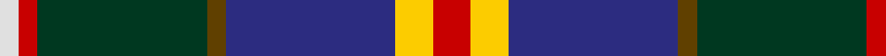
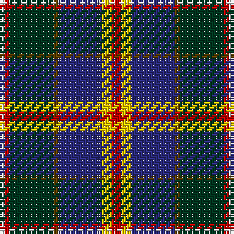

In pattern [RYBGGRW](/patterns/rybggrw/).

This was sourced from tartans-authority.  It is a [7 stripes tartan](/stripes/stripes7/).

Original link http://www.tartansauthority.com/tartan-ferret/display/8867/

## Thread count
LN/2 R2 DG18 T2 DB18 Y4 R/4

## Palette
Each colour and its ΔE from the base-6 reference it is a variant of.

| Colour | Shade | Base | ΔE (OKLab) |
|---|---|---|---|
| DB | <code style="background-color:#2C2C80;">#2C2C80</code> `#2C2C80` | B <code style="background-color:#2A418A;">#2A418A</code> | 0.06 |
| DG | <code style="background-color:#003820;">#003820</code> `#003820` | G <code style="background-color:#006100;">#006100</code> | 0.15 |
| LN | <code style="background-color:#E0E0E0;">#E0E0E0</code> `#E0E0E0` | W <code style="background-color:#F7F7F7;">#F7F7F7</code> | 0.07 |
| R | <code style="background-color:#C80000;">#C80000</code> `#C80000` | R <code style="background-color:#CC0000;">#CC0000</code> | 0.01 |
| T | <code style="background-color:#604000;">#604000</code> `#604000` | G <code style="background-color:#006100;">#006100</code> | 0.14 |
| Y | <code style="background-color:#FCCC00;">#FCCC00</code> `#FCCC00` | Y <code style="background-color:#F2BF00;">#F2BF00</code> | 0.04 |

# Sample pattern

## Nearest tartans

The nearest existing variants by ΔTartan distance.

1. [Harvey of Cornwall (Personal)](/setts/s7/w10k52b52g24y10g5r5~b2c4084-g003c14-k101010-rdc0000-we0e0e0-ye8c000/) — ΔT 0.74
1. [Dunedin](/setts/s9/k3r3g21ra8r3ra4k3b26w3~b304080-g008000-k000000-rc00000-ra900030-we0e0e0~x2/) — ΔT 0.75
1. [Souza Nery (Personal)](/setts/s7/y4g22r3k17r3b37w3~b2c2c80-g006818-k101010-rc8002c-we0e0e0-yfccc00~x2/) — ΔT 0.80
1. [Morris of Balgonie (Personal)](/setts/s6/w2b20r3k10g20y2~b5c005c-g006818-k101010-r880000-wf8f8f8-yd09800~x2/) — ΔT 0.80
1. [State Seal of Utah (Fashion)](/setts/s8/b48y25g15r7w5b7k10w10~b003c64-g604000-k101010-r880000-we8ccb8-ya08858~x2/) — ΔT 0.88
1. [Cowan of Inveresk Family Tartan Tartan Number: 1549. Earliest known date: 1979 This is a modern family tartan designed by the representer of the family of Cowan of Inveresk, in the parish of that name in Musselburgh, Mr Robert Cowan of Atlanta, Georgia. Cowans are a Sept of the Colquhouns, variously spelt Macillechomhghain, Comhain, Comhan and Cowen. Cowans not associated with the Inveresk branch of the family may wear the Colquhoun tartan on which this design is based. See products available Copyright © Blair Urquhart, Comrie, 2015](/setts/s8/r4g16w2k15b15k2b2y2~b2c2c80-g006818-k101010-rc80000-we0e0e0-ye8c000~x2/) — ΔT 0.95
1. [Morris of Eddergoll (Personal)](/setts/s6/w2b20r3k10g20y2~b1c0070-g006818-k101010-rc80000-wf8f8f8-yd09800~x2/) — ΔT 0.95
1. [Loch Awe](/setts/s9/w3k2r3g20k24b20r3k2y3~b2c2c80-g006818-k101010-rc80000-wc0c0c0-yfccc00~x2/) — ΔT 0.96
1. [Leung (Personal)](/setts/s9/r4k7r2b25k19w2g13k2y3~b2c2c80-g006818-k101010-rb468ac-wfcfcfc-ye8c000~x2/) — ΔT 0.99
1. [Mary, Queen of Scots](/setts/s9/r5w1b10g10w1y1g2ba2w1~b2c2c80-ba5c8ca8-g006818-rc80000-we0e0e0-ye8c000~x2/) — ΔT 0.99

## Neighbour map

Every grey dot is one of 15726 variants placed by the first two principal components of the ΔTartan feature space (44% of its variance). Red is this tartan; blue dots are its nearest — click one to open its page.

<svg viewBox="0 0 640 380" role="img" style="max-width:100%;height:auto;border:1px solid #e0e0e0;border-radius:4px;display:block" xmlns="http://www.w3.org/2000/svg"><image href="/nn/cloud.v1.png" width="640" height="380"/><a href="/setts/s7/w10k52b52g24y10g5r5~b2c4084-g003c14-k101010-rdc0000-we0e0e0-ye8c000/"><circle cx="120.0" cy="164.6" r="4" fill="#3465a4"><title>Harvey of Cornwall (Personal)</title></circle></a><a href="/setts/s9/k3r3g21ra8r3ra4k3b26w3~b304080-g008000-k000000-rc00000-ra900030-we0e0e0~x2/"><circle cx="125.6" cy="144.2" r="4" fill="#3465a4"><title>Dunedin</title></circle></a><a href="/setts/s7/y4g22r3k17r3b37w3~b2c2c80-g006818-k101010-rc8002c-we0e0e0-yfccc00~x2/"><circle cx="172.9" cy="152.9" r="4" fill="#3465a4"><title>Souza Nery (Personal)</title></circle></a><a href="/setts/s6/w2b20r3k10g20y2~b5c005c-g006818-k101010-r880000-wf8f8f8-yd09800~x2/"><circle cx="148.9" cy="176.5" r="4" fill="#3465a4"><title>Morris of Balgonie (Personal)</title></circle></a><a href="/setts/s8/b48y25g15r7w5b7k10w10~b003c64-g604000-k101010-r880000-we8ccb8-ya08858~x2/"><circle cx="155.2" cy="160.5" r="4" fill="#3465a4"><title>State Seal of Utah (Fashion)</title></circle></a><a href="/setts/s8/r4g16w2k15b15k2b2y2~b2c2c80-g006818-k101010-rc80000-we0e0e0-ye8c000~x2/"><circle cx="101.1" cy="169.9" r="4" fill="#3465a4"><title>Cowan of Inveresk Family Tartan Tartan Number: 1549. Earliest known date: 1979 This is a modern family tartan designed by the representer of the family of Cowan of Inveresk, in the parish of that name in Musselburgh, Mr Robert Cowan of Atlanta, Georgia. Cowans are a Sept of the Colquhouns, variously spelt Macillechomhghain, Comhain, Comhan and Cowen. Cowans not associated with the Inveresk branch of the family may wear the Colquhoun tartan on which this design is based. See products available Copyright © Blair Urquhart, Comrie, 2015</title></circle></a><a href="/setts/s6/w2b20r3k10g20y2~b1c0070-g006818-k101010-rc80000-wf8f8f8-yd09800~x2/"><circle cx="135.2" cy="178.7" r="4" fill="#3465a4"><title>Morris of Eddergoll (Personal)</title></circle></a><a href="/setts/s9/w3k2r3g20k24b20r3k2y3~b2c2c80-g006818-k101010-rc80000-wc0c0c0-yfccc00~x2/"><circle cx="141.7" cy="140.9" r="4" fill="#3465a4"><title>Loch Awe</title></circle></a><a href="/setts/s9/r4k7r2b25k19w2g13k2y3~b2c2c80-g006818-k101010-rb468ac-wfcfcfc-ye8c000~x2/"><circle cx="148.8" cy="144.5" r="4" fill="#3465a4"><title>Leung (Personal)</title></circle></a><a href="/setts/s9/r5w1b10g10w1y1g2ba2w1~b2c2c80-ba5c8ca8-g006818-rc80000-we0e0e0-ye8c000~x2/"><circle cx="133.2" cy="140.4" r="4" fill="#3465a4"><title>Mary, Queen of Scots</title></circle></a><circle cx="145.5" cy="159.9" r="5" fill="#c00000"/></svg>

ID: /setts/s7/r2y2b9g1ga9r1w1~b2c2c80-g604000-ga003820-rc80000-we0e0e0-yfccc00~x2/
