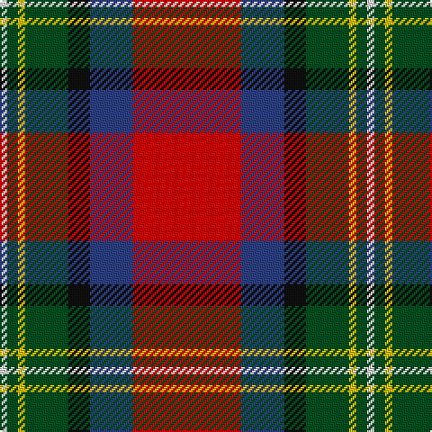

In pattern [RBKGYGW](/patterns/rbkgygw/).

This was sourced from register-of-tartans.  It is a [7 stripes tartan](/stripes/stripes7/).

Original link https://www.tartanregister.gov.uk/tartanDetails.aspx?ref=5929

## Thread count
LN/4 G6 Y4 G24 K12 B24 R/60

## Palette
Each colour and its ΔE from the base-6 reference it is a variant of.

| Colour | Shade | Base | ΔE (OKLab) |
|---|---|---|---|
| B | <code style="background-color:#2C4084;">#2C4084</code> `#2C4084` | B <code style="background-color:#2A418A;">#2A418A</code> | 0.01 |
| G | <code style="background-color:#005020;">#005020</code> `#005020` | G <code style="background-color:#006100;">#006100</code> | 0.07 |
| K | <code style="background-color:#101010;">#101010</code> `#101010` | K <code style="background-color:#000000;">#000000</code> | 0.17 |
| LN | <code style="background-color:#E0E0E0;">#E0E0E0</code> `#E0E0E0` | W <code style="background-color:#F7F7F7;">#F7F7F7</code> | 0.07 |
| R | <code style="background-color:#DC0000;">#DC0000</code> `#DC0000` | R <code style="background-color:#CC0000;">#CC0000</code> | 0.03 |
| Y | <code style="background-color:#E8C000;">#E8C000</code> `#E8C000` | Y <code style="background-color:#F2BF00;">#F2BF00</code> | 0.02 |

# Sample pattern

## Nearest tartans

The nearest existing variants by ΔTartan distance.

1. [Hewitt (Name)](/setts/s7/r30b12k3g12y2g3w2x2~b2c2c80-g006818-k101010-rc80000-we0e0e0-ye8c000/) — ΔT 0.38
1. [Scottish American Society of Michigan (Official)](/setts/s6/r48b16y5g17w8k3x2~b5f749c-g23321b-k000000-rb62531-wf9f5ef-ye0a126/) — ΔT 0.69
1. [Gordon of Abergeldie (Portrait)](/setts/s6/r63w4k4b18y4g50x2~b780078-g005830-k101010-rc80000-wfcfcfc-yd8b000/) — ΔT 0.70
1. [Bombeiros Voluntarios De Galicia (Co](/setts/s7/r3b2r25ra12k25w2wa2x2~b5c5c5c-k101010-rc80000-ra888888-we0e0e0-waa8ace8/) — ΔT 0.71
1. [Bombeiros Voluntarios De Galicia](/setts/s7/r3b2r25ra12k25w2wa2x2~b5c5c5c-k101010-rc80000-ra888888-wffffff-waa8ace8/) — ΔT 0.74
1. [Round Table Sweden](/setts/s8/r3y15g4b6w2r30b6ya3x2~b003c64-g006818-ra00000-wfcfcfc-yd09800-yafccc00/) — ΔT 0.82
1. [Round Table Sweden](/setts/s8/r3y15g4b6w2r30b6ya3x2~b3c82af-g007800-r800028-wffffff-ye0a126-yaffff00/) — ΔT 0.83
1. [Hogeboom (Personal)](/setts/s9/b4g3b9ba14y8ba2r35ra2r3x2~b5c8ca8-ba003c64-g006818-rc80000-rae87878-yfccc00/) — ΔT 0.96
1. [Scottish American Soc. of Michigan](/setts/s6/r48b16y5g17w8ga3x2~b1474b4-g006818-ga604000-rc80000-we0e0e0-ybc8c00/) — ΔT 0.97
1. [Wilson's, No 2](/setts/s8/b2r11ba9b11y2g13r21w2x2~b300030-ba5480b0-g008000-rc00000-we0e0e0-yf0c000/) — ΔT 1.08

## Neighbour map

Every grey dot is one of 15726 variants placed by the first two principal components of the ΔTartan feature space (44% of its variance). Red is this tartan; blue dots are its nearest — click one to open its page.

<svg viewBox="0 0 640 380" role="img" style="max-width:100%;height:auto;border:1px solid #e0e0e0;border-radius:4px;display:block" xmlns="http://www.w3.org/2000/svg"><image href="/nn/cloud.v1.png" width="640" height="380"/><a href="/setts/s7/r30b12k3g12y2g3w2x2~b2c2c80-g006818-k101010-rc80000-we0e0e0-ye8c000/"><circle cx="229.9" cy="130.2" r="4" fill="#3465a4"><title>Hewitt (Name)</title></circle></a><a href="/setts/s6/r48b16y5g17w8k3x2~b5f749c-g23321b-k000000-rb62531-wf9f5ef-ye0a126/"><circle cx="231.4" cy="136.6" r="4" fill="#3465a4"><title>Scottish American Society of Michigan (Official)</title></circle></a><a href="/setts/s6/r63w4k4b18y4g50x2~b780078-g005830-k101010-rc80000-wfcfcfc-yd8b000/"><circle cx="241.7" cy="141.0" r="4" fill="#3465a4"><title>Gordon of Abergeldie (Portrait)</title></circle></a><a href="/setts/s7/r3b2r25ra12k25w2wa2x2~b5c5c5c-k101010-rc80000-ra888888-we0e0e0-waa8ace8/"><circle cx="185.1" cy="136.7" r="4" fill="#3465a4"><title>Bombeiros Voluntarios De Galicia (Co</title></circle></a><a href="/setts/s7/r3b2r25ra12k25w2wa2x2~b5c5c5c-k101010-rc80000-ra888888-wffffff-waa8ace8/"><circle cx="182.7" cy="135.7" r="4" fill="#3465a4"><title>Bombeiros Voluntarios De Galicia</title></circle></a><a href="/setts/s8/r3y15g4b6w2r30b6ya3x2~b003c64-g006818-ra00000-wfcfcfc-yd09800-yafccc00/"><circle cx="229.6" cy="121.0" r="4" fill="#3465a4"><title>Round Table Sweden</title></circle></a><a href="/setts/s8/r3y15g4b6w2r30b6ya3x2~b3c82af-g007800-r800028-wffffff-ye0a126-yaffff00/"><circle cx="215.9" cy="116.9" r="4" fill="#3465a4"><title>Round Table Sweden</title></circle></a><a href="/setts/s9/b4g3b9ba14y8ba2r35ra2r3x2~b5c8ca8-ba003c64-g006818-rc80000-rae87878-yfccc00/"><circle cx="235.9" cy="104.4" r="4" fill="#3465a4"><title>Hogeboom (Personal)</title></circle></a><a href="/setts/s6/r48b16y5g17w8ga3x2~b1474b4-g006818-ga604000-rc80000-we0e0e0-ybc8c00/"><circle cx="243.1" cy="140.7" r="4" fill="#3465a4"><title>Scottish American Soc. of Michigan</title></circle></a><a href="/setts/s8/b2r11ba9b11y2g13r21w2x2~b300030-ba5480b0-g008000-rc00000-we0e0e0-yf0c000/"><circle cx="169.8" cy="160.1" r="4" fill="#3465a4"><title>Wilson's, No 2</title></circle></a><circle cx="206.7" cy="132.0" r="5" fill="#c00000"/></svg>

ID: /setts/s7/r30b12k6g12y2g3w2x2~b2c4084-g005020-k101010-rdc0000-we0e0e0-ye8c000/
