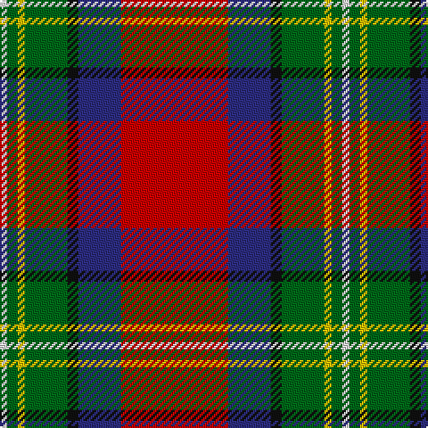

This page is one **sett** — a single exact thread-count. It belongs to the [tartan](/tartans/r30db12k3g12ly2g3w2/)
(the same proportion at any scale), whose colour order is pattern [RBKGYGW](/stripes/rbkgygw/).

Sourced from tartans-authority.  It is a [7 stripe tartan](/stripes/stripes7/).

Original link http://www.tartansauthority.com/tartan-ferret/display/7369/

## Also known as

This cloth is also recorded under:

- Hewitt #2

2 attestations — the source records this cloth was collapsed from (oldest owns this page)

<ul>
<li>pre 2007 — Hewitt (Name) (tartans-authority, <a href="http://www.tartansauthority.com/tartan-ferret/display/7369/">record</a>)</li>
<li>undated — Hewitt #2 (register-of-tartans, <a href="https://www.tartanregister.gov.uk/tartanDetails.aspx?ref=5475">record</a>)</li>
</ul>

## Register references

External register numbers recorded for this tartan.

- Scottish Register of Tartans: [5475](https://www.tartanregister.gov.uk/tartanDetails.aspx?ref=5475)
- Scottish Tartans Authority (ITI): 7369

## Thread count
R/60 DB24 K6 G24 Y4 G6 LN/4

## Palette

Palette: <strong>Tartan Register</strong>
<table><thead><tr><th>Colour</th><th>Threads</th><th>Shade</th><th>Base</th><th>OKLCh</th></tr></thead><tbody><tr><td>R/</td><td style="text-align:right;font-variant-numeric:tabular-nums">60</td><td><code style="background-color:#C80000;">#C80000</code> <small style="color:#888">#C80000</small></td><td>R <code style="background-color:#CC0000;">#CC0000</code></td><td><small style="color:#888">oklch(52.3% 0.215 29.2)</small></td></tr><tr><td>DB</td><td style="text-align:right;font-variant-numeric:tabular-nums">24</td><td><code style="background-color:#2C2C80;">#2C2C80</code> <small style="color:#888">#2C2C80</small></td><td>B <code style="background-color:#2A418A;">#2A418A</code></td><td><small style="color:#888">oklch(35.0% 0.138 276.6)</small></td></tr><tr><td>K</td><td style="text-align:right;font-variant-numeric:tabular-nums">6</td><td><code style="background-color:#101010;">#101010</code> <small style="color:#888">#101010</small></td><td>K <code style="background-color:#000000;">#000000</code></td><td><small style="color:#888">oklch(17.3% 0.000 89.9)</small></td></tr><tr><td>G</td><td style="text-align:right;font-variant-numeric:tabular-nums">24</td><td><code style="background-color:#006818;">#006818</code> <small style="color:#888">#006818</small></td><td>G <code style="background-color:#006100;">#006100</code></td><td><small style="color:#888">oklch(45.0% 0.142 145.0)</small></td></tr><tr><td>Y</td><td style="text-align:right;font-variant-numeric:tabular-nums">4</td><td><code style="background-color:#E8C000;">#E8C000</code> <small style="color:#888">#E8C000</small></td><td>Y <code style="background-color:#F2BF00;">#F2BF00</code></td><td><small style="color:#888">oklch(81.9% 0.168 93.7)</small></td></tr><tr><td>G</td><td style="text-align:right;font-variant-numeric:tabular-nums">6</td><td><code style="background-color:#006818;">#006818</code> <small style="color:#888">#006818</small></td><td>G <code style="background-color:#006100;">#006100</code></td><td><small style="color:#888">oklch(45.0% 0.142 145.0)</small></td></tr><tr><td>LN/</td><td style="text-align:right;font-variant-numeric:tabular-nums">4</td><td><code style="background-color:#E0E0E0;">#E0E0E0</code> <small style="color:#888">#E0E0E0</small></td><td>W <code style="background-color:#F7F7F7;">#F7F7F7</code></td><td><small style="color:#888">oklch(90.7% 0.000 89.9)</small></td></tr></tbody></table>

# Sample pattern

## Nearest tartans

The nearest existing variants by ΔTartan distance, with this tartan at the top so the swatches line up against it.

ΔTartan

Tartan

Sett

—

<a href="/ttd/edit/#slug=r30db12k3g12ly2g3w2~x2">Hewitt (Name)</a> <a class="nn-out" href="/setts/s7/r30db12k3g12ly2g3w2~x2/" title="open its dictionary page">↗</a>

0.38

<a href="/ttd/edit/#slug=r30db12k6dg12ly2dg3w2~x2">Hewitt</a> <a class="nn-out" href="/setts/s7/r30db12k6dg12ly2dg3w2~x2/" title="open its dictionary page">↗</a>

0.57

<a href="/ttd/edit/#slug=r63w4k4dp18ly4dg50~x2">Gordon of Abergeldie (Portrait)</a> <a class="nn-out" href="/setts/s6/r63w4k4dp18ly4dg50~x2/" title="open its dictionary page">↗</a>

0.68

<a href="/ttd/edit/#slug=r3lo15g4dt6w2r30dt6ly3~x2">Round Table Sweden</a> <a class="nn-out" href="/setts/s8/r3lo15g4dt6w2r30dt6ly3~x2/" title="open its dictionary page">↗</a>

0.71

<a href="/ttd/edit/#slug=r48t16lo5dg17w8k3~x2">Scottish American Society of Michigan (Official)</a> <a class="nn-out" href="/setts/s6/r48t16lo5dg17w8k3~x2/" title="open its dictionary page">↗</a>

0.74

<a href="/ttd/edit/#slug=r3lo15g4t6w2r30t6ly3~x2">Round Table Sweden</a> <a class="nn-out" href="/setts/s8/r3lo15g4t6w2r30t6ly3~x2/" title="open its dictionary page">↗</a>

0.84

<a href="/ttd/edit/#slug=t4g3t9dt14ly8dt2r35ri2r3~x2">Hogeboom (Personal)</a> <a class="nn-out" href="/setts/s9/t4g3t9dt14ly8dt2r35ri2r3~x2/" title="open its dictionary page">↗</a>

0.84

<a href="/ttd/edit/#slug=r48b16lo5g17w8dy3~x2">Scottish American Soc. of Michigan</a> <a class="nn-out" href="/setts/s6/r48b16lo5g17w8dy3~x2/" title="open its dictionary page">↗</a>

0.92

<a href="/ttd/edit/#slug=r3n2r25o12k25w2lb2~x2">Bombeiros Voluntarios De Galicia (Co</a> <a class="nn-out" href="/setts/s7/r3n2r25o12k25w2lb2~x2/" title="open its dictionary page">↗</a>

1.03

<a href="/ttd/edit/#slug=gi18g2db5r45dbi3db18dbi3r5w2">MacNiven Family Tartan Tartan Number: 752. Earliest known date: 1986 Based in part on the MacNaughton of which the MacNivens are a Sept. The name in Mr Cannonito's family was spelt, MacKniffen. Other members of the family have dropped the 'Mac' since arriving in America in 1650. This clan tartan was accredited by the Scottish Tartans Society in 1988. See products available Copyright © Blair Urquhart, Comrie, 2015</a> <a class="nn-out" href="/setts/s9/gi18g2db5r45dbi3db18dbi3r5w2/" title="open its dictionary page">↗</a>

1.05

<a href="/ttd/edit/#slug=r20w1k1dp6ly1g18~x2">Gordon of Abergeldie, (Red..)</a> <a class="nn-out" href="/setts/s6/r20w1k1dp6ly1g18~x2/" title="open its dictionary page">↗</a>

## Neighbour map

Every grey dot is one of 14359 variants placed by the first two principal components of the ΔTartan feature space (44% of its variance). Red is this tartan; blue dots are its nearest — click one to open its page.

<svg viewBox="0 0 640 380" role="img" style="max-width:100%;height:auto;border:1px solid #e0e0e0;border-radius:4px;display:block" xmlns="http://www.w3.org/2000/svg"><image href="/nn/cloud.v1.png" width="640" height="380"/><a href="/setts/s7/r30db12k6dg12ly2dg3w2~x2/"><circle cx="206.9" cy="131.9" r="4" fill="#3465a4"><title>Hewitt</title></circle></a><a href="/setts/s6/r63w4k4dp18ly4dg50~x2/"><circle cx="241.6" cy="141.6" r="4" fill="#3465a4"><title>Gordon of Abergeldie (Portrait)</title></circle></a><a href="/setts/s8/r3lo15g4dt6w2r30dt6ly3~x2/"><circle cx="229.2" cy="120.6" r="4" fill="#3465a4"><title>Round Table Sweden</title></circle></a><a href="/setts/s6/r48t16lo5dg17w8k3~x2/"><circle cx="231.2" cy="135.4" r="4" fill="#3465a4"><title>Scottish American Society of Michigan (Official)</title></circle></a><a href="/setts/s8/r3lo15g4t6w2r30t6ly3~x2/"><circle cx="215.9" cy="115.6" r="4" fill="#3465a4"><title>Round Table Sweden</title></circle></a><a href="/setts/s9/t4g3t9dt14ly8dt2r35ri2r3~x2/"><circle cx="235.6" cy="104.4" r="4" fill="#3465a4"><title>Hogeboom (Personal)</title></circle></a><a href="/setts/s6/r48b16lo5g17w8dy3~x2/"><circle cx="242.6" cy="140.8" r="4" fill="#3465a4"><title>Scottish American Soc. of Michigan</title></circle></a><a href="/setts/s7/r3n2r25o12k25w2lb2~x2/"><circle cx="185.7" cy="136.1" r="4" fill="#3465a4"><title>Bombeiros Voluntarios De Galicia (Co</title></circle></a><a href="/setts/s9/gi18g2db5r45dbi3db18dbi3r5w2/"><circle cx="273.3" cy="100.0" r="4" fill="#3465a4"><title>MacNiven Family Tartan Tartan Number: 752. Earliest known date: 1986 Based in part on the MacNaughton of which the MacNivens are a Sept. The name in Mr Cannonito's family was spelt, MacKniffen. Other members of the family have dropped the 'Mac' since arriving in America in 1650. This clan tartan was accredited by the Scottish Tartans Society in 1988. See products available Copyright © Blair Urquhart, Comrie, 2015</title></circle></a><a href="/setts/s6/r20w1k1dp6ly1g18~x2/"><circle cx="243.2" cy="129.3" r="4" fill="#3465a4"><title>Gordon of Abergeldie, (Red..)</title></circle></a><circle cx="230.1" cy="130.2" r="5" fill="#c00000"/></svg>

ID: /setts/s7/r30db12k3g12ly2g3w2~x2/
