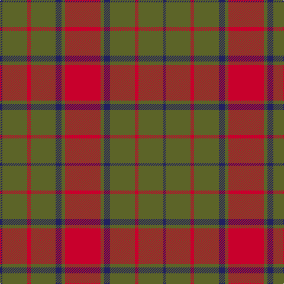

In pattern [BGRGBGR](/patterns/bgrgbgr/).

This was sourced from tartans-authority.  It is a [7 stripes tartan](/stripes/stripes7/).

Original link http://www.tartansauthority.com/tartan-ferret/display/3190/

## Thread count
DB/4 G42 R6 G42 DB10 G6 R/60

## Palette
Each colour and its ΔE from the base-6 reference it is a variant of.

| Colour | Shade | Base | ΔE (OKLab) |
|---|---|---|---|
| DB | <code style="background-color:#202060;">#202060</code> `#202060` | B <code style="background-color:#2A418A;">#2A418A</code> | 0.11 |
| G | <code style="background-color:#5C6428;">#5C6428</code> `#5C6428` | G <code style="background-color:#006100;">#006100</code> | 0.10 |
| R | <code style="background-color:#C8002C;">#C8002C</code> `#C8002C` | R <code style="background-color:#CC0000;">#CC0000</code> | 0.03 |

# Sample pattern

## Nearest tartans

The nearest existing variants by ΔTartan distance.

1. [Cameron Clan D](/setts/s6/r1g6r1g6r15y1~g11450d-raa0000-yaaaa00~x2/) — ΔT 1.09
1. [Cameron](/setts/s6/r2g6r2g6r16y1~g11450d-raa0000-yaaaa00~x2/) — ΔT 1.24
1. [Edinchat](/setts/s6/b2r28g13r2b13r2~b2c2c80-g006818-rc04c08~x4/) — ΔT 1.27
1. [Chisholm](/setts/s8/r12b2y1b2r3g8r3b1~b6e5058-g11450d-raa0000-yaaaaaa~x2/) — ΔT 1.28
1. [Chisholm](/setts/s8/r12b2y1b2r3g8r3b1~b6e5058-g11450d-raa0000-yaaaaaa/) — ΔT 1.28
1. [Grant of Lurg](/setts/s6/b2r25g10r2b10r2~b304080-g008000-rc00000~x2/) — ΔT 1.29
1. [MacKintosh, Plaid](/setts/s6/r16b6r2g6r2b1~b304080-g008000-rc00000~x2/) — ΔT 1.34
1. [Wasko (Personal)](/setts/s7/r8w2ra30g12ra3g12ra3~g006818-rc80000-raa00048-we0e0e0~x2/) — ΔT 1.37
1. [Hubbard (2016)](/setts/s9/b5r19ba2g8r3g18ba2g9ba2~b003c64-ba1c1c1c-g5c6428-rc80000~x2/) — ΔT 1.40
1. [Livingston](/setts/s10/g12r4k1r2k1r4g16r20g2r8~g11450d-k000000-raa0000~x2/) — ΔT 1.41

## Neighbour map

Every grey dot is one of 15726 variants placed by the first two principal components of the ΔTartan feature space (44% of its variance). Red is this tartan; blue dots are its nearest — click one to open its page.

<svg viewBox="0 0 640 380" role="img" style="max-width:100%;height:auto;border:1px solid #e0e0e0;border-radius:4px;display:block" xmlns="http://www.w3.org/2000/svg"><image href="/nn/cloud.v1.png" width="640" height="380"/><a href="/setts/s6/r1g6r1g6r15y1~g11450d-raa0000-yaaaa00~x2/"><circle cx="422.2" cy="214.1" r="4" fill="#3465a4"><title>Cameron Clan D</title></circle></a><a href="/setts/s6/r2g6r2g6r16y1~g11450d-raa0000-yaaaa00~x2/"><circle cx="442.7" cy="218.1" r="4" fill="#3465a4"><title>Cameron</title></circle></a><a href="/setts/s6/b2r28g13r2b13r2~b2c2c80-g006818-rc04c08~x4/"><circle cx="347.6" cy="209.0" r="4" fill="#3465a4"><title>Edinchat</title></circle></a><a href="/setts/s8/r12b2y1b2r3g8r3b1~b6e5058-g11450d-raa0000-yaaaaaa~x2/"><circle cx="377.6" cy="203.2" r="4" fill="#3465a4"><title>Chisholm</title></circle></a><a href="/setts/s8/r12b2y1b2r3g8r3b1~b6e5058-g11450d-raa0000-yaaaaaa/"><circle cx="377.6" cy="203.2" r="4" fill="#3465a4"><title>Chisholm</title></circle></a><a href="/setts/s6/b2r25g10r2b10r2~b304080-g008000-rc00000~x2/"><circle cx="370.3" cy="208.9" r="4" fill="#3465a4"><title>Grant of Lurg</title></circle></a><a href="/setts/s6/r16b6r2g6r2b1~b304080-g008000-rc00000~x2/"><circle cx="403.1" cy="204.4" r="4" fill="#3465a4"><title>MacKintosh, Plaid</title></circle></a><a href="/setts/s7/r8w2ra30g12ra3g12ra3~g006818-rc80000-raa00048-we0e0e0~x2/"><circle cx="331.3" cy="186.2" r="4" fill="#3465a4"><title>Wasko (Personal)</title></circle></a><a href="/setts/s9/b5r19ba2g8r3g18ba2g9ba2~b003c64-ba1c1c1c-g5c6428-rc80000~x2/"><circle cx="317.0" cy="208.7" r="4" fill="#3465a4"><title>Hubbard (2016)</title></circle></a><a href="/setts/s10/g12r4k1r2k1r4g16r20g2r8~g11450d-k000000-raa0000~x2/"><circle cx="402.5" cy="187.5" r="4" fill="#3465a4"><title>Livingston</title></circle></a><circle cx="390.4" cy="217.1" r="5" fill="#c00000"/></svg>

ID: /setts/s7/r30g3b5g21r3g21b2~b202060-g5c6428-rc8002c~x2/
