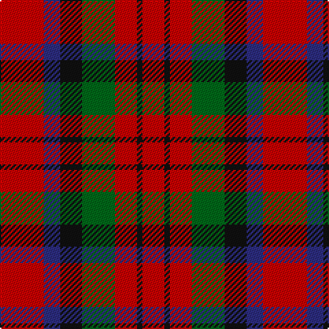

In pattern [RBKGRKR](/patterns/rbkgrkr/).

This was sourced from house-of-tartan.  It is a [7 stripes tartan](/stripes/stripes7/).

Original link http://www.house-of-tartan.scotland.net/house/TartanViewjs.asp?colr=Def&tnam=2141

## Thread count
R/32 DB12 K16 G24 R16 K4 R/16

## Palette
Each colour and its ΔE from the base-6 reference it is a variant of.

| Colour | Shade | Base | ΔE (OKLab) |
|---|---|---|---|
| DB | <code style="background-color:#2C2C80;">#2C2C80</code> `#2C2C80` | B <code style="background-color:#2C4084;">#2C4084</code> | 0.05 |
| G | <code style="background-color:#006818;">#006818</code> `#006818` | G <code style="background-color:#006400;">#006400</code> | 0.02 |
| K | <code style="background-color:#101010;">#101010</code> `#101010` | K <code style="background-color:#000000;">#000000</code> | 0.17 |
| R | <code style="background-color:#C80000;">#C80000</code> `#C80000` | R <code style="background-color:#C80000;">#C80000</code> | 0.00 |

# Sample pattern

## Nearest tartans

The nearest existing variants by ΔTartan distance.

1. [MacDuff #5](/setts/s7/r16b6k8g12r8k2r8-b3c82af-g005020-k101010-rdc0000/) — ΔT 0.39
1. [MacDuff #2](/setts/s7/r44b16k18g28r20b4r20-b3c82af-g005020-k101010-rdc0000/) — ΔT 0.79
1. [MacTavish Clan Tartan Tartan Number: 797. Earliest known date: 1850 This plate is taken from the manuscript of William and Andrew Smith's 'Authenticated Tartans of the Clans and Families of Scotland'. The Smith's sources included the findings of George Hunter, an Army clothier, who toured the Highlands in search of old tartans prior to 1822. See products available Copyright © Blair Urquhart, Comrie, 2015](/setts/s7/r24g4r24b4g12k12g12-b2c2c80-g006818-k101010-rc80000/) — ΔT 0.84
1. [MacTavish](/setts/s7/r24g4r24b4g12k12g12-b202060-g006818-k101010-rc80000/) — ΔT 0.85
1. [MacDuff](/setts/s7/r16b6k8g12r8k2r8-b5480b0-g008000-k000000-rc00000/) — ΔT 0.87
1. [MacDuff](/setts/s7/r44b16k18g28r20b4r20-b5480b0-g008000-k000000-rc00000/) — ΔT 0.89
1. [MacDuff](/setts/s7/r16b6k8g12r8k2r8-b000052-g11450d-k000000-raa0000/) — ΔT 0.93
1. [MacDuff](/setts/s7/r16b6k8g12r8k2r8-b00004c-g004c00-k000000-rc80000/) — ΔT 0.95
1. [Unidentified item](/setts/s5/g72w8r72k72r72-g005020-k101010-rdc0000-we0e0e0/) — ΔT 1.00
1. [MacTavish](/setts/s7/r24g4r24b4g12k12g12-b304080-g008000-k000000-rc00000/) — ΔT 1.20

## Neighbour map

Every grey dot is one of 15726 variants placed by the first two principal components of the ΔTartan feature space (44% of its variance). Red is this tartan; blue dots are its nearest — click one to open its page.

<svg viewBox="0 0 640 380" role="img" style="max-width:100%;height:auto;border:1px solid #e0e0e0;border-radius:4px;display:block" xmlns="http://www.w3.org/2000/svg"><image href="/nn/cloud.v1.png" width="640" height="380"/><a href="/setts/s7/r16b6k8g12r8k2r8-b3c82af-g005020-k101010-rdc0000/"><circle cx="233.2" cy="234.5" r="4" fill="#3465a4"><title>MacDuff #5</title></circle></a><a href="/setts/s7/r44b16k18g28r20b4r20-b3c82af-g005020-k101010-rdc0000/"><circle cx="269.9" cy="217.3" r="4" fill="#3465a4"><title>MacDuff #2</title></circle></a><a href="/setts/s7/r24g4r24b4g12k12g12-b2c2c80-g006818-k101010-rc80000/"><circle cx="248.2" cy="240.8" r="4" fill="#3465a4"><title>MacTavish Clan Tartan Tartan Number: 797. Earliest known date: 1850 This plate is taken from the manuscript of William and Andrew Smith's 'Authenticated Tartans of the Clans and Families of Scotland'. The Smith's sources included the findings of George Hunter, an Army clothier, who toured the Highlands in search of old tartans prior to 1822. See products available Copyright © Blair Urquhart, Comrie, 2015</title></circle></a><a href="/setts/s7/r24g4r24b4g12k12g12-b202060-g006818-k101010-rc80000/"><circle cx="248.0" cy="240.8" r="4" fill="#3465a4"><title>MacTavish</title></circle></a><a href="/setts/s7/r16b6k8g12r8k2r8-b5480b0-g008000-k000000-rc00000/"><circle cx="215.7" cy="231.1" r="4" fill="#3465a4"><title>MacDuff</title></circle></a><a href="/setts/s7/r44b16k18g28r20b4r20-b5480b0-g008000-k000000-rc00000/"><circle cx="255.5" cy="215.0" r="4" fill="#3465a4"><title>MacDuff</title></circle></a><a href="/setts/s7/r16b6k8g12r8k2r8-b000052-g11450d-k000000-raa0000/"><circle cx="232.8" cy="242.4" r="4" fill="#3465a4"><title>MacDuff</title></circle></a><a href="/setts/s7/r16b6k8g12r8k2r8-b00004c-g004c00-k000000-rc80000/"><circle cx="220.4" cy="233.9" r="4" fill="#3465a4"><title>MacDuff</title></circle></a><a href="/setts/s5/g72w8r72k72r72-g005020-k101010-rdc0000-we0e0e0/"><circle cx="213.9" cy="249.7" r="4" fill="#3465a4"><title>Unidentified item</title></circle></a><a href="/setts/s7/r24g4r24b4g12k12g12-b304080-g008000-k000000-rc00000/"><circle cx="224.5" cy="232.5" r="4" fill="#3465a4"><title>MacTavish</title></circle></a><circle cx="241.0" cy="240.2" r="5" fill="#c00000"/></svg>

ID: /setts/s7/r32b12k16g24r16k4r16-b2c2c80-g006818-k101010-rc80000/
