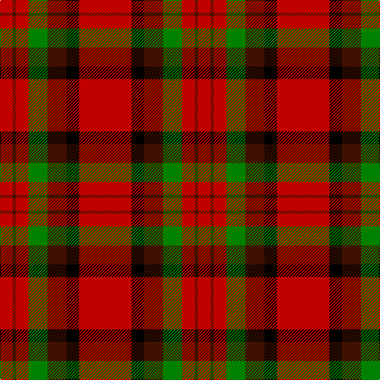

In pattern [RBRGBKR](/stripes/rbrgbkr/).

This was sourced from weddslist.  It is a [7 stripe tartan](/stripes/stripes7/).

Original link http://www.weddslist.com/cgi-bin/tartans/pg.pl?source=sts

## Thread count
R/66 K16 DR24 G24 R16 DR4 R/16

## Palette
Each colour and the base-6 reference it is a variant of.

| Colour | Shade | Base |
|---|---|---|
| DR | <code style="background-color:#401000;">#401000</code> `oklch(25.3% 0.079 39.9)` <small>#401000</small> | B <code style="background-color:#2A418A;">#2A418A</code> |
| G | <code style="background-color:#008000;">#008000</code> `oklch(52.0% 0.177 142.5)` <small>#008000</small> | G <code style="background-color:#006100;">#006100</code> |
| K | <code style="background-color:#000000;">#000000</code> `oklch(0.0% 0.000 0.0)` <small>#000000</small> | K <code style="background-color:#000000;">#000000</code> |
| R | <code style="background-color:#C00000;">#C00000</code> `oklch(50.7% 0.208 29.2)` <small>#C00000</small> | R <code style="background-color:#CC0000;">#CC0000</code> |

# Sample pattern

## Nearest tartans

The nearest existing variants by ΔTartan distance.

1. [Sturrock](/setts/s6/r52k32dg22r16ly3r16/) — ΔT 0.72
1. [MacKintosh #4](/setts/s6/r5w2r28k12dg16r3~x2/) — ΔT 0.76
1. [MacDuff - 1819 (Clan)](/setts/s7/r36db9k12g17r10k3r10~x2/) — ΔT 0.83
1. [MacDuff #6](/setts/s7/r36lt9k12g17r10k3r10~x2/) — ΔT 0.94
1. [Sturrock](/setts/s6/r52k32g22r16ly3r16/) — ΔT 1.01
1. [Sturrock](/setts/s7/r52db16k16g22r16ly3r16/) — ΔT 1.05
1. [MacAulay](/setts/s6/k2r16dg6r3dg8lb1/) — ΔT 1.06
1. [MacKinnon #4](/setts/s7/k1r18dg12r2dg12r18w1~x2/) — ΔT 1.15
1. [MacKintosh 6](/setts/s6/r5w2r28k12g16r3~x2/) — ΔT 1.17
1. [Sturrock, Blue/Black (Clan)](/setts/s7/r52b16k16g22r16lo3r16~x2/) — ΔT 1.19

## Neighbour map

Every grey dot is one of 14299 variants placed by the first two principal components of the ΔTartan feature space (44% of its variance). Red is this tartan; blue dots are its nearest — click one to open its page.

<svg viewBox="0 0 640 380" role="img" style="max-width:100%;height:auto;border:1px solid #e0e0e0;border-radius:4px;display:block" xmlns="http://www.w3.org/2000/svg"><image href="/nn/cloud.v1.png" width="640" height="380"/><a href="/setts/s6/r52k32dg22r16ly3r16/"><circle cx="328.7" cy="189.6" r="4" fill="#3465a4"><title>Sturrock</title></circle></a><a href="/setts/s6/r5w2r28k12dg16r3~x2/"><circle cx="301.3" cy="181.1" r="4" fill="#3465a4"><title>MacKintosh #4</title></circle></a><a href="/setts/s7/r36db9k12g17r10k3r10~x2/"><circle cx="309.8" cy="199.6" r="4" fill="#3465a4"><title>MacDuff - 1819 (Clan)</title></circle></a><a href="/setts/s7/r36lt9k12g17r10k3r10~x2/"><circle cx="292.6" cy="190.1" r="4" fill="#3465a4"><title>MacDuff #6</title></circle></a><a href="/setts/s6/r52k32g22r16ly3r16/"><circle cx="311.0" cy="186.6" r="4" fill="#3465a4"><title>Sturrock</title></circle></a><a href="/setts/s7/r52db16k16g22r16ly3r16/"><circle cx="296.5" cy="164.0" r="4" fill="#3465a4"><title>Sturrock</title></circle></a><a href="/setts/s6/k2r16dg6r3dg8lb1/"><circle cx="322.2" cy="183.6" r="4" fill="#3465a4"><title>MacAulay</title></circle></a><a href="/setts/s7/k1r18dg12r2dg12r18w1~x2/"><circle cx="374.0" cy="179.4" r="4" fill="#3465a4"><title>MacKinnon #4</title></circle></a><a href="/setts/s6/r5w2r28k12g16r3~x2/"><circle cx="284.0" cy="177.6" r="4" fill="#3465a4"><title>MacKintosh 6</title></circle></a><a href="/setts/s7/r52b16k16g22r16lo3r16~x2/"><circle cx="317.0" cy="172.8" r="4" fill="#3465a4"><title>Sturrock, Blue/Black (Clan)</title></circle></a><circle cx="329.1" cy="178.0" r="5" fill="#c00000"/></svg>

ID: /setts/s7/r33k8dr12g12r8dr2r8~x2/
