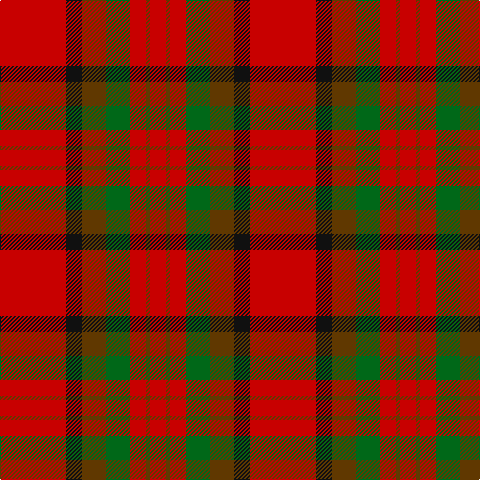

In pattern [RGRGGKR](/patterns/rgrggkr/).

This was sourced from register-of-tartans.  It is a [7 stripes tartan](/stripes/stripes7/).

Original link https://www.tartanregister.gov.uk/tartanDetails.aspx?ref=4128

## Attestations

This cloth appears in 2 source records; the oldest owns this page.

- 01/01/1996 — Tipperary, County (register-of-tartans, [record](https://www.tartanregister.gov.uk/tartanDetails.aspx?ref=4128))
- 1997 — Tipperary, County (District) (tartans-authority, [record](http://www.tartansauthority.com/tartan-ferret/display/2249/))

## Thread count
R/66 K16 T24 G24 R16 T4 R/16

## Palette
Each colour and its ΔE from the base-6 reference it is a variant of.

| Colour | Shade | Base | ΔE (OKLab) |
|---|---|---|---|
| G | <code style="background-color:#006818;">#006818</code> `#006818` | G <code style="background-color:#006100;">#006100</code> | 0.02 |
| K | <code style="background-color:#101010;">#101010</code> `#101010` | K <code style="background-color:#000000;">#000000</code> | 0.17 |
| R | <code style="background-color:#C80000;">#C80000</code> `#C80000` | R <code style="background-color:#CC0000;">#CC0000</code> | 0.01 |
| T | <code style="background-color:#603800;">#603800</code> `#603800` | G <code style="background-color:#006100;">#006100</code> | 0.16 |

# Sample pattern

## Nearest tartans

The nearest existing variants by ΔTartan distance.

1. [MacNab #3](/setts/s7/g6r2ra2g4ra2r12k1x2~g005020-k101010-rdc0000-ra960028/) — ΔT 1.16
1. [Chisholm](/setts/s8/r12b2w1b2r3g8r3b1x2~b5a3094-g004c00-rc80000-wd0d0d0/) — ΔT 1.20
1. [MacDuff - 1819 (Clan)](/setts/s7/r36b9k12g17r10k3r10x2~b2c2c80-g006818-k101010-rc80000/) — ΔT 1.21
1. [Wasko (Personal)](/setts/s7/r8w2ra30g12ra3g12ra3x2~g006818-rc80000-raa00048-we0e0e0/) — ΔT 1.24
1. [McInally (Name)](/setts/s7/r3g16r4k6r28g2y3x2~g006818-k101010-rc80000-yd09800/) — ΔT 1.26
1. [Tipperary](/setts/s7/r33k8b12g12r8b2r8x2~b401000-g008000-k000000-rc00000/) — ΔT 1.27
1. [Kirk (Name)](/setts/s7/r4g21r4k7r34y3r4x2~g006818-k101010-ra00000-yd09800/) — ΔT 1.28
1. [Buccleuch](/setts/s7/r107k9r5b41r5g51r14~b780078-g006818-k000000-rc80000/) — ΔT 1.29
1. [Sturrock, Blue/Black (Clan)](/setts/s7/r52b16k16g22r16y3r16x2~b1870a4-g006818-k101010-rc80000-yd09800/) — ΔT 1.29
1. [MacKinnon #4](/setts/s7/k1r18g12r2g12r18w1x2~g005020-k101010-rdc0000-we0e0e0/) — ΔT 1.30

## Neighbour map

Every grey dot is one of 15726 variants placed by the first two principal components of the ΔTartan feature space (44% of its variance). Red is this tartan; blue dots are its nearest — click one to open its page.

<svg viewBox="0 0 640 380" role="img" style="max-width:100%;height:auto;border:1px solid #e0e0e0;border-radius:4px;display:block" xmlns="http://www.w3.org/2000/svg"><image href="/nn/cloud.v1.png" width="640" height="380"/><a href="/setts/s7/g6r2ra2g4ra2r12k1x2~g005020-k101010-rdc0000-ra960028/"><circle cx="297.9" cy="192.2" r="4" fill="#3465a4"><title>MacNab #3</title></circle></a><a href="/setts/s8/r12b2w1b2r3g8r3b1x2~b5a3094-g004c00-rc80000-wd0d0d0/"><circle cx="330.2" cy="180.3" r="4" fill="#3465a4"><title>Chisholm</title></circle></a><a href="/setts/s7/r36b9k12g17r10k3r10x2~b2c2c80-g006818-k101010-rc80000/"><circle cx="309.8" cy="202.8" r="4" fill="#3465a4"><title>MacDuff - 1819 (Clan)</title></circle></a><a href="/setts/s7/r8w2ra30g12ra3g12ra3x2~g006818-rc80000-raa00048-we0e0e0/"><circle cx="331.3" cy="186.2" r="4" fill="#3465a4"><title>Wasko (Personal)</title></circle></a><a href="/setts/s7/r3g16r4k6r28g2y3x2~g006818-k101010-rc80000-yd09800/"><circle cx="345.5" cy="174.1" r="4" fill="#3465a4"><title>McInally (Name)</title></circle></a><a href="/setts/s7/r33k8b12g12r8b2r8x2~b401000-g008000-k000000-rc00000/"><circle cx="329.3" cy="182.6" r="4" fill="#3465a4"><title>Tipperary</title></circle></a><a href="/setts/s7/r4g21r4k7r34y3r4x2~g006818-k101010-ra00000-yd09800/"><circle cx="376.2" cy="194.6" r="4" fill="#3465a4"><title>Kirk (Name)</title></circle></a><a href="/setts/s7/r107k9r5b41r5g51r14~b780078-g006818-k000000-rc80000/"><circle cx="364.3" cy="155.6" r="4" fill="#3465a4"><title>Buccleuch</title></circle></a><a href="/setts/s7/r52b16k16g22r16y3r16x2~b1870a4-g006818-k101010-rc80000-yd09800/"><circle cx="317.2" cy="175.2" r="4" fill="#3465a4"><title>Sturrock, Blue/Black (Clan)</title></circle></a><a href="/setts/s7/k1r18g12r2g12r18w1x2~g005020-k101010-rdc0000-we0e0e0/"><circle cx="374.5" cy="183.9" r="4" fill="#3465a4"><title>MacKinnon #4</title></circle></a><circle cx="363.2" cy="194.2" r="5" fill="#c00000"/></svg>

ID: /setts/s7/r33k8g12ga12r8g2r8x2~g603800-ga006818-k101010-rc80000/
