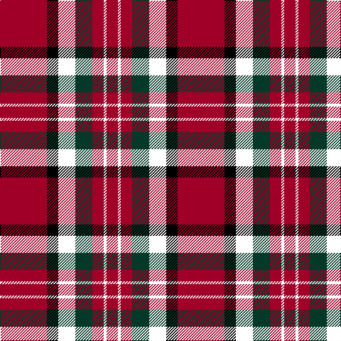

This page is one **sett** — a single exact thread-count. It belongs to the [tartan](/tartans/r33k8ki12dg12r8ki2r8/)
(the same proportion at any scale), whose colour order is pattern [RKKGRKR](/stripes/rkkgrkr/).

Sourced from house-of-tartan.  It is a [7 stripe tartan](/stripes/stripes7/).

Original link http://www.house-of-tartan.scotland.net/house/TartanViewjs.asp?colr=Def&tnam=2249

## Thread count
DR/66 K16 LUT24 DG24 DR16 LUT4 DR/16

## Palette

Palette: <strong>Ingles Buchan</strong> <small style="color:#888">(1 of 4 colours)</small>
<table><thead><tr><th>Colour</th><th>Threads</th><th>Shade</th><th>Base</th><th>OKLCh</th></tr></thead><tbody><tr><td>DR/</td><td style="text-align:right;font-variant-numeric:tabular-nums">66</td><td><code style="background-color:#A00028;">#A00028</code> <small style="color:#888">#A00028</small></td><td>R <code style="background-color:#CC0000;">#CC0000</code></td><td><small style="color:#888">oklch(44.7% 0.179 19.5)</small></td></tr><tr><td>K</td><td style="text-align:right;font-variant-numeric:tabular-nums">16</td><td><code style="background-color:#000000;">#000000</code> <small style="color:#888">#000000</small></td><td>K <code style="background-color:#000000;">#000000</code></td><td><small style="color:#888">oklch(0.0% 0.000 0.0)</small></td></tr><tr><td></td><td style="text-align:right;font-variant-numeric:tabular-nums">24</td><td><code style="background-color:;"></code> <small style="color:#888"></small></td><td> <code style="background-color:;"></code></td><td><small style="color:#888"></small></td></tr><tr><td>DG</td><td style="text-align:right;font-variant-numeric:tabular-nums">24</td><td><code style="background-color:#043828;">#043828</code> <small style="color:#888">#043828</small></td><td>G <code style="background-color:#006100;">#006100</code></td><td><small style="color:#888">oklch(30.4% 0.060 166.6)</small></td></tr><tr><td>DR</td><td style="text-align:right;font-variant-numeric:tabular-nums">16</td><td><code style="background-color:#A00028;">#A00028</code> <small style="color:#888">#A00028</small></td><td>R <code style="background-color:#CC0000;">#CC0000</code></td><td><small style="color:#888">oklch(44.7% 0.179 19.5)</small></td></tr><tr><td></td><td style="text-align:right;font-variant-numeric:tabular-nums">4</td><td><code style="background-color:;"></code> <small style="color:#888"></small></td><td> <code style="background-color:;"></code></td><td><small style="color:#888"></small></td></tr><tr><td>DR/</td><td style="text-align:right;font-variant-numeric:tabular-nums">16</td><td><code style="background-color:#A00028;">#A00028</code> <small style="color:#888">#A00028</small></td><td>R <code style="background-color:#CC0000;">#CC0000</code></td><td><small style="color:#888">oklch(44.7% 0.179 19.5)</small></td></tr></tbody></table>

# Sample pattern

## Nearest tartans

The nearest existing variants by ΔTartan distance, with this tartan at the top so the swatches line up against it.

ΔTartan

Tartan

Sett

—

<a href="/ttd/edit/#slug=r33k8ki12dg12r8ki2r8~x2">Tipperary Irish County Tartan Tartan Number: 2249. Earliest known date: 1995 One of a series of Irish District tartans designed by Polly Wittering of the House of Edgar, with colours reminiscent of the Country with soft warm colours dominating. See products available Copyright © Blair Urquhart, Comrie, 2015</a> <a class="nn-out" href="/setts/s7/r33k8ki12dg12r8ki2r8~x2/" title="open its dictionary page">↗</a>

1.21

<a href="/ttd/edit/#slug=k24db2k24db14ly3r36k18ly5r3~x2">Craigholme (Corporate)</a> <a class="nn-out" href="/setts/s9/k24db2k24db14ly3r36k18ly5r3~x2/" title="open its dictionary page">↗</a>

1.25

<a href="/ttd/edit/#slug=r2db12r2dg12r24w1~x2">Fraser</a> <a class="nn-out" href="/setts/s6/r2db12r2dg12r24w1~x2/" title="open its dictionary page">↗</a>

1.35

<a href="/ttd/edit/#slug=r33k8dr12g12r8dr2r8~x2">Tipperary</a> <a class="nn-out" href="/setts/s7/r33k8dr12g12r8dr2r8~x2/" title="open its dictionary page">↗</a>

1.36

<a href="/ttd/edit/#slug=k2r6k2r6k12ly1~x4">MacQueen</a> <a class="nn-out" href="/setts/s6/k2r6k2r6k12ly1~x4/" title="open its dictionary page">↗</a>

1.37

<a href="/ttd/edit/#slug=lr1r12k2r2k16r2k2r12ly1~x2">MacIver</a> <a class="nn-out" href="/setts/s9/lr1r12k2r2k16r2k2r12ly1~x2/" title="open its dictionary page">↗</a>

1.39

<a href="/ttd/edit/#slug=b4r1k11r20k20r20g4ly1~x2">Templeton (Name?)</a> <a class="nn-out" href="/setts/s8/b4r1k11r20k20r20g4ly1~x2/" title="open its dictionary page">↗</a>

1.40

<a href="/ttd/edit/#slug=r5m2r30k28w2k4~x2">Ramsay Red Clan Tartan Tartan Number: 1238. Earliest known date: 1842 Ramsay was one of the names adopted by members of the Clan MacGregor when their own was proscribed. It is not surprising then that an early MacGregor sett was used as a basis for the Ramsay tartan. It is possible that the tartan was in existance long before the earliest recorded date given. See products available Copyright © Blair Urquhart, Comrie, 2015</a> <a class="nn-out" href="/setts/s6/r5m2r30k28w2k4~x2/" title="open its dictionary page">↗</a>

1.41

<a href="/ttd/edit/#slug=r1db6r1dg6r12lr1~x2">Fraser VS</a> <a class="nn-out" href="/setts/s6/r1db6r1dg6r12lr1~x2/" title="open its dictionary page">↗</a>

1.43

<a href="/ttd/edit/#slug=k8r49k8lb3k20lo3~x2">Dunbar (District)</a> <a class="nn-out" href="/setts/s6/k8r49k8lb3k20lo3~x2/" title="open its dictionary page">↗</a>

1.43

<a href="/ttd/edit/#slug=r36db9k12g17r10k3r10~x2">MacDuff - 1819 (Clan)</a> <a class="nn-out" href="/setts/s7/r36db9k12g17r10k3r10~x2/" title="open its dictionary page">↗</a>

## Neighbour map

Every grey dot is one of 14359 variants placed by the first two principal components of the ΔTartan feature space (44% of its variance). Red is this tartan; blue dots are its nearest — click one to open its page.

<svg viewBox="0 0 640 380" role="img" style="max-width:100%;height:auto;border:1px solid #e0e0e0;border-radius:4px;display:block" xmlns="http://www.w3.org/2000/svg"><image href="/nn/cloud.v1.png" width="640" height="380"/><a href="/setts/s9/k24db2k24db14ly3r36k18ly5r3~x2/"><circle cx="275.7" cy="169.0" r="4" fill="#3465a4"><title>Craigholme (Corporate)</title></circle></a><a href="/setts/s6/r2db12r2dg12r24w1~x2/"><circle cx="321.0" cy="162.2" r="4" fill="#3465a4"><title>Fraser</title></circle></a><a href="/setts/s7/r33k8dr12g12r8dr2r8~x2/"><circle cx="327.9" cy="178.8" r="4" fill="#3465a4"><title>Tipperary</title></circle></a><a href="/setts/s6/k2r6k2r6k12ly1~x4/"><circle cx="341.5" cy="217.8" r="4" fill="#3465a4"><title>MacQueen</title></circle></a><a href="/setts/s9/lr1r12k2r2k16r2k2r12ly1~x2/"><circle cx="337.6" cy="151.8" r="4" fill="#3465a4"><title>MacIver</title></circle></a><a href="/setts/s8/b4r1k11r20k20r20g4ly1~x2/"><circle cx="285.4" cy="149.7" r="4" fill="#3465a4"><title>Templeton (Name?)</title></circle></a><a href="/setts/s6/r5m2r30k28w2k4~x2/"><circle cx="324.6" cy="169.6" r="4" fill="#3465a4"><title>Ramsay Red Clan Tartan Tartan Number: 1238. Earliest known date: 1842 Ramsay was one of the names adopted by members of the Clan MacGregor when their own was proscribed. It is not surprising then that an early MacGregor sett was used as a basis for the Ramsay tartan. It is possible that the tartan was in existance long before the earliest recorded date given. See products available Copyright © Blair Urquhart, Comrie, 2015</title></circle></a><a href="/setts/s6/r1db6r1dg6r12lr1~x2/"><circle cx="298.2" cy="197.8" r="4" fill="#3465a4"><title>Fraser VS</title></circle></a><a href="/setts/s6/k8r49k8lb3k20lo3~x2/"><circle cx="370.9" cy="183.6" r="4" fill="#3465a4"><title>Dunbar (District)</title></circle></a><a href="/setts/s7/r36db9k12g17r10k3r10~x2/"><circle cx="308.8" cy="200.5" r="4" fill="#3465a4"><title>MacDuff - 1819 (Clan)</title></circle></a><circle cx="326.4" cy="186.3" r="5" fill="#c00000"/></svg>

ID: /setts/s7/r33k8ki12dg12r8ki2r8~x2/
