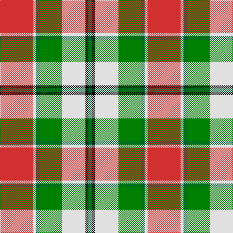

In pattern [GKWGGWR](/stripes/gkwggwr/).

This was sourced from weddslist.  It is a [7 stripe tartan](/stripes/stripes7/).

Original link http://www.weddslist.com/cgi-bin/tartans/pg.pl?source=sts

## Thread count
R/68 LN6 G8 Ga46 LN48 K6 G/8

## Palette
Each colour and the base-6 reference it is a variant of.

| Colour | Shade | Base |
|---|---|---|
| G | <code style="background-color:#006030;">#006030</code> `oklch(42.9% 0.111 152.8)` <small>#006030</small> | G <code style="background-color:#006100;">#006100</code> |
| Ga | <code style="background-color:#008000;">#008000</code> `oklch(52.0% 0.177 142.5)` <small>#008000</small> | G <code style="background-color:#006100;">#006100</code> |
| K | <code style="background-color:#000000;">#000000</code> `oklch(0.0% 0.000 0.0)` <small>#000000</small> | K <code style="background-color:#000000;">#000000</code> |
| LN | <code style="background-color:#E0E0E0;">#E0E0E0</code> `oklch(90.7% 0.000 89.9)` <small>#E0E0E0</small> | W <code style="background-color:#F7F7F7;">#F7F7F7</code> |
| R | <code style="background-color:#D03030;">#D03030</code> `oklch(56.4% 0.196 26.2)` <small>#D03030</small> | R <code style="background-color:#CC0000;">#CC0000</code> |

# Sample pattern

## Nearest tartans

The nearest existing variants by ΔTartan distance.

1. [MacLachlan Dress Clan Tartan Tartan Number: 828. Earliest known date: 1990 Based on the MacLachlan pattern in Old And Rare See products available Copyright © Blair Urquhart, Comrie, 2015](/setts/s7/r34w3g4g23w24k3g4~x2/) — ΔT 0.40
1. [MacLachlan Dress](/setts/s7/r36w3lo4g24w24k3lo6~x2/) — ΔT 0.46
1. [MacLean, dress](/setts/s6/r1w12g6r8t3ly1~x4/) — ΔT 0.85
1. [MacLean Dress (Lumsden)](/setts/s6/r1w12g6r8lb3lo1~x4/) — ΔT 0.87
1. [Glasgow](/setts/s7/dg20r3y3r15w19dg3t2~x2/) — ΔT 1.00
1. [MacKintosh Dress (Dance)](/setts/s6/r3w33dp8dg18r9g3~x2/) — ΔT 1.06
1. [Project, Faith Inc (Corporate)](/setts/s10/ly22k11ly10k2g2k2ly10k11ly7r2~x2/) — ΔT 1.09
1. [Bannockbane Orange Stripes](/setts/s8/do2lo2do15lo1w10lo15lo2lo2~x2/) — ΔT 1.12
1. [Lalage (Personal)](/setts/s8/w4k13w17lo2r2lo24w2w2~x2/) — ΔT 1.13
1. [Northern Ontario](/setts/s7/dy17g5db2w12db2ly4g7~x4/) — ΔT 1.14

## Neighbour map

Every grey dot is one of 14299 variants placed by the first two principal components of the ΔTartan feature space (44% of its variance). Red is this tartan; blue dots are its nearest — click one to open its page.

<svg viewBox="0 0 640 380" role="img" style="max-width:100%;height:auto;border:1px solid #e0e0e0;border-radius:4px;display:block" xmlns="http://www.w3.org/2000/svg"><image href="/nn/cloud.v1.png" width="640" height="380"/><a href="/setts/s7/r34w3g4g23w24k3g4~x2/"><circle cx="154.6" cy="155.2" r="4" fill="#3465a4"><title>MacLachlan Dress Clan Tartan Tartan Number: 828. Earliest known date: 1990 Based on the MacLachlan pattern in Old And Rare See products available Copyright © Blair Urquhart, Comrie, 2015</title></circle></a><a href="/setts/s7/r36w3lo4g24w24k3lo6~x2/"><circle cx="140.3" cy="146.4" r="4" fill="#3465a4"><title>MacLachlan Dress</title></circle></a><a href="/setts/s6/r1w12g6r8t3ly1~x4/"><circle cx="158.9" cy="164.8" r="4" fill="#3465a4"><title>MacLean, dress</title></circle></a><a href="/setts/s6/r1w12g6r8lb3lo1~x4/"><circle cx="149.5" cy="158.8" r="4" fill="#3465a4"><title>MacLean Dress (Lumsden)</title></circle></a><a href="/setts/s7/dg20r3y3r15w19dg3t2~x2/"><circle cx="134.8" cy="157.9" r="4" fill="#3465a4"><title>Glasgow</title></circle></a><a href="/setts/s6/r3w33dp8dg18r9g3~x2/"><circle cx="176.2" cy="158.0" r="4" fill="#3465a4"><title>MacKintosh Dress (Dance)</title></circle></a><a href="/setts/s10/ly22k11ly10k2g2k2ly10k11ly7r2~x2/"><circle cx="128.9" cy="143.4" r="4" fill="#3465a4"><title>Project, Faith Inc (Corporate)</title></circle></a><a href="/setts/s8/do2lo2do15lo1w10lo15lo2lo2~x2/"><circle cx="185.6" cy="151.1" r="4" fill="#3465a4"><title>Bannockbane Orange Stripes</title></circle></a><a href="/setts/s8/w4k13w17lo2r2lo24w2w2~x2/"><circle cx="166.7" cy="133.9" r="4" fill="#3465a4"><title>Lalage (Personal)</title></circle></a><a href="/setts/s7/dy17g5db2w12db2ly4g7~x4/"><circle cx="103.4" cy="175.6" r="4" fill="#3465a4"><title>Northern Ontario</title></circle></a><circle cx="148.8" cy="150.9" r="5" fill="#c00000"/></svg>

ID: /setts/s7/r34w3dg4g23w24k3dg4~x2/
