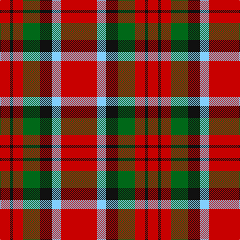

**Bands:** [RKRGKWR](/stripes/rkrgkwr/) · **Stripes:** [R K R G K LT R](/stripes/stripes7/) R K R G K LT R

This was sourced from register-of-tartans.  It is a [7 band tartan](/bands/bands7/).

Original link https://www.tartanregister.gov.uk/tartanDetails.aspx?ref=2418

## Register references

External register numbers recorded for this tartan.

- Scottish Register of Tartans: [2418](https://www.tartanregister.gov.uk/tartanDetails.aspx?ref=2418)
- Scottish Tartans Authority (ITI): 2455
- Scottish Tartans World Register: 2455

## Thread count
R/20 K6 R20 G34 K24 LB18 R/72

## Palette
Each colour and its ΔE from the base-6 reference it is a variant of.

| Colour | Shade | Base | ΔE (OKLab) |
|---|---|---|---|
| G | <code style="background-color:#006818;">#006818</code> `#006818` | G <code style="background-color:#006100;">#006100</code> | 0.02 |
| K | <code style="background-color:#101010;">#101010</code> `#101010` | K <code style="background-color:#000000;">#000000</code> | 0.17 |
| LB | <code style="background-color:#82CFFD;">#82CFFD</code> `#82CFFD` | W <code style="background-color:#F7F7F7;">#F7F7F7</code> | 0.18 |
| R | <code style="background-color:#C80000;">#C80000</code> `#C80000` | R <code style="background-color:#CC0000;">#CC0000</code> | 0.01 |

# Sample pattern

## Nearest tartans

The nearest existing variants by ΔTartan distance.

1. [MacDuff - 1819 (Clan)](/setts/s7/r36db9k12g17r10k3r10~x2/) — ΔT 0.65
1. [MacKintosh #4](/setts/s6/r5w2r28k12dg16r3~x2/) — ΔT 0.70
1. [Nisbet](/setts/s6/r10g24k10r28lb3r6~x2/) — ΔT 0.86
1. [MacDuff](/setts/s7/r22t8k9g14r10t2r10~x2/) — ΔT 0.89
1. [MacDuff #2](/setts/s7/r22t8k9dg14r10t2r10~x2/) — ΔT 0.89
1. [Tipperary](/setts/s7/r33k8dr12g12r8dr2r8~x2/) — ΔT 0.94
1. [Morrison](/setts/s9/g5w2g8r9k3r4k3r17g3~x2/) — ΔT 0.95
1. [Sturrock](/setts/s6/r52k32dg22r16ly3r16/) — ΔT 0.98
1. [Morrison LC](/setts/s9/dg9lb4dg15r17k5r7k5r32dg5/) — ΔT 1.02
1. [MacDuff #4](/setts/s7/r4k2r24k6db6dg16r3~x2/) — ΔT 1.02

## Neighbour map

Every grey dot is one of 14313 variants placed by the first two principal components of the ΔTartan feature space (44% of its variance). Red is this tartan; blue dots are its nearest — click one to open its page.

<svg viewBox="0 0 640 380" role="img" style="max-width:100%;height:auto;border:1px solid #e0e0e0;border-radius:4px;display:block" xmlns="http://www.w3.org/2000/svg"><image href="/nn/cloud.v1.png" width="640" height="380"/><a href="/setts/s7/r36db9k12g17r10k3r10~x2/"><circle cx="310.0" cy="199.7" r="4" fill="#3465a4"><title>MacDuff - 1819 (Clan)</title></circle></a><a href="/setts/s6/r5w2r28k12dg16r3~x2/"><circle cx="301.5" cy="181.2" r="4" fill="#3465a4"><title>MacKintosh #4</title></circle></a><a href="/setts/s6/r10g24k10r28lb3r6~x2/"><circle cx="286.8" cy="216.9" r="4" fill="#3465a4"><title>Nisbet</title></circle></a><a href="/setts/s7/r22t8k9g14r10t2r10~x2/"><circle cx="254.6" cy="213.1" r="4" fill="#3465a4"><title>MacDuff</title></circle></a><a href="/setts/s7/r22t8k9dg14r10t2r10~x2/"><circle cx="268.7" cy="215.9" r="4" fill="#3465a4"><title>MacDuff #2</title></circle></a><a href="/setts/s7/r33k8dr12g12r8dr2r8~x2/"><circle cx="329.3" cy="178.2" r="4" fill="#3465a4"><title>Tipperary</title></circle></a><a href="/setts/s9/g5w2g8r9k3r4k3r17g3~x2/"><circle cx="286.4" cy="195.1" r="4" fill="#3465a4"><title>Morrison</title></circle></a><a href="/setts/s6/r52k32dg22r16ly3r16/"><circle cx="329.0" cy="189.8" r="4" fill="#3465a4"><title>Sturrock</title></circle></a><a href="/setts/s9/dg9lb4dg15r17k5r7k5r32dg5/"><circle cx="281.7" cy="188.9" r="4" fill="#3465a4"><title>Morrison LC</title></circle></a><a href="/setts/s7/r4k2r24k6db6dg16r3~x2/"><circle cx="279.2" cy="183.0" r="4" fill="#3465a4"><title>MacDuff #4</title></circle></a><circle cx="292.9" cy="190.2" r="5" fill="#c00000"/></svg>

ID: /setts/s7/r36lt9k12g17r10k3r10~x2/
