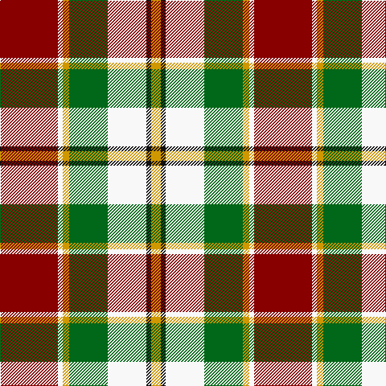

In pattern [RWYGWKY](/stripes/rwygwky/).

This was sourced from register-of-tartans.  It is a [7 stripe tartan](/stripes/stripes7/).

Original link https://www.tartanregister.gov.uk/tartanDetails.aspx?ref=2587

## Attestations

This cloth appears in 2 source records; the oldest owns this page.

- 01/01/2002 — MacLachlan Dress (register-of-tartans, [record](https://www.tartanregister.gov.uk/tartanDetails.aspx?ref=2587))
- pre 2002 — MacLachlan Dress (Dance) (tartans-authority, [record](http://www.tartansauthority.com/tartan-ferret/display/828/))

## Register references

External register numbers recorded for this tartan.

- Scottish Register of Tartans: [2587](https://www.tartanregister.gov.uk/tartanDetails.aspx?ref=2587)
- Scottish Tartans Authority (ITI): 828
- Scottish Tartans World Register: 828

## Thread count
DR/72 W6 DY8 G48 W48 K6 DY/12

## Palette
Each colour and the base-6 reference it is a variant of.

| Colour | Shade | Base |
|---|---|---|
| DR | <code style="background-color:#880000;">#880000</code> `oklch(39.4% 0.162 29.2)` <small>#880000</small> | R <code style="background-color:#CC0000;">#CC0000</code> |
| DY | <code style="background-color:#D09800;">#D09800</code> `oklch(71.4% 0.147 82.1)` <small>#D09800</small> | Y <code style="background-color:#F2BF00;">#F2BF00</code> |
| G | <code style="background-color:#006818;">#006818</code> `oklch(45.0% 0.142 145.0)` <small>#006818</small> | G <code style="background-color:#006100;">#006100</code> |
| K | <code style="background-color:#101010;">#101010</code> `oklch(17.3% 0.000 89.9)` <small>#101010</small> | K <code style="background-color:#000000;">#000000</code> |
| W | <code style="background-color:#F8F8F8;">#F8F8F8</code> `oklch(97.9% 0.000 89.9)` <small>#F8F8F8</small> | W <code style="background-color:#F7F7F7;">#F7F7F7</code> |

# Sample pattern

## Nearest tartans

The nearest existing variants by ΔTartan distance, with this tartan at the top so the swatches line up against it.

ΔTartan

Tartan

Sett

—

<a href="/ttd/edit/#slug=r36w3lo4g24w24k3lo6~x2">MacLachlan Dress</a> <a class="nn-out" href="/setts/s7/r36w3lo4g24w24k3lo6~x2/" title="open its dictionary page">↗</a>

0.46

<a href="/ttd/edit/#slug=r34w3dg4g23w24k3dg4~x2">MacLachlan, dress</a> <a class="nn-out" href="/setts/s7/r34w3dg4g23w24k3dg4~x2/" title="open its dictionary page">↗</a>

0.76

<a href="/ttd/edit/#slug=r34w3g4g23w24k3g4~x2">MacLachlan Dress Clan Tartan Tartan Number: 828. Earliest known date: 1990 Based on the MacLachlan pattern in Old And Rare See products available Copyright © Blair Urquhart, Comrie, 2015</a> <a class="nn-out" href="/setts/s7/r34w3g4g23w24k3g4~x2/" title="open its dictionary page">↗</a>

0.76

<a href="/ttd/edit/#slug=dg20r3y3r15w19dg3t2~x2">Glasgow</a> <a class="nn-out" href="/setts/s7/dg20r3y3r15w19dg3t2~x2/" title="open its dictionary page">↗</a>

0.98

<a href="/ttd/edit/#slug=ly22k11ly10k2g2k2ly10k11ly7r2~x2">Project, Faith Inc (Corporate)</a> <a class="nn-out" href="/setts/s10/ly22k11ly10k2g2k2ly10k11ly7r2~x2/" title="open its dictionary page">↗</a>

1.00

<a href="/ttd/edit/#slug=r2w12t1k12lo12k1~x2">Dutch, dress</a> <a class="nn-out" href="/setts/s6/r2w12t1k12lo12k1~x2/" title="open its dictionary page">↗</a>

1.02

<a href="/ttd/edit/#slug=r1w12g6r8lb3lo1~x4">MacLean Dress (Lumsden)</a> <a class="nn-out" href="/setts/s6/r1w12g6r8lb3lo1~x4/" title="open its dictionary page">↗</a>

1.04

<a href="/ttd/edit/#slug=r2w12y1k12o12k1~x2">Dutch Dress</a> <a class="nn-out" href="/setts/s6/r2w12y1k12o12k1~x2/" title="open its dictionary page">↗</a>

1.10

<a href="/ttd/edit/#slug=do2lo2do15lo1w10lo15lo2lo2~x2">Bannockbane Orange Stripes</a> <a class="nn-out" href="/setts/s8/do2lo2do15lo1w10lo15lo2lo2~x2/" title="open its dictionary page">↗</a>

1.11

<a href="/ttd/edit/#slug=dg2do8dg8r3do1w12dg2y1~x2">National Trust Corporate Tartan Tartan Number: 2117. Earliest known date: pre 1991 Sent in by Tweedmill for information. See products available Copyright © Blair Urquhart, Comrie, 2015</a> <a class="nn-out" href="/setts/s8/dg2do8dg8r3do1w12dg2y1~x2/" title="open its dictionary page">↗</a>

1.12

<a href="/ttd/edit/#slug=r10dg3ly3w1k2w1ly3dg12w2r3w1~x4">Unnamed C18th - Pr Ch Ed Plaid?</a> <a class="nn-out" href="/setts/s11/r10dg3ly3w1k2w1ly3dg12w2r3w1~x4/" title="open its dictionary page">↗</a>

## Neighbour map

Every grey dot is one of 14299 variants placed by the first two principal components of the ΔTartan feature space (44% of its variance). Red is this tartan; blue dots are its nearest — click one to open its page.

<svg viewBox="0 0 640 380" role="img" style="max-width:100%;height:auto;border:1px solid #e0e0e0;border-radius:4px;display:block" xmlns="http://www.w3.org/2000/svg"><image href="/nn/cloud.v1.png" width="640" height="380"/><a href="/setts/s7/r34w3dg4g23w24k3dg4~x2/"><circle cx="148.8" cy="150.9" r="4" fill="#3465a4"><title>MacLachlan, dress</title></circle></a><a href="/setts/s7/r34w3g4g23w24k3g4~x2/"><circle cx="154.6" cy="155.2" r="4" fill="#3465a4"><title>MacLachlan Dress Clan Tartan Tartan Number: 828. Earliest known date: 1990 Based on the MacLachlan pattern in Old And Rare See products available Copyright © Blair Urquhart, Comrie, 2015</title></circle></a><a href="/setts/s7/dg20r3y3r15w19dg3t2~x2/"><circle cx="134.8" cy="157.9" r="4" fill="#3465a4"><title>Glasgow</title></circle></a><a href="/setts/s10/ly22k11ly10k2g2k2ly10k11ly7r2~x2/"><circle cx="128.9" cy="143.4" r="4" fill="#3465a4"><title>Project, Faith Inc (Corporate)</title></circle></a><a href="/setts/s6/r2w12t1k12lo12k1~x2/"><circle cx="121.0" cy="154.0" r="4" fill="#3465a4"><title>Dutch, dress</title></circle></a><a href="/setts/s6/r1w12g6r8lb3lo1~x4/"><circle cx="149.5" cy="158.8" r="4" fill="#3465a4"><title>MacLean Dress (Lumsden)</title></circle></a><a href="/setts/s6/r2w12y1k12o12k1~x2/"><circle cx="132.4" cy="162.1" r="4" fill="#3465a4"><title>Dutch Dress</title></circle></a><a href="/setts/s8/do2lo2do15lo1w10lo15lo2lo2~x2/"><circle cx="185.6" cy="151.1" r="4" fill="#3465a4"><title>Bannockbane Orange Stripes</title></circle></a><a href="/setts/s8/dg2do8dg8r3do1w12dg2y1~x2/"><circle cx="123.0" cy="151.9" r="4" fill="#3465a4"><title>National Trust Corporate Tartan Tartan Number: 2117. Earliest known date: pre 1991 Sent in by Tweedmill for information. See products available Copyright © Blair Urquhart, Comrie, 2015</title></circle></a><a href="/setts/s11/r10dg3ly3w1k2w1ly3dg12w2r3w1~x4/"><circle cx="143.6" cy="124.5" r="4" fill="#3465a4"><title>Unnamed C18th - Pr Ch Ed Plaid?</title></circle></a><circle cx="140.3" cy="146.4" r="5" fill="#c00000"/></svg>

ID: /setts/s7/r36w3lo4g24w24k3lo6~x2/
