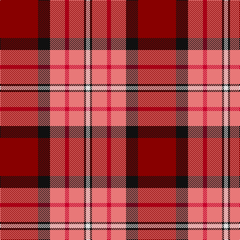

This page is one **sett** — a single exact thread-count. It belongs to the [tartan](/tartans/dr38k12lr15r4lr15k2ln4/)
(the same proportion at any scale), whose colour order is pattern [RKRRRKW](/stripes/rkrrrkw/).

Sourced from tartans-authority.  It is a [7 stripe tartan](/stripes/stripes7/).

Original link http://www.tartansauthority.com/tartan-ferret/display/10305/

## Thread count
DR/76 K24 LR30 R8 LR30 K4 LN/8

## Palette
Each colour and the base-6 reference it is a variant of.

| Colour | Shade | Base |
|---|---|---|
| DR | <code style="background-color:#880000;">#880000</code> `oklch(39.4% 0.162 29.2)` <small>#880000</small> | R <code style="background-color:#CC0000;">#CC0000</code> |
| K | <code style="background-color:#101010;">#101010</code> `oklch(17.3% 0.000 89.9)` <small>#101010</small> | K <code style="background-color:#000000;">#000000</code> |
| LN | <code style="background-color:#E0E0E0;">#E0E0E0</code> `oklch(90.7% 0.000 89.9)` <small>#E0E0E0</small> | W <code style="background-color:#F7F7F7;">#F7F7F7</code> |
| LR | <code style="background-color:#E87878;">#E87878</code> `oklch(70.0% 0.139 21.2)` <small>#E87878</small> | R <code style="background-color:#CC0000;">#CC0000</code> |
| R | <code style="background-color:#C8002C;">#C8002C</code> `oklch(52.6% 0.212 22.0)` <small>#C8002C</small> | R <code style="background-color:#CC0000;">#CC0000</code> |

# Sample pattern

## Nearest tartans

The nearest existing variants by ΔTartan distance, with this tartan at the top so the swatches line up against it.

ΔTartan

Tartan

Sett

—

<a href="/ttd/edit/#slug=r38k12r15r4r15k2w4~x2">Ferguson's Promise (Commemorative)</a> <a class="nn-out" href="/setts/s7/r38k12r15r4r15k2w4~x2/" title="open its dictionary page">↗</a>

0.87

<a href="/ttd/edit/#slug=w15do8m25do72r98ly15">Afternoon Tea / Apple Tea</a> <a class="nn-out" href="/setts/s6/w15do8m25do72r98ly15/" title="open its dictionary page">↗</a>

0.89

<a href="/ttd/edit/#slug=m38k12r15r4r15k2w4~x2">Ferguson's Promise</a> <a class="nn-out" href="/setts/s7/m38k12r15r4r15k2w4~x2/" title="open its dictionary page">↗</a>

1.08

<a href="/ttd/edit/#slug=k4r32db9r6db2r3db2r12lb3">Rose VS</a> <a class="nn-out" href="/setts/s9/k4r32db9r6db2r3db2r12lb3/" title="open its dictionary page">↗</a>

1.16

<a href="/ttd/edit/#slug=k6r20w2r9w3lb2~x2">Thermos Un-named (aretefact)</a> <a class="nn-out" href="/setts/s6/k6r20w2r9w3lb2~x2/" title="open its dictionary page">↗</a>

1.17

<a href="/ttd/edit/#slug=do47r8k22r7w3r24do9r10ly3~x2">Ulster Ancestry</a> <a class="nn-out" href="/setts/s9/do47r8k22r7w3r24do9r10ly3~x2/" title="open its dictionary page">↗</a>

1.20

<a href="/ttd/edit/#slug=r24r5lr7dt2lr4dt14r11dt3r3w4~x2">MIT1951</a> <a class="nn-out" href="/setts/s10/r24r5lr7dt2lr4dt14r11dt3r3w4~x2/" title="open its dictionary page">↗</a>

1.28

<a href="/ttd/edit/#slug=lb5k1r30dp15r8dg30r8dp2">Shaw</a> <a class="nn-out" href="/setts/s8/lb5k1r30dp15r8dg30r8dp2/" title="open its dictionary page">↗</a>

1.29

<a href="/ttd/edit/#slug=g3r4k1r26y14r4dp16w2~x2">MacQueen of Dalmagarry (Clan?)</a> <a class="nn-out" href="/setts/s8/g3r4k1r26y14r4dp16w2~x2/" title="open its dictionary page">↗</a>

1.36

<a href="/ttd/edit/#slug=r96db16dg34dg48r18k6r9">MacDuff</a> <a class="nn-out" href="/setts/s7/r96db16dg34dg48r18k6r9/" title="open its dictionary page">↗</a>

1.37

<a href="/ttd/edit/#slug=r30db12k6dg12ly2dg3w2~x2">Hewitt</a> <a class="nn-out" href="/setts/s7/r30db12k6dg12ly2dg3w2~x2/" title="open its dictionary page">↗</a>

## Neighbour map

Every grey dot is one of 14299 variants placed by the first two principal components of the ΔTartan feature space (44% of its variance). Red is this tartan; blue dots are its nearest — click one to open its page.

<svg viewBox="0 0 640 380" role="img" style="max-width:100%;height:auto;border:1px solid #e0e0e0;border-radius:4px;display:block" xmlns="http://www.w3.org/2000/svg"><image href="/nn/cloud.v1.png" width="640" height="380"/><a href="/setts/s6/w15do8m25do72r98ly15/"><circle cx="221.2" cy="162.3" r="4" fill="#3465a4"><title>Afternoon Tea / Apple Tea</title></circle></a><a href="/setts/s7/m38k12r15r4r15k2w4~x2/"><circle cx="242.4" cy="141.0" r="4" fill="#3465a4"><title>Ferguson's Promise</title></circle></a><a href="/setts/s9/k4r32db9r6db2r3db2r12lb3/"><circle cx="238.5" cy="113.4" r="4" fill="#3465a4"><title>Rose VS</title></circle></a><a href="/setts/s6/k6r20w2r9w3lb2~x2/"><circle cx="226.7" cy="162.2" r="4" fill="#3465a4"><title>Thermos Un-named (aretefact)</title></circle></a><a href="/setts/s9/do47r8k22r7w3r24do9r10ly3~x2/"><circle cx="228.2" cy="142.3" r="4" fill="#3465a4"><title>Ulster Ancestry</title></circle></a><a href="/setts/s10/r24r5lr7dt2lr4dt14r11dt3r3w4~x2/"><circle cx="232.2" cy="143.0" r="4" fill="#3465a4"><title>MIT1951</title></circle></a><a href="/setts/s8/lb5k1r30dp15r8dg30r8dp2/"><circle cx="275.5" cy="129.9" r="4" fill="#3465a4"><title>Shaw</title></circle></a><a href="/setts/s8/g3r4k1r26y14r4dp16w2~x2/"><circle cx="272.1" cy="112.8" r="4" fill="#3465a4"><title>MacQueen of Dalmagarry (Clan?)</title></circle></a><a href="/setts/s7/r96db16dg34dg48r18k6r9/"><circle cx="294.1" cy="155.8" r="4" fill="#3465a4"><title>MacDuff</title></circle></a><a href="/setts/s7/r30db12k6dg12ly2dg3w2~x2/"><circle cx="207.8" cy="131.2" r="4" fill="#3465a4"><title>Hewitt</title></circle></a><circle cx="235.3" cy="139.0" r="5" fill="#c00000"/></svg>

ID: /setts/s7/r38k12r15r4r15k2w4~x2/
