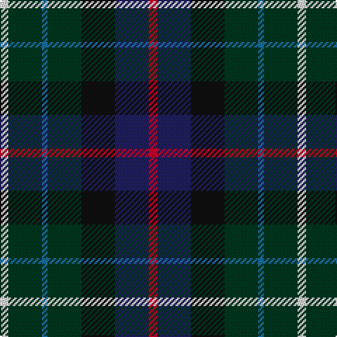

In pattern [RBKGBGW](/patterns/rbkgbgw/).

This was sourced from register-of-tartans.  It is a [7 stripes tartan](/stripes/stripes7/).

Original link https://www.tartanregister.gov.uk/tartanDetails.aspx?ref=1310

## Register references

External register numbers recorded for this tartan.

- Scottish Register of Tartans: [1310](https://www.tartanregister.gov.uk/tartanDetails.aspx?ref=1310)
- Scottish Tartans Authority (ITI): 4081

## Thread count
LN/6 DG24 B4 DG24 K24 DB24 R/6

## Palette
Each colour and its ΔE from the base-6 reference it is a variant of.

| Colour | Shade | Base | ΔE (OKLab) |
|---|---|---|---|
| B | <code style="background-color:#1870A4;">#1870A4</code> `#1870A4` | B <code style="background-color:#2A418A;">#2A418A</code> | 0.13 |
| DB | <code style="background-color:#202060;">#202060</code> `#202060` | B <code style="background-color:#2A418A;">#2A418A</code> | 0.11 |
| DG | <code style="background-color:#003820;">#003820</code> `#003820` | G <code style="background-color:#006100;">#006100</code> | 0.15 |
| K | <code style="background-color:#101010;">#101010</code> `#101010` | K <code style="background-color:#000000;">#000000</code> | 0.17 |
| LN | <code style="background-color:#E0E0E0;">#E0E0E0</code> `#E0E0E0` | W <code style="background-color:#F7F7F7;">#F7F7F7</code> | 0.07 |
| R | <code style="background-color:#C8002C;">#C8002C</code> `#C8002C` | R <code style="background-color:#CC0000;">#CC0000</code> | 0.03 |

# Sample pattern

## Nearest tartans

The nearest existing variants by ΔTartan distance.

1. [Glen Erin Canadian Tartan Tartan Number: 1909. Earliest known date: pre 2003 Many new designs have been given district names to promote their Scottish connections. However, these names should not be confused with the District tartans which have earned their title through 'use and wont' and not a little history. See products available Copyright © Blair Urquhart, Comrie, 2015](/setts/s8/b16g8ba8g8b16r3ga3gb3~b202060-ba2c2c80-g006818-ga604000-gb289c18-rc80000~x2/) — ΔT 1.19
1. [Coulthard (Personal)](/setts/s7/r3g9ga15b10k2b18w3~b202060-g006818-ga5c6428-k101010-rc8002c-we0e0e0~x2/) — ΔT 1.20
1. [Nairn (Edinburgh Woollen Mill)](/setts/s11/r2g10b10k5ba2k5g10k10ba2k10y2~b1c0070-ba3850c8-g006818-k101010-r880000-yd09800~x2/) — ΔT 1.20
1. [Williamson/Smart (Personal)](/setts/s8/b10r3b10ra3k21g20k15ra3~b38409c-g006818-k101010-r888888-rac8002c~x2/) — ΔT 1.21
1. [Royal Navy Submarine Service](/setts/s9/w3b3r2b14k3g12k14b16y2~b141e46-g005448-k101010-r880000-wf0e0c8-yc88c00~x2/) — ΔT 1.22
1. [Forbo Nairn Corporate Tartan Tartan Number: 2298. Earliest known date: pre 2002 Designed for Forbo Nairn Ltd - a Swiss based company with two factories in Kirkcaldy, Fife. Tartan is based on the Nairn (#1331) because of an association with Michael Nairn, builder of the first 'floor cloth' (linoleum) factory in Scotland in 1843.STS said Approved by Sir Robert Spencer Nairn. Blue and red used in this graphic in place of dark blue and red so that sett could be seen. See products available Copyright © Blair Urquhart, Comrie, 2015](/setts/s8/g8k7b12r2b12k7g8ba2~b2c2c80-ba5c8ca8-g006818-k101010-rc80000~x4/) — ΔT 1.24
1. [Gracey (2013)](/setts/s7/r3b8g20k20ba17k3y3~b780078-ba202060-g006818-k101010-rc80050-y48a4c0~x2/) — ΔT 1.25
1. [Parliament Trade Tartan Tartan Number: 2477. Earliest known date: 1998 Created to celebrate the referendum result for the re-establishment of a Scottish Parliament as well as to provide a Parliamentary livery tartan. See products available Copyright © Blair Urquhart, Comrie, 2015](/setts/s7/b8g11k3g11r12ba10y2~b2c2c80-ba003c64-g006818-k101010-r880000-ye8c000~x2/) — ΔT 1.27
1. [MacCallum of Berwick](/setts/s9/b10r7b31k25g23k8b7k8y5~b2c2c80-g285800-k101010-rc80000-ye8c000~x2/) — ΔT 1.31
1. [Nance (1998)](/setts/s10/b2y1b6r1b2r2k2g6ba1g2~b1c0070-ba5c8ca8-g006818-k101010-r880000-yd09800~x4/) — ΔT 1.31

## Neighbour map

Every grey dot is one of 15726 variants placed by the first two principal components of the ΔTartan feature space (44% of its variance). Red is this tartan; blue dots are its nearest — click one to open its page.

<svg viewBox="0 0 640 380" role="img" style="max-width:100%;height:auto;border:1px solid #e0e0e0;border-radius:4px;display:block" xmlns="http://www.w3.org/2000/svg"><image href="/nn/cloud.v1.png" width="640" height="380"/><a href="/setts/s8/b16g8ba8g8b16r3ga3gb3~b202060-ba2c2c80-g006818-ga604000-gb289c18-rc80000~x2/"><circle cx="197.8" cy="231.7" r="4" fill="#3465a4"><title>Glen Erin Canadian Tartan Tartan Number: 1909. Earliest known date: pre 2003 Many new designs have been given district names to promote their Scottish connections. However, these names should not be confused with the District tartans which have earned their title through 'use and wont' and not a little history. See products available Copyright © Blair Urquhart, Comrie, 2015</title></circle></a><a href="/setts/s7/r3g9ga15b10k2b18w3~b202060-g006818-ga5c6428-k101010-rc8002c-we0e0e0~x2/"><circle cx="183.6" cy="197.0" r="4" fill="#3465a4"><title>Coulthard (Personal)</title></circle></a><a href="/setts/s11/r2g10b10k5ba2k5g10k10ba2k10y2~b1c0070-ba3850c8-g006818-k101010-r880000-yd09800~x2/"><circle cx="137.9" cy="214.6" r="4" fill="#3465a4"><title>Nairn (Edinburgh Woollen Mill)</title></circle></a><a href="/setts/s8/b10r3b10ra3k21g20k15ra3~b38409c-g006818-k101010-r888888-rac8002c~x2/"><circle cx="169.9" cy="220.3" r="4" fill="#3465a4"><title>Williamson/Smart (Personal)</title></circle></a><a href="/setts/s9/w3b3r2b14k3g12k14b16y2~b141e46-g005448-k101010-r880000-wf0e0c8-yc88c00~x2/"><circle cx="208.5" cy="197.3" r="4" fill="#3465a4"><title>Royal Navy Submarine Service</title></circle></a><a href="/setts/s8/g8k7b12r2b12k7g8ba2~b2c2c80-ba5c8ca8-g006818-k101010-rc80000~x4/"><circle cx="160.5" cy="252.6" r="4" fill="#3465a4"><title>Forbo Nairn Corporate Tartan Tartan Number: 2298. Earliest known date: pre 2002 Designed for Forbo Nairn Ltd - a Swiss based company with two factories in Kirkcaldy, Fife. Tartan is based on the Nairn (#1331) because of an association with Michael Nairn, builder of the first 'floor cloth' (linoleum) factory in Scotland in 1843.STS said Approved by Sir Robert Spencer Nairn. Blue and red used in this graphic in place of dark blue and red so that sett could be seen. See products available Copyright © Blair Urquhart, Comrie, 2015</title></circle></a><a href="/setts/s7/r3b8g20k20ba17k3y3~b780078-ba202060-g006818-k101010-rc80050-y48a4c0~x2/"><circle cx="108.0" cy="205.9" r="4" fill="#3465a4"><title>Gracey (2013)</title></circle></a><a href="/setts/s7/b8g11k3g11r12ba10y2~b2c2c80-ba003c64-g006818-k101010-r880000-ye8c000~x2/"><circle cx="112.9" cy="240.2" r="4" fill="#3465a4"><title>Parliament Trade Tartan Tartan Number: 2477. Earliest known date: 1998 Created to celebrate the referendum result for the re-establishment of a Scottish Parliament as well as to provide a Parliamentary livery tartan. See products available Copyright © Blair Urquhart, Comrie, 2015</title></circle></a><a href="/setts/s9/b10r7b31k25g23k8b7k8y5~b2c2c80-g285800-k101010-rc80000-ye8c000~x2/"><circle cx="156.5" cy="219.4" r="4" fill="#3465a4"><title>MacCallum of Berwick</title></circle></a><a href="/setts/s10/b2y1b6r1b2r2k2g6ba1g2~b1c0070-ba5c8ca8-g006818-k101010-r880000-yd09800~x4/"><circle cx="131.1" cy="190.7" r="4" fill="#3465a4"><title>Nance (1998)</title></circle></a><circle cx="146.9" cy="230.0" r="5" fill="#c00000"/></svg>

ID: /setts/s7/r3b12k12g12ba2g12w3~b202060-ba1870a4-g003820-k101010-rc8002c-we0e0e0~x2/
