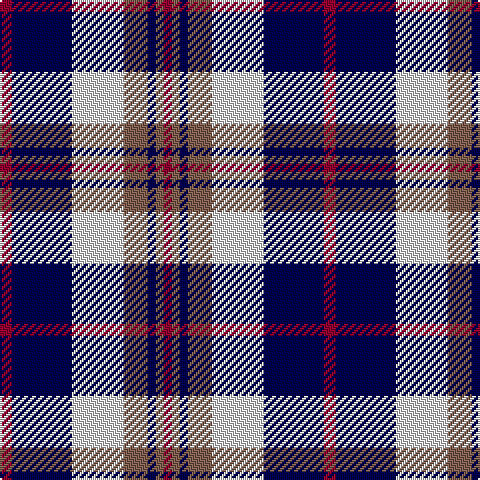

In pattern [RBWRBRR](/patterns/rbwrbrr/).

This was sourced from weddslist.  It is a [7 stripes tartan](/stripes/stripes7/).

Original link http://www.weddslist.com/cgi-bin/tartans/pg.pl?source=sts

## Thread count
DR/6 DB30 LN26 LT12 DB4 LT4 DR/4

## Palette
Each colour and its ΔE from the base-6 reference it is a variant of.

| Colour | Shade | Base | ΔE (OKLab) |
|---|---|---|---|
| DB | <code style="background-color:#000050;">#000050</code> `#000050` | B <code style="background-color:#2A418A;">#2A418A</code> | 0.21 |
| DR | <code style="background-color:#900030;">#900030</code> `#900030` | R <code style="background-color:#CC0000;">#CC0000</code> | 0.14 |
| LN | <code style="background-color:#E0E0E0;">#E0E0E0</code> `#E0E0E0` | W <code style="background-color:#F7F7F7;">#F7F7F7</code> | 0.07 |
| LT | <code style="background-color:#806050;">#806050</code> `#806050` | R <code style="background-color:#CC0000;">#CC0000</code> | 0.17 |

# Sample pattern

## Nearest tartans

The nearest existing variants by ΔTartan distance.

1. [Thompson Navy Trade Tartan Tartan Number: 1443. Earliest known date: Oregon Possibly designed by Councillor John Hannay himself. No other information is available. See products available Copyright © Blair Urquhart, Comrie, 2015](/setts/s7/r3b15w13g6b2g2r2~b202060-g604000-ra00048-we0e0e0~x2/) — ΔT 0.49
1. [Hydro-Electric (Corporate)](/setts/s6/r3k1w5k4b11r1~b2c2c80-k101010-rc80000-wfcfcfc~x4/) — ΔT 0.87
1. [Over Mountain](/setts/s7/r2w1b8w8g8w1g1~b1c0070-g8c7038-r880000-wa8ace8~x2/) — ΔT 1.00
1. [Strathclyde](/setts/s7/k2b16w2ka16w15k2w2~b0060b0-k000000-ka000030-we0e0e0~x2/) — ΔT 1.04
1. [Kile (Red line) (Personal)](/setts/s8/b18w3b3w3r3w3k5y12~b1c0070-k101010-r880000-wfcfcfc-yd8b000~x2/) — ΔT 1.06
1. [Strathclyde](/setts/s7/b4ba2b15w10k15ba2k4~b8080d0-ba304080-k000030-we0e0e0~x2/) — ΔT 1.08
1. [Sibbald Blue (2014)](/setts/s9/g4b22ba6w10b3w6bb4ba3w4~b141e46-ba003c64-bb64008c-g003c14-wfcfcfc~x2/) — ΔT 1.12
1. [Ailsa Craig Trade Tartan Tartan Number: 1673. Earliest known date: 1972 Nothing See products available Copyright © Blair Urquhart, Comrie, 2015](/setts/s8/r5w2b20y2k16w18k2w5~b2c2c80-k101010-rc80000-we0e0e0-ye8c000~x2/) — ΔT 1.12
1. [Kinnaird](/setts/s8/w33k4w4k5w4k7b41r4~b304080-k000000-rc00000-wc0c0c0~x2/) — ΔT 1.12
1. [Laval (Tartan de..), dress](/setts/s8/b2w2b8ba8w10b2w1b1~b000050-ba600030-we0e0e0~x2/) — ΔT 1.14

## Neighbour map

Every grey dot is one of 15726 variants placed by the first two principal components of the ΔTartan feature space (44% of its variance). Red is this tartan; blue dots are its nearest — click one to open its page.

<svg viewBox="0 0 640 380" role="img" style="max-width:100%;height:auto;border:1px solid #e0e0e0;border-radius:4px;display:block" xmlns="http://www.w3.org/2000/svg"><image href="/nn/cloud.v1.png" width="640" height="380"/><a href="/setts/s7/r3b15w13g6b2g2r2~b202060-g604000-ra00048-we0e0e0~x2/"><circle cx="156.9" cy="192.0" r="4" fill="#3465a4"><title>Thompson Navy Trade Tartan Tartan Number: 1443. Earliest known date: Oregon Possibly designed by Councillor John Hannay himself. No other information is available. See products available Copyright © Blair Urquhart, Comrie, 2015</title></circle></a><a href="/setts/s6/r3k1w5k4b11r1~b2c2c80-k101010-rc80000-wfcfcfc~x4/"><circle cx="184.5" cy="188.5" r="4" fill="#3465a4"><title>Hydro-Electric (Corporate)</title></circle></a><a href="/setts/s7/r2w1b8w8g8w1g1~b1c0070-g8c7038-r880000-wa8ace8~x2/"><circle cx="156.1" cy="198.7" r="4" fill="#3465a4"><title>Over Mountain</title></circle></a><a href="/setts/s7/k2b16w2ka16w15k2w2~b0060b0-k000000-ka000030-we0e0e0~x2/"><circle cx="124.9" cy="190.1" r="4" fill="#3465a4"><title>Strathclyde</title></circle></a><a href="/setts/s8/b18w3b3w3r3w3k5y12~b1c0070-k101010-r880000-wfcfcfc-yd8b000~x2/"><circle cx="118.4" cy="174.2" r="4" fill="#3465a4"><title>Kile (Red line) (Personal)</title></circle></a><a href="/setts/s7/b4ba2b15w10k15ba2k4~b8080d0-ba304080-k000030-we0e0e0~x2/"><circle cx="133.7" cy="206.7" r="4" fill="#3465a4"><title>Strathclyde</title></circle></a><a href="/setts/s9/g4b22ba6w10b3w6bb4ba3w4~b141e46-ba003c64-bb64008c-g003c14-wfcfcfc~x2/"><circle cx="119.9" cy="167.0" r="4" fill="#3465a4"><title>Sibbald Blue (2014)</title></circle></a><a href="/setts/s8/r5w2b20y2k16w18k2w5~b2c2c80-k101010-rc80000-we0e0e0-ye8c000~x2/"><circle cx="118.7" cy="156.9" r="4" fill="#3465a4"><title>Ailsa Craig Trade Tartan Tartan Number: 1673. Earliest known date: 1972 Nothing See products available Copyright © Blair Urquhart, Comrie, 2015</title></circle></a><a href="/setts/s8/w33k4w4k5w4k7b41r4~b304080-k000000-rc00000-wc0c0c0~x2/"><circle cx="199.8" cy="160.0" r="4" fill="#3465a4"><title>Kinnaird</title></circle></a><a href="/setts/s8/b2w2b8ba8w10b2w1b1~b000050-ba600030-we0e0e0~x2/"><circle cx="183.7" cy="194.1" r="4" fill="#3465a4"><title>Laval (Tartan de..), dress</title></circle></a><circle cx="148.6" cy="191.9" r="5" fill="#c00000"/></svg>

ID: /setts/s7/r3b15w13ra6b2ra2r2~b000050-r900030-ra806050-we0e0e0~x2/
