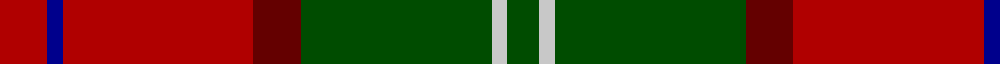

In pattern [GWGRRBR](/patterns/gwgrrbr/).

This was sourced from register-of-tartans.  It is a [7 stripes tartan](/stripes/stripes7/).

Original link https://www.tartanregister.gov.uk/tartanDetails.aspx?ref=2078

## Attestations

This cloth appears in 2 source records; the oldest owns this page.

- 01/01/1988 — Leckie (Personal) (register-of-tartans, [record](https://www.tartanregister.gov.uk/tartanDetails.aspx?ref=2078))
- 1988 — Leckie (Personal) (tartans-authority, [record](http://www.tartansauthority.com/tartan-ferret/display/5405/))

## Thread count
DR/12 DB4 DR48 DRa12 G48 N4 G/8

## Palette
Each colour and its ΔE from the base-6 reference it is a variant of.

| Colour | Shade | Base | ΔE (OKLab) |
|---|---|---|---|
| DB | <code style="background-color:#00008C;">#00008C</code> `#00008C` | B <code style="background-color:#2A418A;">#2A418A</code> | 0.13 |
| DR | <code style="background-color:#B00000;">#B00000</code> `#B00000` | R <code style="background-color:#CC0000;">#CC0000</code> | 0.06 |
| DRa | <code style="background-color:#640000;">#640000</code> `#640000` | R <code style="background-color:#CC0000;">#CC0000</code> | 0.23 |
| G | <code style="background-color:#004C00;">#004C00</code> `#004C00` | G <code style="background-color:#006100;">#006100</code> | 0.07 |
| N | <code style="background-color:#C8C8C8;">#C8C8C8</code> `#C8C8C8` | W <code style="background-color:#F7F7F7;">#F7F7F7</code> | 0.14 |

# Sample pattern

## Nearest tartans

The nearest existing variants by ΔTartan distance.

1. [Spragg, Andrew](/setts/s7/r2g16ra1r2ra12y1ga1x2~g165041-ga547c73-ra62a2a-racc1100-yffe600/) — ΔT 0.98
1. [Wellmont Foundation (Corporate)](/setts/s7/b12w2b13g3ga2r24ga3x2~b14283c-g003820-ga006818-ra40000-wfcfcfc/) — ΔT 1.10
1. [Lennox](/setts/s7/g2y1g10r2ra10r1ra2x4~g006818-r880000-rac80000-yb8b8b8/) — ΔT 1.11
1. [Turnbull Dress](/setts/s5/k2b1g10r10y1x6~b2c2c80-g006818-k101010-rc80000-yd8b000/) — ΔT 1.13
1. [Plummer Family Personal Tartan Tartan Number: 2778. Earliest known date: 2001 From a D C Dalgliesh swatch in 2001 via Phil Smith June 2004. See products available Copyright © Blair Urquhart, Comrie, 2015](/setts/s6/r30k8g30b4r3b2x2~b1860a8-g005028-k101010-rc80000/) — ΔT 1.14
1. [Lennox District Tartan Tartan Number: 935. Earliest known date: pre 1600 Families with the surname 'Lennox' are usually considered related to Clans Stewart or MacFarlane. Some of this surname also choose to wear the distinctive and ancient 'Lennox' tartan. D W Stewart reproduced the sett from a 'lost' portrait of the Countess of Lennox dating from the 16th century. See products available Copyright © Blair Urquhart, Comrie, 2015](/setts/s7/g2w1g10r2ra10r1ra2x2~g006818-r880000-rac80000-we0e0e0/) — ΔT 1.14
1. [Ulster Ancestry (Fashion)](/setts/s9/b47r8k22r7w3r24b9r10y3x2~b5c5c5c-k101010-rc80000-we8ccb8-ybc8c00/) — ΔT 1.17
1. [Bronte](/setts/s5/g24b2r25y2k3x2~b1870a4-g408060-k101010-rc80000-ye8c000/) — ΔT 1.18
1. [MacNab 6](/setts/s7/g28r7ra7g14ra7r48k4x2~g008000-k000000-rc00000-ra802040/) — ΔT 1.19
1. [MacDuff](/setts/s7/r96b16g34ga48r18k6r9~b304080-g003000-ga008000-k000000-rc00000/) — ΔT 1.20

## Neighbour map

Every grey dot is one of 15726 variants placed by the first two principal components of the ΔTartan feature space (44% of its variance). Red is this tartan; blue dots are its nearest — click one to open its page.

<svg viewBox="0 0 640 380" role="img" style="max-width:100%;height:auto;border:1px solid #e0e0e0;border-radius:4px;display:block" xmlns="http://www.w3.org/2000/svg"><image href="/nn/cloud.v1.png" width="640" height="380"/><a href="/setts/s7/r2g16ra1r2ra12y1ga1x2~g165041-ga547c73-ra62a2a-racc1100-yffe600/"><circle cx="301.8" cy="151.9" r="4" fill="#3465a4"><title>Spragg, Andrew</title></circle></a><a href="/setts/s7/b12w2b13g3ga2r24ga3x2~b14283c-g003820-ga006818-ra40000-wfcfcfc/"><circle cx="246.9" cy="178.3" r="4" fill="#3465a4"><title>Wellmont Foundation (Corporate)</title></circle></a><a href="/setts/s7/g2y1g10r2ra10r1ra2x4~g006818-r880000-rac80000-yb8b8b8/"><circle cx="284.5" cy="197.1" r="4" fill="#3465a4"><title>Lennox</title></circle></a><a href="/setts/s5/k2b1g10r10y1x6~b2c2c80-g006818-k101010-rc80000-yd8b000/"><circle cx="234.7" cy="194.4" r="4" fill="#3465a4"><title>Turnbull Dress</title></circle></a><a href="/setts/s6/r30k8g30b4r3b2x2~b1860a8-g005028-k101010-rc80000/"><circle cx="279.4" cy="187.3" r="4" fill="#3465a4"><title>Plummer Family Personal Tartan Tartan Number: 2778. Earliest known date: 2001 From a D C Dalgliesh swatch in 2001 via Phil Smith June 2004. See products available Copyright © Blair Urquhart, Comrie, 2015</title></circle></a><a href="/setts/s7/g2w1g10r2ra10r1ra2x2~g006818-r880000-rac80000-we0e0e0/"><circle cx="276.5" cy="193.8" r="4" fill="#3465a4"><title>Lennox District Tartan Tartan Number: 935. Earliest known date: pre 1600 Families with the surname 'Lennox' are usually considered related to Clans Stewart or MacFarlane. Some of this surname also choose to wear the distinctive and ancient 'Lennox' tartan. D W Stewart reproduced the sett from a 'lost' portrait of the Countess of Lennox dating from the 16th century. See products available Copyright © Blair Urquhart, Comrie, 2015</title></circle></a><a href="/setts/s9/b47r8k22r7w3r24b9r10y3x2~b5c5c5c-k101010-rc80000-we8ccb8-ybc8c00/"><circle cx="253.1" cy="154.0" r="4" fill="#3465a4"><title>Ulster Ancestry (Fashion)</title></circle></a><a href="/setts/s5/g24b2r25y2k3x2~b1870a4-g408060-k101010-rc80000-ye8c000/"><circle cx="283.3" cy="182.5" r="4" fill="#3465a4"><title>Bronte</title></circle></a><a href="/setts/s7/g28r7ra7g14ra7r48k4x2~g008000-k000000-rc00000-ra802040/"><circle cx="288.8" cy="188.0" r="4" fill="#3465a4"><title>MacNab 6</title></circle></a><a href="/setts/s7/r96b16g34ga48r18k6r9~b304080-g003000-ga008000-k000000-rc00000/"><circle cx="293.2" cy="160.8" r="4" fill="#3465a4"><title>MacDuff</title></circle></a><circle cx="274.1" cy="179.0" r="5" fill="#c00000"/></svg>

ID: /setts/s7/r3b1r12ra3g12w1g2x4~b00008c-g004c00-rb00000-ra640000-wc8c8c8/
