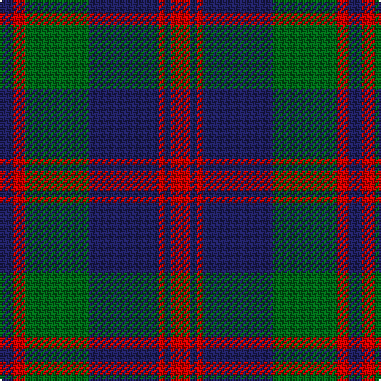

In pattern [BRGBRBR](/patterns/brgbrbr/).

This was sourced from register-of-tartans.  It is a [7 stripes tartan](/stripes/stripes7/).

Original link https://www.tartanregister.gov.uk/tartanDetails.aspx?ref=3536

## Attestations

This cloth appears in 2 source records; the oldest owns this page.

- 01/01/1816 — Robertson of Struan 1816 (register-of-tartans, [record](https://www.tartanregister.gov.uk/tartanDetails.aspx?ref=3536))
- 1816 — Robertson of Struan - 1816 (Clan) (tartans-authority, [record](http://www.tartansauthority.com/tartan-ferret/display/530/))

## Thread count
DB/8 R8 G40 DB44 R4 DB4 R/12

## Palette
Each colour and its ΔE from the base-6 reference it is a variant of.

| Colour | Shade | Base | ΔE (OKLab) |
|---|---|---|---|
| DB | <code style="background-color:#202060;">#202060</code> `#202060` | B <code style="background-color:#2A418A;">#2A418A</code> | 0.11 |
| DG | <code style="background-color:#003820;">#003820</code> `#003820` | G <code style="background-color:#006100;">#006100</code> | 0.15 |
| G | <code style="background-color:#006818;">#006818</code> `#006818` | G <code style="background-color:#006100;">#006100</code> | 0.02 |
| R | <code style="background-color:#C80000;">#C80000</code> `#C80000` | R <code style="background-color:#CC0000;">#CC0000</code> | 0.01 |

# Sample pattern

## Nearest tartans

The nearest existing variants by ΔTartan distance.

1. [Logan #5](/setts/s6/b9r3b1g9r3b1~b2c2c80-g006818-rc80000~x2/) — ΔT 0.82
1. [Robertson of Struan](/setts/s7/r6b2r2b21g20r4g4~b2c4084-g005020-rdc0000~x2/) — ΔT 0.84
1. [Logan](/setts/s7/b8r3b1r3g14r3b1~b2c4084-g005020-rdc0000~x4/) — ΔT 0.87
1. [Brown, Barnaby (Personal)](/setts/s9/g2r1g8b2g1b2g1b10r2~b202060-g006818-rc8002c~x4/) — ΔT 0.98
1. [Fibonacci7](/setts/s7/b13g8r5b3g2r1y1~b141e46-g004c00-rb03000-yffe600~x4/) — ΔT 1.05
1. [Bannockbane Brown #2](/setts/s7/b3g2b30g19y14g2y3~b202060-g808080-ya08858~x2/) — ΔT 1.06
1. [Remony (Red)](/setts/s8/r17b2r2b13r2b2g17b2~b1c0070-g006818-r880000~x2/) — ΔT 1.07
1. [Pride of the Forth](/setts/s6/k3b23k3b3k20y3~b5c5c5c-k101010-y48a4c0~x2/) — ΔT 1.09
1. [Brown, Barnaby (Personal)](/setts/s9/g2r1g8b2g1b2g1b10r2~b2c2c80-g006818-rc80000~x4/) — ΔT 1.11
1. [Scottish National Party (Corporate)](/setts/s6/k3b31k3b3k27y3~b5c5c5c-k101010-ye8c000~x2/) — ΔT 1.11

## Neighbour map

Every grey dot is one of 15726 variants placed by the first two principal components of the ΔTartan feature space (44% of its variance). Red is this tartan; blue dots are its nearest — click one to open its page.

<svg viewBox="0 0 640 380" role="img" style="max-width:100%;height:auto;border:1px solid #e0e0e0;border-radius:4px;display:block" xmlns="http://www.w3.org/2000/svg"><image href="/nn/cloud.v1.png" width="640" height="380"/><a href="/setts/s6/b9r3b1g9r3b1~b2c2c80-g006818-rc80000~x2/"><circle cx="258.5" cy="241.2" r="4" fill="#3465a4"><title>Logan #5</title></circle></a><a href="/setts/s7/r6b2r2b21g20r4g4~b2c4084-g005020-rdc0000~x2/"><circle cx="282.4" cy="225.2" r="4" fill="#3465a4"><title>Robertson of Struan</title></circle></a><a href="/setts/s7/b8r3b1r3g14r3b1~b2c4084-g005020-rdc0000~x4/"><circle cx="287.1" cy="207.8" r="4" fill="#3465a4"><title>Logan</title></circle></a><a href="/setts/s9/g2r1g8b2g1b2g1b10r2~b202060-g006818-rc8002c~x4/"><circle cx="316.8" cy="216.6" r="4" fill="#3465a4"><title>Brown, Barnaby (Personal)</title></circle></a><a href="/setts/s7/b13g8r5b3g2r1y1~b141e46-g004c00-rb03000-yffe600~x4/"><circle cx="281.4" cy="204.8" r="4" fill="#3465a4"><title>Fibonacci7</title></circle></a><a href="/setts/s7/b3g2b30g19y14g2y3~b202060-g808080-ya08858~x2/"><circle cx="295.8" cy="200.2" r="4" fill="#3465a4"><title>Bannockbane Brown #2</title></circle></a><a href="/setts/s8/r17b2r2b13r2b2g17b2~b1c0070-g006818-r880000~x2/"><circle cx="245.9" cy="219.7" r="4" fill="#3465a4"><title>Remony (Red)</title></circle></a><a href="/setts/s6/k3b23k3b3k20y3~b5c5c5c-k101010-y48a4c0~x2/"><circle cx="322.9" cy="244.6" r="4" fill="#3465a4"><title>Pride of the Forth</title></circle></a><a href="/setts/s9/g2r1g8b2g1b2g1b10r2~b2c2c80-g006818-rc80000~x4/"><circle cx="319.7" cy="216.9" r="4" fill="#3465a4"><title>Brown, Barnaby (Personal)</title></circle></a><a href="/setts/s6/k3b31k3b3k27y3~b5c5c5c-k101010-ye8c000~x2/"><circle cx="339.5" cy="223.0" r="4" fill="#3465a4"><title>Scottish National Party (Corporate)</title></circle></a><circle cx="293.1" cy="218.1" r="5" fill="#c00000"/></svg>

ID: /setts/s7/r3b1r1b11g10r2b2~b202060-g006818-rc80000~x4/
