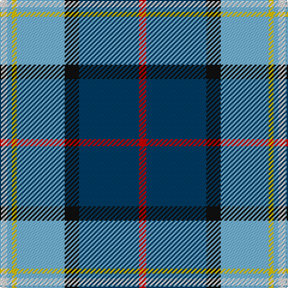

In pattern [RBKWYWW](/patterns/rbkwyww/).

This was sourced from tartans-authority.  It is a [7 stripes tartan](/stripes/stripes7/).

Original link http://www.tartansauthority.com/tartan-ferret/display/7757/

## Attestations

This cloth appears in 2 source records; the oldest owns this page.

- September 2008 — Madras College (Corporate) (tartans-authority, [record](http://www.tartansauthority.com/tartan-ferret/display/7757/))
- undated — Madras College (register-of-tartans, [record](https://www.tartanregister.gov.uk/tartanDetails.aspx?ref=5737))

## Register references

External register numbers recorded for this tartan.

- Scottish Register of Tartans: [5737](https://www.tartanregister.gov.uk/tartanDetails.aspx?ref=5737)
- Scottish Tartans Authority (ITI): 7757
- Scottish Tartans World Register: 3259

## Thread count
LN/6 LB4 Y4 LB40 K12 DB50 R/6

## Palette
Each colour and its ΔE from the base-6 reference it is a variant of.

| Colour | Shade | Base | ΔE (OKLab) |
|---|---|---|---|
| DB | <code style="background-color:#003C64;">#003C64</code> `#003C64` | B <code style="background-color:#2A418A;">#2A418A</code> | 0.08 |
| K | <code style="background-color:#101010;">#101010</code> `#101010` | K <code style="background-color:#000000;">#000000</code> | 0.17 |
| LB | <code style="background-color:#74B4E0;">#74B4E0</code> `#74B4E0` | W <code style="background-color:#F7F7F7;">#F7F7F7</code> | 0.25 |
| LN | <code style="background-color:#E0E0E0;">#E0E0E0</code> `#E0E0E0` | W <code style="background-color:#F7F7F7;">#F7F7F7</code> | 0.07 |
| R | <code style="background-color:#C80000;">#C80000</code> `#C80000` | R <code style="background-color:#CC0000;">#CC0000</code> | 0.01 |
| Y | <code style="background-color:#E8C000;">#E8C000</code> `#E8C000` | Y <code style="background-color:#F2BF00;">#F2BF00</code> | 0.02 |

# Sample pattern

## Nearest tartans

The nearest existing variants by ΔTartan distance.

1. [Hodgkinson](/setts/s8/b5y5ba12g1ba1r1ba1w2~b5c8ca8-ba2c2c80-g006818-rc80000-we0e0e0-ye8c000~x4/) — ΔT 0.95
1. [Yorkshire C.C.C. Corporate Tartan Tartan Number: 670. Earliest known date: 1983 Nothing See products available Copyright © Blair Urquhart, Comrie, 2015](/setts/s8/b5y5ba12g1ba1r1ba1w2~b5c8ca8-ba2c2c80-g006818-rc80000-we0e0e0-ye8c000~x2/) — ΔT 0.95
1. [Curd (2013)](/setts/s8/b1ba9w3y3b9y1g1r1~b202060-ba2888c4-g006818-rc80000-wfcfcfc-ye8c000~x4/) — ΔT 0.97
1. [Dignan School of Dancing](/setts/s7/y4r2b32k10ba4w21ba2~b2474e8-ba6c0070-k101010-r880000-wc0c0c0-yd09800~x2/) — ΔT 0.98
1. [Loch Ness (Fashion)](/setts/s7/r2b2r2b21y11k17w2~b5c8ca8-k00002c-rc80000-w98c8e8-y48a4c0~x2/) — ΔT 1.01
1. [Yorkshire, C.C.C.](/setts/s8/b5y5ba12g1ba1r1ba1w2~b5480b0-ba304080-g008000-rc00000-we0e0e0-yf0c000~x2/) — ΔT 1.03
1. [Arran (Pendleton)](/setts/s8/b12k1b1k1b1ba8w9g2~b3c82af-ba080848-g808080-k101010-we0e0e0~x4/) — ΔT 1.03
1. [Unidentified (Woven sample)](/setts/s8/k16w6k4b64r19k8g42y6~b3850c8-g006818-k101010-r981c70-wf8f8f8-ye8c000/) — ΔT 1.03
1. [Minnesota Dress](/setts/s9/b4k2w3k2ba30g9k4w20y3~b780078-ba2c2c80-g289c18-k101010-we0e0e0-ye8c000~x2/) — ΔT 1.03
1. [Fulbright Foundation](/setts/s8/r3y25b6ba3r2bb5ba18w3~b1c1c50-ba1c0070-bb507c94-rc8002c-we0e0e0-ya0a0a0~x2/) — ΔT 1.08

## Neighbour map

Every grey dot is one of 15726 variants placed by the first two principal components of the ΔTartan feature space (44% of its variance). Red is this tartan; blue dots are its nearest — click one to open its page.

<svg viewBox="0 0 640 380" role="img" style="max-width:100%;height:auto;border:1px solid #e0e0e0;border-radius:4px;display:block" xmlns="http://www.w3.org/2000/svg"><image href="/nn/cloud.v1.png" width="640" height="380"/><a href="/setts/s8/b5y5ba12g1ba1r1ba1w2~b5c8ca8-ba2c2c80-g006818-rc80000-we0e0e0-ye8c000~x4/"><circle cx="200.3" cy="132.2" r="4" fill="#3465a4"><title>Hodgkinson</title></circle></a><a href="/setts/s8/b5y5ba12g1ba1r1ba1w2~b5c8ca8-ba2c2c80-g006818-rc80000-we0e0e0-ye8c000~x2/"><circle cx="200.3" cy="132.2" r="4" fill="#3465a4"><title>Yorkshire C.C.C. Corporate Tartan Tartan Number: 670. Earliest known date: 1983 Nothing See products available Copyright © Blair Urquhart, Comrie, 2015</title></circle></a><a href="/setts/s8/b1ba9w3y3b9y1g1r1~b202060-ba2888c4-g006818-rc80000-wfcfcfc-ye8c000~x4/"><circle cx="105.7" cy="143.1" r="4" fill="#3465a4"><title>Curd (2013)</title></circle></a><a href="/setts/s7/y4r2b32k10ba4w21ba2~b2474e8-ba6c0070-k101010-r880000-wc0c0c0-yd09800~x2/"><circle cx="175.0" cy="127.8" r="4" fill="#3465a4"><title>Dignan School of Dancing</title></circle></a><a href="/setts/s7/r2b2r2b21y11k17w2~b5c8ca8-k00002c-rc80000-w98c8e8-y48a4c0~x2/"><circle cx="165.8" cy="169.7" r="4" fill="#3465a4"><title>Loch Ness (Fashion)</title></circle></a><a href="/setts/s8/b5y5ba12g1ba1r1ba1w2~b5480b0-ba304080-g008000-rc00000-we0e0e0-yf0c000~x2/"><circle cx="208.0" cy="134.8" r="4" fill="#3465a4"><title>Yorkshire, C.C.C.</title></circle></a><a href="/setts/s8/b12k1b1k1b1ba8w9g2~b3c82af-ba080848-g808080-k101010-we0e0e0~x4/"><circle cx="154.7" cy="148.3" r="4" fill="#3465a4"><title>Arran (Pendleton)</title></circle></a><a href="/setts/s8/k16w6k4b64r19k8g42y6~b3850c8-g006818-k101010-r981c70-wf8f8f8-ye8c000/"><circle cx="158.3" cy="132.7" r="4" fill="#3465a4"><title>Unidentified (Woven sample)</title></circle></a><a href="/setts/s9/b4k2w3k2ba30g9k4w20y3~b780078-ba2c2c80-g289c18-k101010-we0e0e0-ye8c000~x2/"><circle cx="139.3" cy="106.4" r="4" fill="#3465a4"><title>Minnesota Dress</title></circle></a><a href="/setts/s8/r3y25b6ba3r2bb5ba18w3~b1c1c50-ba1c0070-bb507c94-rc8002c-we0e0e0-ya0a0a0~x2/"><circle cx="150.1" cy="132.5" r="4" fill="#3465a4"><title>Fulbright Foundation</title></circle></a><circle cx="168.4" cy="139.3" r="5" fill="#c00000"/></svg>

ID: /setts/s7/r3b25k6w20y2w2wa3~b003c64-k101010-rc80000-w74b4e0-wae0e0e0-ye8c000~x2/
