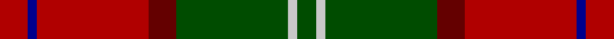

**Bands:** [RBRRGWG](/stripes/rbrrgwg/) · **Stripes:** [R DB R O DG LB DG](/stripes/stripes7/) R DB R O DG LB DG

This was sourced from register-of-tartans.  It is a [7 band tartan](/bands/bands7/).

Original link https://www.tartanregister.gov.uk/tartanDetails.aspx?ref=2078

## Attestations

This cloth appears in 2 source records; the oldest owns this page.

- 01/01/1988 — Leckie (Personal) (register-of-tartans, [record](https://www.tartanregister.gov.uk/tartanDetails.aspx?ref=2078))
- 1988 — Leckie (Personal) (tartans-authority, [record](http://www.tartansauthority.com/tartan-ferret/display/5405/))

## Register references

External register numbers recorded for this tartan.

- Scottish Register of Tartans: [2078](https://www.tartanregister.gov.uk/tartanDetails.aspx?ref=2078)
- Scottish Tartans Authority (ITI): 5405

## Thread count
DR/12 DB4 DR48 DRa12 G48 N4 G/8

## Palette
Each colour and its ΔE from the base-6 reference it is a variant of.

| Colour | Shade | Base | ΔE (OKLab) |
|---|---|---|---|
| DB | <code style="background-color:#00008C;">#00008C</code> `#00008C` | B <code style="background-color:#2A418A;">#2A418A</code> | 0.13 |
| DR | <code style="background-color:#B00000;">#B00000</code> `#B00000` | R <code style="background-color:#CC0000;">#CC0000</code> | 0.06 |
| DRa | <code style="background-color:#640000;">#640000</code> `#640000` | R <code style="background-color:#CC0000;">#CC0000</code> | 0.23 |
| G | <code style="background-color:#004C00;">#004C00</code> `#004C00` | G <code style="background-color:#006100;">#006100</code> | 0.07 |
| N | <code style="background-color:#C8C8C8;">#C8C8C8</code> `#C8C8C8` | W <code style="background-color:#F7F7F7;">#F7F7F7</code> | 0.14 |

# Sample pattern

## Nearest tartans

The nearest existing variants by ΔTartan distance.

1. [Spragg, Andrew](/setts/s7/r2dg16r1r2r12ly1y1~x2/) — ΔT 0.99
1. [Wellmont Foundation (Corporate)](/setts/s7/dt12w2dt13dg3g2r24g3~x2/) — ΔT 1.10
1. [Lennox](/setts/s7/r2r1r10r2g10lr1g2~x4/) — ΔT 1.11
1. [Turnbull Dress](/setts/s5/k2db1g10r10ly1~x6/) — ΔT 1.13
1. [Plummer Family Personal Tartan Tartan Number: 2778. Earliest known date: 2001 From a D C Dalgliesh swatch in 2001 via Phil Smith June 2004. See products available Copyright © Blair Urquhart, Comrie, 2015](/setts/s6/r30k8dg30b4r3b2~x2/) — ΔT 1.14
1. [Ulster Ancestry (Fashion)](/setts/s9/n47r8k22r7lb3r24n9r10lo3~x2/) — ΔT 1.17
1. [Bronte](/setts/s5/g24b2r25ly2k3~x2/) — ΔT 1.18
1. [MacNab 6](/setts/s7/g28r7m7g14m7r48k4~x2/) — ΔT 1.19
1. [MacDuff](/setts/s7/r96db16dg34g48r18k6r9/) — ΔT 1.20
1. [Craik of Assington (Personal)](/setts/s8/db4r11db1g8r2g4k1lo2~x4/) — ΔT 1.20

## Neighbour map

Every grey dot is one of 14299 variants placed by the first two principal components of the ΔTartan feature space (44% of its variance). Red is this tartan; blue dots are its nearest — click one to open its page.

<svg viewBox="0 0 640 380" role="img" style="max-width:100%;height:auto;border:1px solid #e0e0e0;border-radius:4px;display:block" xmlns="http://www.w3.org/2000/svg"><image href="/nn/cloud.v1.png" width="640" height="380"/><a href="/setts/s7/r2dg16r1r2r12ly1y1~x2/"><circle cx="302.5" cy="154.1" r="4" fill="#3465a4"><title>Spragg, Andrew</title></circle></a><a href="/setts/s7/dt12w2dt13dg3g2r24g3~x2/"><circle cx="248.5" cy="179.7" r="4" fill="#3465a4"><title>Wellmont Foundation (Corporate)</title></circle></a><a href="/setts/s7/r2r1r10r2g10lr1g2~x4/"><circle cx="285.0" cy="198.1" r="4" fill="#3465a4"><title>Lennox</title></circle></a><a href="/setts/s5/k2db1g10r10ly1~x6/"><circle cx="235.9" cy="194.0" r="4" fill="#3465a4"><title>Turnbull Dress</title></circle></a><a href="/setts/s6/r30k8dg30b4r3b2~x2/"><circle cx="280.6" cy="187.6" r="4" fill="#3465a4"><title>Plummer Family Personal Tartan Tartan Number: 2778. Earliest known date: 2001 From a D C Dalgliesh swatch in 2001 via Phil Smith June 2004. See products available Copyright © Blair Urquhart, Comrie, 2015</title></circle></a><a href="/setts/s9/n47r8k22r7lb3r24n9r10lo3~x2/"><circle cx="253.9" cy="155.7" r="4" fill="#3465a4"><title>Ulster Ancestry (Fashion)</title></circle></a><a href="/setts/s5/g24b2r25ly2k3~x2/"><circle cx="284.0" cy="182.7" r="4" fill="#3465a4"><title>Bronte</title></circle></a><a href="/setts/s7/g28r7m7g14m7r48k4~x2/"><circle cx="289.3" cy="186.9" r="4" fill="#3465a4"><title>MacNab 6</title></circle></a><a href="/setts/s7/r96db16dg34g48r18k6r9/"><circle cx="293.7" cy="159.4" r="4" fill="#3465a4"><title>MacDuff</title></circle></a><a href="/setts/s8/db4r11db1g8r2g4k1lo2~x4/"><circle cx="209.3" cy="186.8" r="4" fill="#3465a4"><title>Craik of Assington (Personal)</title></circle></a><circle cx="275.0" cy="180.8" r="5" fill="#c00000"/></svg>

ID: /setts/s7/r3db1r12o3dg12lb1dg2~x4/
