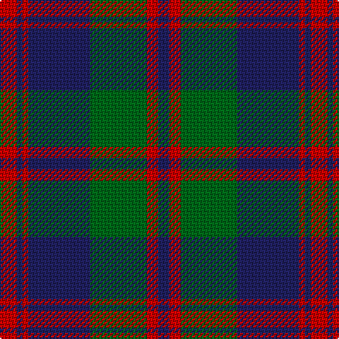

This page is one **sett** — a single exact thread-count. It belongs to the [tartan](/tartans/r3db1r1db11g10r2db2/)
(the same proportion at any scale), whose colour order is pattern [BRGBRBR](/stripes/brgbrbr/).

Sourced from register-of-tartans.  It is a [7 stripe tartan](/stripes/stripes7/).

Original link https://www.tartanregister.gov.uk/tartanDetails.aspx?ref=3536

## Also known as

This cloth is also recorded under:

- Robertson of Struan 1816

2 attestations — the source records this cloth was collapsed from (oldest owns this page)

<ul>
<li>01/01/1816 — Robertson of Struan 1816 (register-of-tartans, <a href="https://www.tartanregister.gov.uk/tartanDetails.aspx?ref=3536">record</a>)</li>
<li>1816 — Robertson of Struan - 1816 (Clan) (tartans-authority, <a href="http://www.tartansauthority.com/tartan-ferret/display/530/">record</a>)</li>
</ul>

## Register references

External register numbers recorded for this tartan.

- Scottish Register of Tartans: [3536](https://www.tartanregister.gov.uk/tartanDetails.aspx?ref=3536)
- Scottish Tartans Authority (ITI): 530
- Scottish Tartans World Register: 530

## Thread count
R/12 DB4 R4 DB44 G40 R8 DB/8

## Palette
Each colour and the base-6 reference it is a variant of.

| Colour | Shade | Base |
|---|---|---|
| DB | <code style="background-color:#202060;">#202060</code> `oklch(28.9% 0.111 276.9)` <small>#202060</small> | B <code style="background-color:#2A418A;">#2A418A</code> |
| DG | <code style="background-color:#003820;">#003820</code> `oklch(30.0% 0.070 158.3)` <small>#003820</small> | G <code style="background-color:#006100;">#006100</code> |
| G | <code style="background-color:#006818;">#006818</code> `oklch(45.0% 0.142 145.0)` <small>#006818</small> | G <code style="background-color:#006100;">#006100</code> |
| R | <code style="background-color:#C80000;">#C80000</code> `oklch(52.3% 0.215 29.2)` <small>#C80000</small> | R <code style="background-color:#CC0000;">#CC0000</code> |

# Sample pattern

## Nearest tartans

The nearest existing variants by ΔTartan distance, with this tartan at the top so the swatches line up against it.

ΔTartan

Tartan

Sett

—

<a href="/ttd/edit/#slug=r3db1r1db11g10r2db2~x4">Robertson of Struan 1816</a> <a class="nn-out" href="/setts/s7/r3db1r1db11g10r2db2~x4/" title="open its dictionary page">↗</a>

0.82

<a href="/ttd/edit/#slug=db9r3db1g9r3db1~x2">Logan #5</a> <a class="nn-out" href="/setts/s6/db9r3db1g9r3db1~x2/" title="open its dictionary page">↗</a>

0.83

<a href="/ttd/edit/#slug=r6db2r2db21dg20r4dg4~x2">Robertson of Struan</a> <a class="nn-out" href="/setts/s7/r6db2r2db21dg20r4dg4~x2/" title="open its dictionary page">↗</a>

0.87

<a href="/ttd/edit/#slug=db8r3db1r3dg14r3db1~x4">Logan</a> <a class="nn-out" href="/setts/s7/db8r3db1r3dg14r3db1~x4/" title="open its dictionary page">↗</a>

0.98

<a href="/ttd/edit/#slug=r2db10g1db2g1db2g8r1g2~x4">Brown, Barnaby (Personal)</a> <a class="nn-out" href="/setts/s9/r2db10g1db2g1db2g8r1g2~x4/" title="open its dictionary page">↗</a>

1.06

<a href="/ttd/edit/#slug=db13dg8r5db3dg2r1ly1~x4">Fibonacci7</a> <a class="nn-out" href="/setts/s7/db13dg8r5db3dg2r1ly1~x4/" title="open its dictionary page">↗</a>

1.06

<a href="/ttd/edit/#slug=db3y2db30y19lo14y2lo3~x2">Bannockbane Brown #2</a> <a class="nn-out" href="/setts/s7/db3y2db30y19lo14y2lo3~x2/" title="open its dictionary page">↗</a>

1.07

<a href="/ttd/edit/#slug=r17db2r2db13r2db2g17db2~x2">Remony (Red)</a> <a class="nn-out" href="/setts/s8/r17db2r2db13r2db2g17db2~x2/" title="open its dictionary page">↗</a>

1.09

<a href="/ttd/edit/#slug=k3n23k3n3k20lg3~x2">Pride of the Forth</a> <a class="nn-out" href="/setts/s6/k3n23k3n3k20lg3~x2/" title="open its dictionary page">↗</a>

1.10

<a href="/ttd/edit/#slug=k3n31k3n3k27ly3~x2">Scottish National Party (Corporate)</a> <a class="nn-out" href="/setts/s6/k3n31k3n3k27ly3~x2/" title="open its dictionary page">↗</a>

1.13

<a href="/ttd/edit/#slug=r6db2r2db21g20r4g4~x2">Robertson of Struan</a> <a class="nn-out" href="/setts/s7/r6db2r2db21g20r4g4~x2/" title="open its dictionary page">↗</a>

## Neighbour map

Every grey dot is one of 14299 variants placed by the first two principal components of the ΔTartan feature space (44% of its variance). Red is this tartan; blue dots are its nearest — click one to open its page.

<svg viewBox="0 0 640 380" role="img" style="max-width:100%;height:auto;border:1px solid #e0e0e0;border-radius:4px;display:block" xmlns="http://www.w3.org/2000/svg"><image href="/nn/cloud.v1.png" width="640" height="380"/><a href="/setts/s6/db9r3db1g9r3db1~x2/"><circle cx="260.7" cy="242.6" r="4" fill="#3465a4"><title>Logan #5</title></circle></a><a href="/setts/s7/r6db2r2db21dg20r4dg4~x2/"><circle cx="284.7" cy="228.7" r="4" fill="#3465a4"><title>Robertson of Struan</title></circle></a><a href="/setts/s7/db8r3db1r3dg14r3db1~x4/"><circle cx="289.0" cy="209.7" r="4" fill="#3465a4"><title>Logan</title></circle></a><a href="/setts/s9/r2db10g1db2g1db2g8r1g2~x4/"><circle cx="319.5" cy="219.3" r="4" fill="#3465a4"><title>Brown, Barnaby (Personal)</title></circle></a><a href="/setts/s7/db13dg8r5db3dg2r1ly1~x4/"><circle cx="283.8" cy="207.2" r="4" fill="#3465a4"><title>Fibonacci7</title></circle></a><a href="/setts/s7/db3y2db30y19lo14y2lo3~x2/"><circle cx="298.1" cy="201.7" r="4" fill="#3465a4"><title>Bannockbane Brown #2</title></circle></a><a href="/setts/s8/r17db2r2db13r2db2g17db2~x2/"><circle cx="248.3" cy="222.1" r="4" fill="#3465a4"><title>Remony (Red)</title></circle></a><a href="/setts/s6/k3n23k3n3k20lg3~x2/"><circle cx="325.4" cy="245.6" r="4" fill="#3465a4"><title>Pride of the Forth</title></circle></a><a href="/setts/s6/k3n31k3n3k27ly3~x2/"><circle cx="341.9" cy="222.5" r="4" fill="#3465a4"><title>Scottish National Party (Corporate)</title></circle></a><a href="/setts/s7/r6db2r2db21g20r4g4~x2/"><circle cx="269.3" cy="221.4" r="4" fill="#3465a4"><title>Robertson of Struan</title></circle></a><circle cx="295.5" cy="219.2" r="5" fill="#c00000"/></svg>

ID: /setts/s7/r3db1r1db11g10r2db2~x4/
