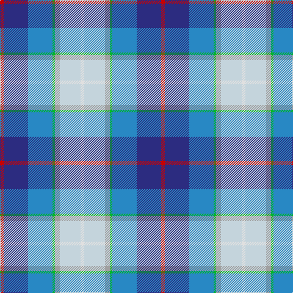

This page is one **sett** — a single exact thread-count. It belongs to the [tartan](/tartans/r3db20b20g2na4n17ln3/)
(the same proportion at any scale), whose colour order is pattern [RBBYYWW](/stripes/rbbyyww/).

Sourced from tartans-authority.  It is a [7 stripe tartan](/stripes/stripes7/).

Original link http://www.tartansauthority.com/tartan-ferret/display/10261/

## Thread count
R/6 DB40 B40 G4 Na8 N34 LN/6

## Palette
Each colour and the base-6 reference it is a variant of.

| Colour | Shade | Base |
|---|---|---|
| B | <code style="background-color:#2888C4;">#2888C4</code> `oklch(60.1% 0.125 241.5)` <small>#2888C4</small> | B <code style="background-color:#2A418A;">#2A418A</code> |
| DB | <code style="background-color:#2C2C80;">#2C2C80</code> `oklch(35.0% 0.138 276.6)` <small>#2C2C80</small> | B <code style="background-color:#2A418A;">#2A418A</code> |
| G | <code style="background-color:#00B828;">#00B828</code> `oklch(67.9% 0.219 144.1)` <small>#00B828</small> | Y <code style="background-color:#F2BF00;">#F2BF00</code> |
| LN | <code style="background-color:#E0E0E0;">#E0E0E0</code> `oklch(90.7% 0.000 89.9)` <small>#E0E0E0</small> | W <code style="background-color:#F7F7F7;">#F7F7F7</code> |
| N | <code style="background-color:#C4D4DC;">#C4D4DC</code> `oklch(86.0% 0.021 229.1)` <small>#C4D4DC</small> | W <code style="background-color:#F7F7F7;">#F7F7F7</code> |
| Na | <code style="background-color:#A0A0A0;">#A0A0A0</code> `oklch(70.6% 0.000 89.9)` <small>#A0A0A0</small> | Y <code style="background-color:#F2BF00;">#F2BF00</code> |
| R | <code style="background-color:#C80000;">#C80000</code> `oklch(52.3% 0.215 29.2)` <small>#C80000</small> | R <code style="background-color:#CC0000;">#CC0000</code> |

# Sample pattern

## Nearest tartans

The nearest existing variants by ΔTartan distance, with this tartan at the top so the swatches line up against it.

ΔTartan

Tartan

Sett

—

<a href="/ttd/edit/#slug=r3db20t20lg2lr4lb17w3~x2">Silversea (Corporate)</a> <a class="nn-out" href="/setts/s7/r3db20t20lg2lr4lb17w3~x2/" title="open its dictionary page">↗</a>

1.13

<a href="/ttd/edit/#slug=r3dt20dt20g2lr4lr17w3~x2">Silversea</a> <a class="nn-out" href="/setts/s7/r3dt20dt20g2lr4lr17w3~x2/" title="open its dictionary page">↗</a>

1.24

<a href="/ttd/edit/#slug=dp2w12b11t12k1g2~x4">Isle of Barra (District)</a> <a class="nn-out" href="/setts/s6/dp2w12b11t12k1g2~x4/" title="open its dictionary page">↗</a>

1.40

<a href="/ttd/edit/#slug=p2g6r1y1db3b10w1~x2">Manx National</a> <a class="nn-out" href="/setts/s7/p2g6r1y1db3b10w1~x2/" title="open its dictionary page">↗</a>

1.41

<a href="/ttd/edit/#slug=db1lb12p6w1ly3db14b18w1~x2">Ancient Gathering</a> <a class="nn-out" href="/setts/s8/db1lb12p6w1ly3db14b18w1~x2/" title="open its dictionary page">↗</a>

1.49

<a href="/ttd/edit/#slug=db1t9w3ly3db9ly1g1r1~x4">Curd (2013)</a> <a class="nn-out" href="/setts/s8/db1t9w3ly3db9ly1g1r1~x4/" title="open its dictionary page">↗</a>

1.51

<a href="/ttd/edit/#slug=b4r4b12w12k4g4db8r1w1db1ly1~x2">Arisaig NS Canada</a> <a class="nn-out" href="/setts/s11/b4r4b12w12k4g4db8r1w1db1ly1~x2/" title="open its dictionary page">↗</a>

1.53

<a href="/ttd/edit/#slug=lb12lg12db7w1do5o5lo2ly2~x2">Isle of Jura</a> <a class="nn-out" href="/setts/s8/lb12lg12db7w1do5o5lo2ly2~x2/" title="open its dictionary page">↗</a>

1.55

<a href="/ttd/edit/#slug=dt2g2dt11o2w8t12ly2t2~x2">Elora (District)</a> <a class="nn-out" href="/setts/s8/dt2g2dt11o2w8t12ly2t2~x2/" title="open its dictionary page">↗</a>

1.55

<a href="/ttd/edit/#slug=t4r4t12w12k4g4dt8r1w1dt1ly1~x2">Arisaig (District)</a> <a class="nn-out" href="/setts/s11/t4r4t12w12k4g4dt8r1w1dt1ly1~x2/" title="open its dictionary page">↗</a>

1.56

<a href="/ttd/edit/#slug=dp2g6r1ly1db3t10w1~x2">Manx National District Tartan Tartan Number: 185. Earliest known date: pre 2003 These are the specifications supplied by the designer. See products available Copyright © Blair Urquhart, Comrie, 2015</a> <a class="nn-out" href="/setts/s7/dp2g6r1ly1db3t10w1~x2/" title="open its dictionary page">↗</a>

## Neighbour map

Every grey dot is one of 14299 variants placed by the first two principal components of the ΔTartan feature space (44% of its variance). Red is this tartan; blue dots are its nearest — click one to open its page.

<svg viewBox="0 0 640 380" role="img" style="max-width:100%;height:auto;border:1px solid #e0e0e0;border-radius:4px;display:block" xmlns="http://www.w3.org/2000/svg"><image href="/nn/cloud.v1.png" width="640" height="380"/><a href="/setts/s7/r3dt20dt20g2lr4lr17w3~x2/"><circle cx="77.1" cy="151.1" r="4" fill="#3465a4"><title>Silversea</title></circle></a><a href="/setts/s6/dp2w12b11t12k1g2~x4/"><circle cx="115.1" cy="174.1" r="4" fill="#3465a4"><title>Isle of Barra (District)</title></circle></a><a href="/setts/s7/p2g6r1y1db3b10w1~x2/"><circle cx="138.3" cy="141.6" r="4" fill="#3465a4"><title>Manx National</title></circle></a><a href="/setts/s8/db1lb12p6w1ly3db14b18w1~x2/"><circle cx="125.4" cy="130.4" r="4" fill="#3465a4"><title>Ancient Gathering</title></circle></a><a href="/setts/s8/db1t9w3ly3db9ly1g1r1~x4/"><circle cx="109.3" cy="143.5" r="4" fill="#3465a4"><title>Curd (2013)</title></circle></a><a href="/setts/s11/b4r4b12w12k4g4db8r1w1db1ly1~x2/"><circle cx="44.0" cy="103.1" r="4" fill="#3465a4"><title>Arisaig NS Canada</title></circle></a><a href="/setts/s8/lb12lg12db7w1do5o5lo2ly2~x2/"><circle cx="17.2" cy="122.1" r="4" fill="#3465a4"><title>Isle of Jura</title></circle></a><a href="/setts/s8/dt2g2dt11o2w8t12ly2t2~x2/"><circle cx="82.4" cy="170.1" r="4" fill="#3465a4"><title>Elora (District)</title></circle></a><a href="/setts/s11/t4r4t12w12k4g4dt8r1w1dt1ly1~x2/"><circle cx="59.2" cy="110.4" r="4" fill="#3465a4"><title>Arisaig (District)</title></circle></a><a href="/setts/s7/dp2g6r1ly1db3t10w1~x2/"><circle cx="145.9" cy="151.0" r="4" fill="#3465a4"><title>Manx National District Tartan Tartan Number: 185. Earliest known date: pre 2003 These are the specifications supplied by the designer. See products available Copyright © Blair Urquhart, Comrie, 2015</title></circle></a><circle cx="72.4" cy="146.3" r="5" fill="#c00000"/></svg>

ID: /setts/s7/r3db20t20lg2lr4lb17w3~x2/
