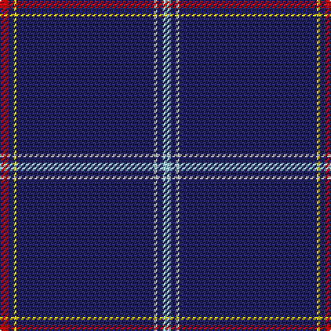

In pattern [RBYBWBW](/stripes/rbybwbw/).

This was sourced from tartans-authority.  It is a [7 stripe tartan](/stripes/stripes7/).

Original link http://www.tartansauthority.com/tartan-ferret/display/11121/

## Thread count
R/6 DB4 Y2 DB100 W2 DB4 LB/6

## Palette
Each colour and its ΔE from the base-6 reference it is a variant of.

| Colour | Shade | Base | ΔE (OKLab) |
|---|---|---|---|
| DB | <code style="background-color:#202060;">#202060</code> `#202060` | B <code style="background-color:#2A418A;">#2A418A</code> | 0.11 |
| LB | <code style="background-color:#98C8E8;">#98C8E8</code> `#98C8E8` | W <code style="background-color:#F7F7F7;">#F7F7F7</code> | 0.18 |
| R | <code style="background-color:#C80000;">#C80000</code> `#C80000` | R <code style="background-color:#CC0000;">#CC0000</code> | 0.01 |
| W | <code style="background-color:#FCFCFC;">#FCFCFC</code> `#FCFCFC` | W <code style="background-color:#F7F7F7;">#F7F7F7</code> | 0.01 |
| Y | <code style="background-color:#FCCC00;">#FCCC00</code> `#FCCC00` | Y <code style="background-color:#F2BF00;">#F2BF00</code> | 0.04 |

# Sample pattern

## Nearest tartans

The nearest existing variants by ΔTartan distance.

1. [Easton (2014)](/setts/s7/r3db2ly1db50w1db2t3~x2/) — ΔT 0.88
1. [Wylie](/setts/s6/db45ly3db10o4k1w2~x2/) — ΔT 1.29
1. [Boat of Garten (District)](/setts/s8/db61w4db2w7p2g3ly2db16~x2/) — ΔT 1.62
1. [Wedding](/setts/s5/o2dr1dp30w1o2~x2/) — ΔT 1.72
1. [MacLaine of Lochbuie, hunting](/setts/s5/db32r3db4k1ly3~x2/) — ΔT 1.86
1. [MacLaine of Lochbuie Hunting](/setts/s5/db32r3db4k1ly3/) — ΔT 1.95
1. [Inverness, Duke of York](/setts/s8/db122r11w4r15ly4db6ly4db30/) — ΔT 1.97
1. [Crichton (Clan)](/setts/s9/db80dg1db2r4lr1n5db8lo2dg2~x2/) — ΔT 2.04
1. [Duke of York (Royal)](/setts/s8/db61r6w2r8lo2db3lo2db15~x2/) — ΔT 2.06
1. [United States (Corporate)](/setts/s9/b7db5w6db5r7db2b2db70w2/) — ΔT 2.06

## Neighbour map

Every grey dot is one of 14299 variants placed by the first two principal components of the ΔTartan feature space (44% of its variance). Red is this tartan; blue dots are its nearest — click one to open its page.

<svg viewBox="0 0 640 380" role="img" style="max-width:100%;height:auto;border:1px solid #e0e0e0;border-radius:4px;display:block" xmlns="http://www.w3.org/2000/svg"><image href="/nn/cloud.v1.png" width="640" height="380"/><a href="/setts/s7/r3db2ly1db50w1db2t3~x2/"><circle cx="626.0" cy="108.7" r="4" fill="#3465a4"><title>Easton (2014)</title></circle></a><a href="/setts/s6/db45ly3db10o4k1w2~x2/"><circle cx="593.6" cy="123.9" r="4" fill="#3465a4"><title>Wylie</title></circle></a><a href="/setts/s8/db61w4db2w7p2g3ly2db16~x2/"><circle cx="534.7" cy="111.4" r="4" fill="#3465a4"><title>Boat of Garten (District)</title></circle></a><a href="/setts/s5/o2dr1dp30w1o2~x2/"><circle cx="593.9" cy="142.9" r="4" fill="#3465a4"><title>Wedding</title></circle></a><a href="/setts/s5/db32r3db4k1ly3~x2/"><circle cx="597.3" cy="164.2" r="4" fill="#3465a4"><title>MacLaine of Lochbuie, hunting</title></circle></a><a href="/setts/s5/db32r3db4k1ly3/"><circle cx="575.7" cy="165.6" r="4" fill="#3465a4"><title>MacLaine of Lochbuie Hunting</title></circle></a><a href="/setts/s8/db122r11w4r15ly4db6ly4db30/"><circle cx="576.2" cy="137.7" r="4" fill="#3465a4"><title>Inverness, Duke of York</title></circle></a><a href="/setts/s9/db80dg1db2r4lr1n5db8lo2dg2~x2/"><circle cx="626.0" cy="96.5" r="4" fill="#3465a4"><title>Crichton (Clan)</title></circle></a><a href="/setts/s8/db61r6w2r8lo2db3lo2db15~x2/"><circle cx="551.2" cy="141.5" r="4" fill="#3465a4"><title>Duke of York (Royal)</title></circle></a><a href="/setts/s9/b7db5w6db5r7db2b2db70w2/"><circle cx="525.5" cy="107.7" r="4" fill="#3465a4"><title>United States (Corporate)</title></circle></a><circle cx="626.0" cy="99.3" r="5" fill="#c00000"/></svg>

ID: /setts/s7/r3db2ly1db50w1db2lb3~x2/
