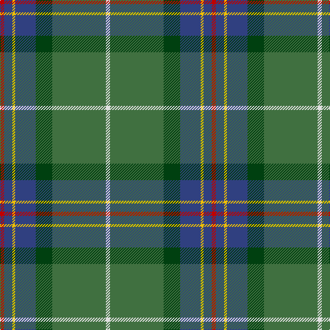

In pattern [RBYBGGW](/stripes/rbybggw/).

This was sourced from weddslist.  It is a [7 stripe tartan](/stripes/stripes7/).

Original link http://www.weddslist.com/cgi-bin/tartans/pg.pl?source=sts

## Thread count
R/6 B12 Y4 B30 DG24 G78 LN/6

## Palette
Each colour and the base-6 reference it is a variant of.

| Colour | Shade | Base |
|---|---|---|
| B | <code style="background-color:#304080;">#304080</code> `oklch(39.4% 0.109 270.2)` <small>#304080</small> | B <code style="background-color:#2A418A;">#2A418A</code> |
| DG | <code style="background-color:#004010;">#004010</code> `oklch(32.3% 0.098 146.3)` <small>#004010</small> | G <code style="background-color:#006100;">#006100</code> |
| G | <code style="background-color:#407040;">#407040</code> `oklch(49.8% 0.091 144.1)` <small>#407040</small> | G <code style="background-color:#006100;">#006100</code> |
| LN | <code style="background-color:#E0E0E0;">#E0E0E0</code> `oklch(90.7% 0.000 89.9)` <small>#E0E0E0</small> | W <code style="background-color:#F7F7F7;">#F7F7F7</code> |
| R | <code style="background-color:#C00000;">#C00000</code> `oklch(50.7% 0.208 29.2)` <small>#C00000</small> | R <code style="background-color:#CC0000;">#CC0000</code> |
| Y | <code style="background-color:#F0C000;">#F0C000</code> `oklch(82.7% 0.169 90.5)` <small>#F0C000</small> | Y <code style="background-color:#F2BF00;">#F2BF00</code> |

# Sample pattern

## Nearest tartans

The nearest existing variants by ΔTartan distance, with this tartan at the top so the swatches line up against it.

ΔTartan

Tartan

Sett

—

<a href="/ttd/edit/#slug=r3db6ly2db15dg12g39w3~x2">Wagland</a> <a class="nn-out" href="/setts/s7/r3db6ly2db15dg12g39w3~x2/" title="open its dictionary page">↗</a>

0.55

<a href="/ttd/edit/#slug=r3db6ly2db15g12dg39w3~x2">Wagland (Name)</a> <a class="nn-out" href="/setts/s7/r3db6ly2db15g12dg39w3~x2/" title="open its dictionary page">↗</a>

0.88

<a href="/ttd/edit/#slug=r4g14k3m3g12n36w4~x2">Vipont (White line)</a> <a class="nn-out" href="/setts/s7/r4g14k3m3g12n36w4~x2/" title="open its dictionary page">↗</a>

0.89

<a href="/ttd/edit/#slug=dt40r4dt10g10y22lo3y4ly3y4~x2">Keith Stanhope Society (Commem.)</a> <a class="nn-out" href="/setts/s9/dt40r4dt10g10y22lo3y4ly3y4~x2/" title="open its dictionary page">↗</a>

0.91

<a href="/ttd/edit/#slug=db30r2db4w1o11g4ly2g22~x2">Yorkland</a> <a class="nn-out" href="/setts/s8/db30r2db4w1o11g4ly2g22~x2/" title="open its dictionary page">↗</a>

1.11

<a href="/ttd/edit/#slug=r3y13db13ly2dg34w3~x2">Glencross, Tynron (Name)</a> <a class="nn-out" href="/setts/s6/r3y13db13ly2dg34w3~x2/" title="open its dictionary page">↗</a>

1.22

<a href="/ttd/edit/#slug=g22r3k1g2r3t16k3ly2~x4">Stirling, University of Corporate Univ Tartan Tartan Number: 2297. Earliest known date: 1994 This is the accepted University design. See products available Copyright © Blair Urquhart, Comrie, 2015</a> <a class="nn-out" href="/setts/s8/g22r3k1g2r3t16k3ly2~x4/" title="open its dictionary page">↗</a>

1.23

<a href="/ttd/edit/#slug=r4db15w2n15g30r2g4~x2">Sinclair Green (Personal)</a> <a class="nn-out" href="/setts/s7/r4db15w2n15g30r2g4~x2/" title="open its dictionary page">↗</a>

1.23

<a href="/ttd/edit/#slug=y2dg9r16r2b30y3dg6lb1~x2">The Climb (Fashion)</a> <a class="nn-out" href="/setts/s8/y2dg9r16r2b30y3dg6lb1~x2/" title="open its dictionary page">↗</a>

1.25

<a href="/ttd/edit/#slug=g22r3w1g2r3t16k3ly2~x4">Stirling University (Corporate)</a> <a class="nn-out" href="/setts/s8/g22r3w1g2r3t16k3ly2~x4/" title="open its dictionary page">↗</a>

1.27

<a href="/ttd/edit/#slug=lo9g18t9r1w1db1~x4">T.H.E. C.O.G. USA (Corporate)</a> <a class="nn-out" href="/setts/s6/lo9g18t9r1w1db1~x4/" title="open its dictionary page">↗</a>

## Neighbour map

Every grey dot is one of 14299 variants placed by the first two principal components of the ΔTartan feature space (44% of its variance). Red is this tartan; blue dots are its nearest — click one to open its page.

<svg viewBox="0 0 640 380" role="img" style="max-width:100%;height:auto;border:1px solid #e0e0e0;border-radius:4px;display:block" xmlns="http://www.w3.org/2000/svg"><image href="/nn/cloud.v1.png" width="640" height="380"/><a href="/setts/s7/r3db6ly2db15g12dg39w3~x2/"><circle cx="271.9" cy="154.2" r="4" fill="#3465a4"><title>Wagland (Name)</title></circle></a><a href="/setts/s7/r4g14k3m3g12n36w4~x2/"><circle cx="255.7" cy="176.8" r="4" fill="#3465a4"><title>Vipont (White line)</title></circle></a><a href="/setts/s9/dt40r4dt10g10y22lo3y4ly3y4~x2/"><circle cx="278.6" cy="163.9" r="4" fill="#3465a4"><title>Keith Stanhope Society (Commem.)</title></circle></a><a href="/setts/s8/db30r2db4w1o11g4ly2g22~x2/"><circle cx="276.5" cy="130.5" r="4" fill="#3465a4"><title>Yorkland</title></circle></a><a href="/setts/s6/r3y13db13ly2dg34w3~x2/"><circle cx="259.6" cy="164.7" r="4" fill="#3465a4"><title>Glencross, Tynron (Name)</title></circle></a><a href="/setts/s8/g22r3k1g2r3t16k3ly2~x4/"><circle cx="250.4" cy="124.7" r="4" fill="#3465a4"><title>Stirling, University of Corporate Univ Tartan Tartan Number: 2297. Earliest known date: 1994 This is the accepted University design. See products available Copyright © Blair Urquhart, Comrie, 2015</title></circle></a><a href="/setts/s7/r4db15w2n15g30r2g4~x2/"><circle cx="255.1" cy="182.9" r="4" fill="#3465a4"><title>Sinclair Green (Personal)</title></circle></a><a href="/setts/s8/y2dg9r16r2b30y3dg6lb1~x2/"><circle cx="266.9" cy="127.7" r="4" fill="#3465a4"><title>The Climb (Fashion)</title></circle></a><a href="/setts/s8/g22r3w1g2r3t16k3ly2~x4/"><circle cx="250.5" cy="124.0" r="4" fill="#3465a4"><title>Stirling University (Corporate)</title></circle></a><a href="/setts/s6/lo9g18t9r1w1db1~x4/"><circle cx="269.0" cy="171.9" r="4" fill="#3465a4"><title>T.H.E. C.O.G. USA (Corporate)</title></circle></a><circle cx="281.6" cy="156.6" r="5" fill="#c00000"/></svg>

ID: /setts/s7/r3db6ly2db15dg12g39w3~x2/
