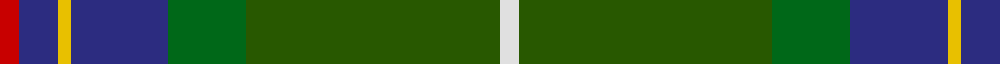
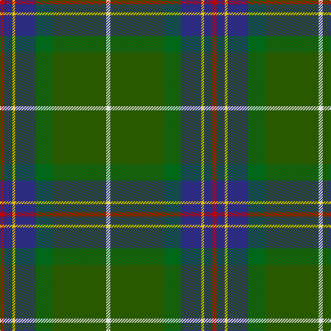

In pattern [RBYBGGW](/stripes/rbybggw/).

This was sourced from tartans-authority.  It is a [7 stripe tartan](/stripes/stripes7/).

Original link http://www.tartansauthority.com/tartan-ferret/display/2470/

## Thread count
R/6 DB12 Y4 DB30 G24 Ga78 LN/6

## Palette
Each colour and its ΔE from the base-6 reference it is a variant of.

| Colour | Shade | Base | ΔE (OKLab) |
|---|---|---|---|
| DB | <code style="background-color:#2C2C80;">#2C2C80</code> `#2C2C80` | B <code style="background-color:#2A418A;">#2A418A</code> | 0.06 |
| G | <code style="background-color:#006818;">#006818</code> `#006818` | G <code style="background-color:#006100;">#006100</code> | 0.02 |
| Ga | <code style="background-color:#285800;">#285800</code> `#285800` | G <code style="background-color:#006100;">#006100</code> | 0.03 |
| LN | <code style="background-color:#E0E0E0;">#E0E0E0</code> `#E0E0E0` | W <code style="background-color:#F7F7F7;">#F7F7F7</code> | 0.07 |
| R | <code style="background-color:#C80000;">#C80000</code> `#C80000` | R <code style="background-color:#CC0000;">#CC0000</code> | 0.01 |
| Y | <code style="background-color:#E8C000;">#E8C000</code> `#E8C000` | Y <code style="background-color:#F2BF00;">#F2BF00</code> | 0.02 |

# Sample pattern

## Nearest tartans

The nearest existing variants by ΔTartan distance.

1. [Wagland](/setts/s7/r3db6ly2db15dg12g39w3~x2/) — ΔT 0.55
1. [Vipont (White line)](/setts/s7/r4g14k3m3g12n36w4~x2/) — ΔT 0.86
1. [Glencross, Tynron (Name)](/setts/s6/r3y13db13ly2dg34w3~x2/) — ΔT 0.88
1. [Stirling, University of Corporate Univ Tartan Tartan Number: 2297. Earliest known date: 1994 This is the accepted University design. See products available Copyright © Blair Urquhart, Comrie, 2015](/setts/s8/g22r3k1g2r3t16k3ly2~x4/) — ΔT 1.02
1. [Yorkland](/setts/s8/db30r2db4w1o11g4ly2g22~x2/) — ΔT 1.06
1. [Keith Stanhope Society (Commem.)](/setts/s9/dt40r4dt10g10y22lo3y4ly3y4~x2/) — ΔT 1.08
1. [McAvoy (Personal)](/setts/s10/ly3dg5k2dg5w1dg17dt4r1dt22w2~x2/) — ΔT 1.09
1. [Stirling University (Corporate)](/setts/s8/g22r3w1g2r3t16k3ly2~x4/) — ΔT 1.10
1. [Sinclair Green (Personal)](/setts/s7/r4db15w2n15g30r2g4~x2/) — ΔT 1.12
1. [Cates Hunting (Clan)](/setts/s9/dg23r7g25ly5dg17k5ly1w1r1~x2/) — ΔT 1.15

## Neighbour map

Every grey dot is one of 14299 variants placed by the first two principal components of the ΔTartan feature space (44% of its variance). Red is this tartan; blue dots are its nearest — click one to open its page.

<svg viewBox="0 0 640 380" role="img" style="max-width:100%;height:auto;border:1px solid #e0e0e0;border-radius:4px;display:block" xmlns="http://www.w3.org/2000/svg"><image href="/nn/cloud.v1.png" width="640" height="380"/><a href="/setts/s7/r3db6ly2db15dg12g39w3~x2/"><circle cx="281.6" cy="156.6" r="4" fill="#3465a4"><title>Wagland</title></circle></a><a href="/setts/s7/r4g14k3m3g12n36w4~x2/"><circle cx="255.7" cy="176.8" r="4" fill="#3465a4"><title>Vipont (White line)</title></circle></a><a href="/setts/s6/r3y13db13ly2dg34w3~x2/"><circle cx="259.6" cy="164.7" r="4" fill="#3465a4"><title>Glencross, Tynron (Name)</title></circle></a><a href="/setts/s8/g22r3k1g2r3t16k3ly2~x4/"><circle cx="250.4" cy="124.7" r="4" fill="#3465a4"><title>Stirling, University of Corporate Univ Tartan Tartan Number: 2297. Earliest known date: 1994 This is the accepted University design. See products available Copyright © Blair Urquhart, Comrie, 2015</title></circle></a><a href="/setts/s8/db30r2db4w1o11g4ly2g22~x2/"><circle cx="276.5" cy="130.5" r="4" fill="#3465a4"><title>Yorkland</title></circle></a><a href="/setts/s9/dt40r4dt10g10y22lo3y4ly3y4~x2/"><circle cx="278.6" cy="163.9" r="4" fill="#3465a4"><title>Keith Stanhope Society (Commem.)</title></circle></a><a href="/setts/s10/ly3dg5k2dg5w1dg17dt4r1dt22w2~x2/"><circle cx="259.2" cy="128.6" r="4" fill="#3465a4"><title>McAvoy (Personal)</title></circle></a><a href="/setts/s8/g22r3w1g2r3t16k3ly2~x4/"><circle cx="250.5" cy="124.0" r="4" fill="#3465a4"><title>Stirling University (Corporate)</title></circle></a><a href="/setts/s7/r4db15w2n15g30r2g4~x2/"><circle cx="255.1" cy="182.9" r="4" fill="#3465a4"><title>Sinclair Green (Personal)</title></circle></a><a href="/setts/s9/dg23r7g25ly5dg17k5ly1w1r1~x2/"><circle cx="248.6" cy="134.4" r="4" fill="#3465a4"><title>Cates Hunting (Clan)</title></circle></a><circle cx="271.9" cy="154.2" r="5" fill="#c00000"/></svg>

ID: /setts/s7/r3db6ly2db15g12dg39w3~x2/
