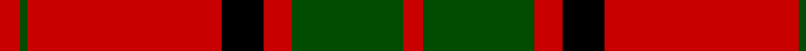
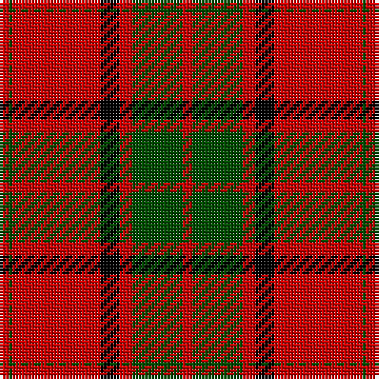

**Bands:** [RGRKRGR](/stripes/rgrkrgr/) · **Stripes:** [R DG R K R DG R](/stripes/stripes7/) R DG R K R DG R

This was sourced from weddslist.  It is a [7 band tartan](/bands/bands7/).

Original link http://www.weddslist.com/cgi-bin/tartans/pg.pl?source=rb

## Attestations

This cloth appears in 2 source records; the oldest owns this page.

- undated — Maxwell (weddslist, [record](http://www.weddslist.com/cgi-bin/tartans/pg.pl?source=rb))
- undated — Maxwell (weddslist, [record](http://www.weddslist.com/cgi-bin/tartans/pg.pl?source=x))

## Register references

External register numbers recorded for this tartan.

- Scottish Register of Tartans: [2540](https://www.tartanregister.gov.uk/tartanDetails.aspx?ref=2540)
- Scottish Register of Tartans: [2625](https://www.tartanregister.gov.uk/tartanDetails.aspx?ref=2625)
- Scottish Register of Tartans: [2666](https://www.tartanregister.gov.uk/tartanDetails.aspx?ref=2666)
- Scottish Register of Tartans: [3555](https://www.tartanregister.gov.uk/tartanDetails.aspx?ref=3555)
- Scottish Register of Tartans: [3808](https://www.tartanregister.gov.uk/tartanDetails.aspx?ref=3808)
- Scottish Tartans Authority (ITI): 1429
- Scottish Tartans Authority (ITI): 218
- Scottish Tartans World Register: 1010
- Scottish Tartans World Register: 1429
- Scottish Tartans World Register: 1585
- Scottish Tartans World Register: 218
- Scottish Tartans World Register: 864

## Variants

Other setts woven to the same stripe pattern.

- [Maxwell Ancient](/setts/s7/r3dg16r4k6r28dg1r3~x2/)

## Thread count
R/3 G1 R28 K6 R4 G16 R/3

## Palette
Each colour and its ΔE from the base-6 reference it is a variant of.

| Colour | Shade | Base | ΔE (OKLab) |
|---|---|---|---|
| G | <code style="background-color:#004C00;">#004C00</code> `#004C00` | G <code style="background-color:#006100;">#006100</code> | 0.07 |
| K | <code style="background-color:#000000;">#000000</code> `#000000` | K <code style="background-color:#000000;">#000000</code> | 0.00 |
| R | <code style="background-color:#C80000;">#C80000</code> `#C80000` | R <code style="background-color:#CC0000;">#CC0000</code> | 0.01 |

# Sample pattern

## Nearest tartans

The nearest existing variants by ΔTartan distance.

1. [Maxwell Ancient](/setts/s7/r3dg16r4k6r28dg1r3~x2/) — ΔT 0.57
1. [Maxwell](/setts/s7/r3g16r4k6r28g1r3~x2/) — ΔT 0.79
1. [MacKintosh](/setts/s6/r24db6r3dg12r4db1~x2/) — ΔT 0.81
1. [MacKintosh D](/setts/s6/r22db5r2dg11r3db1~x2/) — ΔT 0.81
1. [Dunbar](/setts/s6/r6dg21k8r28dg1r4~x2/) — ΔT 1.00
1. [Greig (Personal)](/setts/s6/r60k2w3dg20r10dg20~x2/) — ΔT 1.07
1. [Lougheed](/setts/s8/lb3r3k4lb2r18k1r2k2~x4/) — ΔT 1.08
1. [Forget Family (Red)](/setts/s6/r42k2w2k18w2k5~x2/) — ΔT 1.14
1. [Robertson](/setts/s6/r2dg20r2db8r36dg1~x2/) — ΔT 1.14
1. [MacKintosh #3](/setts/s6/r48db2r3dg28r4db2~x2/) — ΔT 1.15

## Neighbour map

Every grey dot is one of 14313 variants placed by the first two principal components of the ΔTartan feature space (44% of its variance). Red is this tartan; blue dots are its nearest — click one to open its page.

<svg viewBox="0 0 640 380" role="img" style="max-width:100%;height:auto;border:1px solid #e0e0e0;border-radius:4px;display:block" xmlns="http://www.w3.org/2000/svg"><image href="/nn/cloud.v1.png" width="640" height="380"/><a href="/setts/s7/r3dg16r4k6r28dg1r3~x2/"><circle cx="429.1" cy="156.3" r="4" fill="#3465a4"><title>Maxwell Ancient</title></circle></a><a href="/setts/s7/r3g16r4k6r28g1r3~x2/"><circle cx="437.3" cy="163.5" r="4" fill="#3465a4"><title>Maxwell</title></circle></a><a href="/setts/s6/r24db6r3dg12r4db1~x2/"><circle cx="411.4" cy="178.9" r="4" fill="#3465a4"><title>MacKintosh</title></circle></a><a href="/setts/s6/r22db5r2dg11r3db1~x2/"><circle cx="409.0" cy="177.7" r="4" fill="#3465a4"><title>MacKintosh D</title></circle></a><a href="/setts/s6/r6dg21k8r28dg1r4~x2/"><circle cx="366.8" cy="175.5" r="4" fill="#3465a4"><title>Dunbar</title></circle></a><a href="/setts/s6/r60k2w3dg20r10dg20~x2/"><circle cx="420.0" cy="151.1" r="4" fill="#3465a4"><title>Greig (Personal)</title></circle></a><a href="/setts/s8/lb3r3k4lb2r18k1r2k2~x4/"><circle cx="423.8" cy="155.9" r="4" fill="#3465a4"><title>Lougheed</title></circle></a><a href="/setts/s6/r42k2w2k18w2k5~x2/"><circle cx="401.8" cy="151.2" r="4" fill="#3465a4"><title>Forget Family (Red)</title></circle></a><a href="/setts/s6/r2dg20r2db8r36dg1~x2/"><circle cx="425.3" cy="154.2" r="4" fill="#3465a4"><title>Robertson</title></circle></a><a href="/setts/s6/r48db2r3dg28r4db2~x2/"><circle cx="461.1" cy="162.9" r="4" fill="#3465a4"><title>MacKintosh #3</title></circle></a><circle cx="419.6" cy="155.6" r="5" fill="#c00000"/></svg>

ID: /setts/s7/r3dg16r4k6r28dg1r3/
