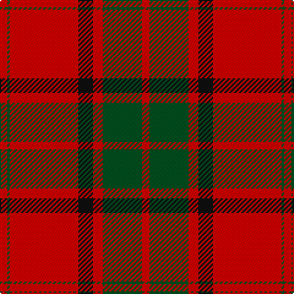

**Bands:** [RGRKRGR](/stripes/rgrkrgr/) · **Stripes:** [R DG R K R DG R](/stripes/stripes7/) R DG R K R DG R

This was sourced from register-of-tartans.  It is a [7 band tartan](/bands/bands7/).

Original link https://www.tartanregister.gov.uk/tartanDetails.aspx?ref=2862

## Attestations

This cloth appears in 2 source records; the oldest owns this page.

- 01/01/1990 — Maxwell Ancient (register-of-tartans, [record](https://www.tartanregister.gov.uk/tartanDetails.aspx?ref=2862))
- undated — Maxwell (weddslist, [record](http://www.weddslist.com/cgi-bin/tartans/pg.pl?source=tinsel))

## Register references

External register numbers recorded for this tartan.

- Scottish Register of Tartans: [1166](https://www.tartanregister.gov.uk/tartanDetails.aspx?ref=1166)
- Scottish Register of Tartans: [1510](https://www.tartanregister.gov.uk/tartanDetails.aspx?ref=1510)
- Scottish Register of Tartans: [1758](https://www.tartanregister.gov.uk/tartanDetails.aspx?ref=1758)
- Scottish Register of Tartans: [2307](https://www.tartanregister.gov.uk/tartanDetails.aspx?ref=2307)
- Scottish Register of Tartans: [2349](https://www.tartanregister.gov.uk/tartanDetails.aspx?ref=2349)
- Scottish Register of Tartans: [2540](https://www.tartanregister.gov.uk/tartanDetails.aspx?ref=2540)
- Scottish Register of Tartans: [2582](https://www.tartanregister.gov.uk/tartanDetails.aspx?ref=2582)
- Scottish Register of Tartans: [2585](https://www.tartanregister.gov.uk/tartanDetails.aspx?ref=2585)
- Scottish Register of Tartans: [2625](https://www.tartanregister.gov.uk/tartanDetails.aspx?ref=2625)
- Scottish Register of Tartans: [2730](https://www.tartanregister.gov.uk/tartanDetails.aspx?ref=2730)
- Scottish Register of Tartans: [2862](https://www.tartanregister.gov.uk/tartanDetails.aspx?ref=2862)
- Scottish Register of Tartans: [3072](https://www.tartanregister.gov.uk/tartanDetails.aspx?ref=3072)
- Scottish Register of Tartans: [3555](https://www.tartanregister.gov.uk/tartanDetails.aspx?ref=3555)
- Scottish Register of Tartans: [4925](https://www.tartanregister.gov.uk/tartanDetails.aspx?ref=4925)
- Scottish Register of Tartans: [696](https://www.tartanregister.gov.uk/tartanDetails.aspx?ref=696)
- Scottish Register of Tartans: [697](https://www.tartanregister.gov.uk/tartanDetails.aspx?ref=697)
- Scottish Register of Tartans: [982](https://www.tartanregister.gov.uk/tartanDetails.aspx?ref=982)
- Scottish Tartans Authority (ITI): 1277
- Scottish Tartans Authority (ITI): 1429
- Scottish Tartans Authority (ITI): 218
- Scottish Tartans Authority (ITI): 977
- Scottish Tartans World Register: 1042
- Scottish Tartans World Register: 127
- Scottish Tartans World Register: 1277
- Scottish Tartans World Register: 1399
- Scottish Tartans World Register: 1429
- Scottish Tartans World Register: 1593
- Scottish Tartans World Register: 218
- Scottish Tartans World Register: 2218
- Scottish Tartans World Register: 3061
- Scottish Tartans World Register: 441
- Scottish Tartans World Register: 737
- Scottish Tartans World Register: 858
- Scottish Tartans World Register: 864
- Scottish Tartans World Register: 873
- Scottish Tartans World Register: 897
- Scottish Tartans World Register: 977
- Scottish Tartans World Register: 978

## Variants

Other setts woven to the same stripe pattern.

- [Maxwell](/setts/s7/r3dg16r4k6r28dg1r3/)

## Thread count
R/6 G2 R56 K12 R8 G32 R/6

## Palette
Each colour and its ΔE from the base-6 reference it is a variant of.

| Colour | Shade | Base | ΔE (OKLab) |
|---|---|---|---|
| G | <code style="background-color:#005020;">#005020</code> `#005020` | G <code style="background-color:#006100;">#006100</code> | 0.07 |
| K | <code style="background-color:#101010;">#101010</code> `#101010` | K <code style="background-color:#000000;">#000000</code> | 0.17 |
| R | <code style="background-color:#DC0000;">#DC0000</code> `#DC0000` | R <code style="background-color:#CC0000;">#CC0000</code> | 0.03 |

# Sample pattern

## Nearest tartans

The nearest existing variants by ΔTartan distance.

1. [Maxwell](/setts/s7/r3g16r4k6r28g1r3~x2/) — ΔT 0.49
1. [Maxwell](/setts/s7/r3dg16r4k6r28dg1r3/) — ΔT 0.57
1. [MacKintosh #3](/setts/s6/r48db2r3dg28r4db2~x2/) — ΔT 0.78
1. [MacKintosh](/setts/s6/r24db6r3dg12r4db1~x2/) — ΔT 0.78
1. [MacKintosh D](/setts/s6/r22db5r2dg11r3db1~x2/) — ΔT 0.80
1. [MacKintosh #2](/setts/s6/r68db18r9dg34r9db3~x2/) — ΔT 0.82
1. [Robertson](/setts/s6/r2dg20r2db8r36dg1~x2/) — ΔT 0.88
1. [MacDonald #7](/setts/s9/dg2r2db1r24db6r3dg12r4db1~x2/) — ΔT 0.92
1. [Lovat or Fraser #2](/setts/s6/r80dp19r8dg36r10dp2~x2/) — ΔT 0.97
1. [Greig (Personal)](/setts/s6/r60k2w3dg20r10dg20~x2/) — ΔT 1.00

## Neighbour map

Every grey dot is one of 14313 variants placed by the first two principal components of the ΔTartan feature space (44% of its variance). Red is this tartan; blue dots are its nearest — click one to open its page.

<svg viewBox="0 0 640 380" role="img" style="max-width:100%;height:auto;border:1px solid #e0e0e0;border-radius:4px;display:block" xmlns="http://www.w3.org/2000/svg"><image href="/nn/cloud.v1.png" width="640" height="380"/><a href="/setts/s7/r3g16r4k6r28g1r3~x2/"><circle cx="437.3" cy="163.5" r="4" fill="#3465a4"><title>Maxwell</title></circle></a><a href="/setts/s7/r3dg16r4k6r28dg1r3/"><circle cx="419.6" cy="155.6" r="4" fill="#3465a4"><title>Maxwell</title></circle></a><a href="/setts/s6/r48db2r3dg28r4db2~x2/"><circle cx="461.1" cy="162.9" r="4" fill="#3465a4"><title>MacKintosh #3</title></circle></a><a href="/setts/s6/r24db6r3dg12r4db1~x2/"><circle cx="411.4" cy="178.9" r="4" fill="#3465a4"><title>MacKintosh</title></circle></a><a href="/setts/s6/r22db5r2dg11r3db1~x2/"><circle cx="409.0" cy="177.7" r="4" fill="#3465a4"><title>MacKintosh D</title></circle></a><a href="/setts/s6/r68db18r9dg34r9db3~x2/"><circle cx="413.1" cy="180.7" r="4" fill="#3465a4"><title>MacKintosh #2</title></circle></a><a href="/setts/s6/r2dg20r2db8r36dg1~x2/"><circle cx="425.3" cy="154.2" r="4" fill="#3465a4"><title>Robertson</title></circle></a><a href="/setts/s9/dg2r2db1r24db6r3dg12r4db1~x2/"><circle cx="415.0" cy="147.4" r="4" fill="#3465a4"><title>MacDonald #7</title></circle></a><a href="/setts/s6/r80dp19r8dg36r10dp2~x2/"><circle cx="456.0" cy="152.5" r="4" fill="#3465a4"><title>Lovat or Fraser #2</title></circle></a><a href="/setts/s6/r60k2w3dg20r10dg20~x2/"><circle cx="420.0" cy="151.1" r="4" fill="#3465a4"><title>Greig (Personal)</title></circle></a><circle cx="429.1" cy="156.3" r="5" fill="#c00000"/></svg>

ID: /setts/s7/r3dg16r4k6r28dg1r3~x2/
