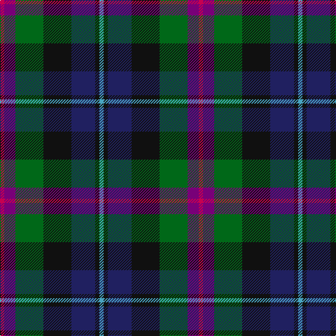

In pattern [RBGKBKY](/stripes/rbgkbky/).

This was sourced from tartans-authority.  It is a [7 stripe tartan](/stripes/stripes7/).

Original link http://www.tartansauthority.com/tartan-ferret/display/10874/

## Thread count
R/6 P16 G40 K40 DB34 K6 B/6

## Palette
Each colour and the base-6 reference it is a variant of.

| Colour | Shade | Base |
|---|---|---|
| B | <code style="background-color:#48A4C0;">#48A4C0</code> `oklch(67.5% 0.096 221.0)` <small>#48A4C0</small> | Y <code style="background-color:#F2BF00;">#F2BF00</code> |
| DB | <code style="background-color:#202060;">#202060</code> `oklch(28.9% 0.111 276.9)` <small>#202060</small> | B <code style="background-color:#2A418A;">#2A418A</code> |
| G | <code style="background-color:#006818;">#006818</code> `oklch(45.0% 0.142 145.0)` <small>#006818</small> | G <code style="background-color:#006100;">#006100</code> |
| K | <code style="background-color:#101010;">#101010</code> `oklch(17.3% 0.000 89.9)` <small>#101010</small> | K <code style="background-color:#000000;">#000000</code> |
| P | <code style="background-color:#780078;">#780078</code> `oklch(40.2% 0.185 328.4)` <small>#780078</small> | B <code style="background-color:#2A418A;">#2A418A</code> |
| R | <code style="background-color:#C80050;">#C80050</code> `oklch(53.2% 0.213 9.9)` <small>#C80050</small> | R <code style="background-color:#CC0000;">#CC0000</code> |

# Sample pattern

## Nearest tartans

The nearest existing variants by ΔTartan distance, with this tartan at the top so the swatches line up against it.

ΔTartan

Tartan

Sett

—

<a href="/ttd/edit/#slug=r3dp8g20k20db17k3lg3~x2">Gracey (2013)</a> <a class="nn-out" href="/setts/s7/r3dp8g20k20db17k3lg3~x2/" title="open its dictionary page">↗</a>

0.79

<a href="/ttd/edit/#slug=lb3db17do16dt2dg17lo2~x2">Ancient Atlantic (Fashion)</a> <a class="nn-out" href="/setts/s6/lb3db17do16dt2dg17lo2~x2/" title="open its dictionary page">↗</a>

0.84

<a href="/ttd/edit/#slug=w3db17dy16db2dg17ly2~x2">Atlantic Ancient Trade Tartan Tartan Number: 1781. Earliest known date: 1968 Also known as Murray of Atholl, it has been authorized by Ian Murray, Duke of Atholl. See products available Copyright © Blair Urquhart, Comrie, 2015</a> <a class="nn-out" href="/setts/s6/w3db17dy16db2dg17ly2~x2/" title="open its dictionary page">↗</a>

0.99

<a href="/ttd/edit/#slug=dp11db2t4db21k16dg19ly4~x2">Ayrshire (International Tartans)</a> <a class="nn-out" href="/setts/s7/dp11db2t4db21k16dg19ly4~x2/" title="open its dictionary page">↗</a>

1.00

<a href="/ttd/edit/#slug=r2k1db8k8g8k1t2~x2">Argyll</a> <a class="nn-out" href="/setts/s7/r2k1db8k8g8k1t2~x2/" title="open its dictionary page">↗</a>

1.00

<a href="/ttd/edit/#slug=r2k1db8k8g8k1t2~x4">Campbell of Cawdor</a> <a class="nn-out" href="/setts/s7/r2k1db8k8g8k1t2~x4/" title="open its dictionary page">↗</a>

1.02

<a href="/ttd/edit/#slug=r2k1db8k8g8k1y2~x2">Campbell of Cawdor Clan Tartan Tartan Number: 2. Earliest known date: 1798 Campbell of Cawdor is one of Wilson's variations based on the military sett. It was originally a numbered pattern, acquiring the name 'Argyle' in 1798 and 'Argylle' in 1819. It is not until W. and A. Smith's work of 1850 that the full title is given, 'Campbell of Cawdor'. This sett is authorized by the present Clan Chief, MacCailien Mor. See products available Copyright © Blair Urquhart, Comrie, 2015</a> <a class="nn-out" href="/setts/s7/r2k1db8k8g8k1y2~x2/" title="open its dictionary page">↗</a>

1.03

<a href="/ttd/edit/#slug=r2k1db6k2g6m2~x4">MacEachain (Clan)</a> <a class="nn-out" href="/setts/s6/r2k1db6k2g6m2~x4/" title="open its dictionary page">↗</a>

1.03

<a href="/ttd/edit/#slug=r4dg16k16db4dg3db12lo2~x2">Junior Chamber International (Corp)</a> <a class="nn-out" href="/setts/s7/r4dg16k16db4dg3db12lo2~x2/" title="open its dictionary page">↗</a>

1.04

<a href="/ttd/edit/#slug=k6t2db12g8r5k2g3~x4">Cooke (Personal)</a> <a class="nn-out" href="/setts/s7/k6t2db12g8r5k2g3~x4/" title="open its dictionary page">↗</a>

1.04

<a href="/ttd/edit/#slug=b8k25g13m5lo5r5m8~x2">Bro-Menez Are (Corporate)</a> <a class="nn-out" href="/setts/s7/b8k25g13m5lo5r5m8~x2/" title="open its dictionary page">↗</a>

## Neighbour map

Every grey dot is one of 14299 variants placed by the first two principal components of the ΔTartan feature space (44% of its variance). Red is this tartan; blue dots are its nearest — click one to open its page.

<svg viewBox="0 0 640 380" role="img" style="max-width:100%;height:auto;border:1px solid #e0e0e0;border-radius:4px;display:block" xmlns="http://www.w3.org/2000/svg"><image href="/nn/cloud.v1.png" width="640" height="380"/><a href="/setts/s6/lb3db17do16dt2dg17lo2~x2/"><circle cx="143.3" cy="213.6" r="4" fill="#3465a4"><title>Ancient Atlantic (Fashion)</title></circle></a><a href="/setts/s6/w3db17dy16db2dg17ly2~x2/"><circle cx="132.5" cy="206.4" r="4" fill="#3465a4"><title>Atlantic Ancient Trade Tartan Tartan Number: 1781. Earliest known date: 1968 Also known as Murray of Atholl, it has been authorized by Ian Murray, Duke of Atholl. See products available Copyright © Blair Urquhart, Comrie, 2015</title></circle></a><a href="/setts/s7/dp11db2t4db21k16dg19ly4~x2/"><circle cx="111.2" cy="202.1" r="4" fill="#3465a4"><title>Ayrshire (International Tartans)</title></circle></a><a href="/setts/s7/r2k1db8k8g8k1t2~x2/"><circle cx="150.9" cy="216.8" r="4" fill="#3465a4"><title>Argyll</title></circle></a><a href="/setts/s7/r2k1db8k8g8k1t2~x4/"><circle cx="150.9" cy="216.8" r="4" fill="#3465a4"><title>Campbell of Cawdor</title></circle></a><a href="/setts/s7/r2k1db8k8g8k1y2~x2/"><circle cx="149.5" cy="215.8" r="4" fill="#3465a4"><title>Campbell of Cawdor Clan Tartan Tartan Number: 2. Earliest known date: 1798 Campbell of Cawdor is one of Wilson's variations based on the military sett. It was originally a numbered pattern, acquiring the name 'Argyle' in 1798 and 'Argylle' in 1819. It is not until W. and A. Smith's work of 1850 that the full title is given, 'Campbell of Cawdor'. This sett is authorized by the present Clan Chief, MacCailien Mor. See products available Copyright © Blair Urquhart, Comrie, 2015</title></circle></a><a href="/setts/s6/r2k1db6k2g6m2~x4/"><circle cx="118.5" cy="240.6" r="4" fill="#3465a4"><title>MacEachain (Clan)</title></circle></a><a href="/setts/s7/r4dg16k16db4dg3db12lo2~x2/"><circle cx="161.6" cy="226.9" r="4" fill="#3465a4"><title>Junior Chamber International (Corp)</title></circle></a><a href="/setts/s7/k6t2db12g8r5k2g3~x4/"><circle cx="114.2" cy="235.2" r="4" fill="#3465a4"><title>Cooke (Personal)</title></circle></a><a href="/setts/s7/b8k25g13m5lo5r5m8~x2/"><circle cx="98.3" cy="212.6" r="4" fill="#3465a4"><title>Bro-Menez Are (Corporate)</title></circle></a><circle cx="111.3" cy="212.4" r="5" fill="#c00000"/></svg>

ID: /setts/s7/r3dp8g20k20db17k3lg3~x2/
