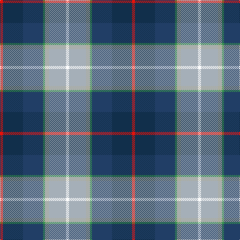

This page is one **sett** — a single exact thread-count. It belongs to the [tartan](/tartans/r3dt20dt20g2lr4lr17w3/)
(the same proportion at any scale), whose colour order is pattern [RBBGYYW](/stripes/rbbgyyw/).

Sourced from register-of-tartans.  It is a [7 stripe tartan](/stripes/stripes7/).

Original link https://www.tartanregister.gov.uk/tartanDetails.aspx?ref=10261

## Register references

External register numbers recorded for this tartan.

- Scottish Register of Tartans: [10261](https://www.tartanregister.gov.uk/tartanDetails.aspx?ref=10261)

## Thread count
R/6 DN40 DB40 G4 Na8 N34 W/6

## Palette

Palette: <strong>Tartan Register</strong> <small style="color:#888">(1 of 7 colours)</small>
<table><thead><tr><th>Colour</th><th>Threads</th><th>Shade</th><th>Base</th><th>OKLCh</th></tr></thead><tbody><tr><td>R/</td><td style="text-align:right;font-variant-numeric:tabular-nums">6</td><td><code style="background-color:#E91009;">#E91009</code> <small style="color:#888">#E91009</small></td><td>R <code style="background-color:#CC0000;">#CC0000</code></td><td><small style="color:#888">oklch(59.0% 0.237 29.3)</small></td></tr><tr><td>DN</td><td style="text-align:right;font-variant-numeric:tabular-nums">40</td><td><code style="background-color:#112F4B;">#112F4B</code> <small style="color:#888">#112F4B</small></td><td>B <code style="background-color:#2A418A;">#2A418A</code></td><td><small style="color:#888">oklch(29.8% 0.062 249.3)</small></td></tr><tr><td>DB</td><td style="text-align:right;font-variant-numeric:tabular-nums">40</td><td><code style="background-color:#213E66;">#213E66</code> <small style="color:#888">#213E66</small></td><td>B <code style="background-color:#2A418A;">#2A418A</code></td><td><small style="color:#888">oklch(36.2% 0.078 256.8)</small></td></tr><tr><td>G</td><td style="text-align:right;font-variant-numeric:tabular-nums">4</td><td><code style="background-color:#36924F;">#36924F</code> <small style="color:#888">#36924F</small></td><td>G <code style="background-color:#006100;">#006100</code></td><td><small style="color:#888">oklch(58.8% 0.133 149.4)</small></td></tr><tr><td>Na</td><td style="text-align:right;font-variant-numeric:tabular-nums">8</td><td><code style="background-color:#ACAD9F;">#ACAD9F</code> <small style="color:#888">#ACAD9F</small></td><td>Y <code style="background-color:#F2BF00;">#F2BF00</code></td><td><small style="color:#888">oklch(74.3% 0.020 110.2)</small></td></tr><tr><td>N</td><td style="text-align:right;font-variant-numeric:tabular-nums">34</td><td><code style="background-color:#A5AFB8;">#A5AFB8</code> <small style="color:#888">#A5AFB8</small></td><td>Y <code style="background-color:#F2BF00;">#F2BF00</code></td><td><small style="color:#888">oklch(74.9% 0.017 245.2)</small></td></tr><tr><td>W/</td><td style="text-align:right;font-variant-numeric:tabular-nums">6</td><td><code style="background-color:#FFFFFF;">#FFFFFF</code> <small style="color:#888">#FFFFFF</small></td><td>W <code style="background-color:#F7F7F7;">#F7F7F7</code></td><td><small style="color:#888">oklch(100.0% 0.000 89.9)</small></td></tr></tbody></table>

# Sample pattern

## Nearest tartans

The nearest existing variants by ΔTartan distance, with this tartan at the top so the swatches line up against it.

ΔTartan

Tartan

Sett

—

<a href="/ttd/edit/#slug=r3dt20dt20g2lr4lr17w3~x2">Silversea</a> <a class="nn-out" href="/setts/s7/r3dt20dt20g2lr4lr17w3~x2/" title="open its dictionary page">↗</a>

1.09

<a href="/ttd/edit/#slug=k40n15o10ly3t5w5db10t20">Julien Pigeut Tartan Tartan Number: 6574. Earliest known date: 2004 For the wedding of Julien and Sylvia Piguet. Also worn by Roland Mathez best man of Julien. See products available Copyright © Blair Urquhart, Comrie, 2015</a> <a class="nn-out" href="/setts/s8/k40n15o10ly3t5w5db10t20/" title="open its dictionary page">↗</a>

1.13

<a href="/ttd/edit/#slug=r3db20t20lg2lr4lb17w3~x2">Silversea (Corporate)</a> <a class="nn-out" href="/setts/s7/r3db20t20lg2lr4lb17w3~x2/" title="open its dictionary page">↗</a>

1.14

<a href="/ttd/edit/#slug=p2g6r1y1db3b10w1~x2">Manx National</a> <a class="nn-out" href="/setts/s7/p2g6r1y1db3b10w1~x2/" title="open its dictionary page">↗</a>

1.15

<a href="/ttd/edit/#slug=db18o4r4g12lb3r2w2dp10~x2">Serco Caledonian Sleeper</a> <a class="nn-out" href="/setts/s8/db18o4r4g12lb3r2w2dp10~x2/" title="open its dictionary page">↗</a>

1.16

<a href="/ttd/edit/#slug=k9ly6db9lr2o3lr2dg17db17lb5~x2">Coats (New Zealand)</a> <a class="nn-out" href="/setts/s9/k9ly6db9lr2o3lr2dg17db17lb5~x2/" title="open its dictionary page">↗</a>

1.18

<a href="/ttd/edit/#slug=w3db4dg8k5db20g3ly13g4w2~x2">Armagh County Crest (Fashion)</a> <a class="nn-out" href="/setts/s9/w3db4dg8k5db20g3ly13g4w2~x2/" title="open its dictionary page">↗</a>

1.20

<a href="/ttd/edit/#slug=k3db3g15db15m5lo3ly2m1~x2">Young Family Tartan Tartan Number: 2048. Earliest known date: 1991 Based on the Christina Young blanket dating from 1726 and preserved at the Scottish Tartans Society museum in Keith, Banffshire. The design retains the unusual purple - yellow - orange box check of the original blanket and changes only the ground colour to the greens and blues of the Douglas tartan. There are 7 colours. Black is normally replaced by dark blue in commercial weaving. See products available Copyright © Blair Urquhart, Comrie, 2015</a> <a class="nn-out" href="/setts/s8/k3db3g15db15m5lo3ly2m1~x2/" title="open its dictionary page">↗</a>

1.22

<a href="/ttd/edit/#slug=ly3r3lb4w2db11g13k2~x2">Kentucky, State of (District)</a> <a class="nn-out" href="/setts/s7/ly3r3lb4w2db11g13k2~x2/" title="open its dictionary page">↗</a>

1.24

<a href="/ttd/edit/#slug=w2r3db6db8g12k1r4db2w2~x4">Scottish National - 1934 (Fashion)</a> <a class="nn-out" href="/setts/s9/w2r3db6db8g12k1r4db2w2~x4/" title="open its dictionary page">↗</a>

1.26

<a href="/ttd/edit/#slug=w8db5db30lr4db13lr13g5lo5~x2">Waterford County Crest (Fashion)</a> <a class="nn-out" href="/setts/s8/w8db5db30lr4db13lr13g5lo5~x2/" title="open its dictionary page">↗</a>

## Neighbour map

Every grey dot is one of 14299 variants placed by the first two principal components of the ΔTartan feature space (44% of its variance). Red is this tartan; blue dots are its nearest — click one to open its page.

<svg viewBox="0 0 640 380" role="img" style="max-width:100%;height:auto;border:1px solid #e0e0e0;border-radius:4px;display:block" xmlns="http://www.w3.org/2000/svg"><image href="/nn/cloud.v1.png" width="640" height="380"/><a href="/setts/s8/k40n15o10ly3t5w5db10t20/"><circle cx="108.5" cy="135.7" r="4" fill="#3465a4"><title>Julien Pigeut Tartan Tartan Number: 6574. Earliest known date: 2004 For the wedding of Julien and Sylvia Piguet. Also worn by Roland Mathez best man of Julien. See products available Copyright © Blair Urquhart, Comrie, 2015</title></circle></a><a href="/setts/s7/r3db20t20lg2lr4lb17w3~x2/"><circle cx="72.4" cy="146.3" r="4" fill="#3465a4"><title>Silversea (Corporate)</title></circle></a><a href="/setts/s7/p2g6r1y1db3b10w1~x2/"><circle cx="138.3" cy="141.6" r="4" fill="#3465a4"><title>Manx National</title></circle></a><a href="/setts/s8/db18o4r4g12lb3r2w2dp10~x2/"><circle cx="55.5" cy="130.8" r="4" fill="#3465a4"><title>Serco Caledonian Sleeper</title></circle></a><a href="/setts/s9/k9ly6db9lr2o3lr2dg17db17lb5~x2/"><circle cx="86.1" cy="161.8" r="4" fill="#3465a4"><title>Coats (New Zealand)</title></circle></a><a href="/setts/s9/w3db4dg8k5db20g3ly13g4w2~x2/"><circle cx="50.3" cy="131.0" r="4" fill="#3465a4"><title>Armagh County Crest (Fashion)</title></circle></a><a href="/setts/s8/k3db3g15db15m5lo3ly2m1~x2/"><circle cx="118.6" cy="132.1" r="4" fill="#3465a4"><title>Young Family Tartan Tartan Number: 2048. Earliest known date: 1991 Based on the Christina Young blanket dating from 1726 and preserved at the Scottish Tartans Society museum in Keith, Banffshire. The design retains the unusual purple - yellow - orange box check of the original blanket and changes only the ground colour to the greens and blues of the Douglas tartan. There are 7 colours. Black is normally replaced by dark blue in commercial weaving. See products available Copyright © Blair Urquhart, Comrie, 2015</title></circle></a><a href="/setts/s7/ly3r3lb4w2db11g13k2~x2/"><circle cx="63.4" cy="163.7" r="4" fill="#3465a4"><title>Kentucky, State of (District)</title></circle></a><a href="/setts/s9/w2r3db6db8g12k1r4db2w2~x4/"><circle cx="93.6" cy="154.1" r="4" fill="#3465a4"><title>Scottish National - 1934 (Fashion)</title></circle></a><a href="/setts/s8/w8db5db30lr4db13lr13g5lo5~x2/"><circle cx="99.5" cy="171.8" r="4" fill="#3465a4"><title>Waterford County Crest (Fashion)</title></circle></a><circle cx="77.1" cy="151.1" r="5" fill="#c00000"/></svg>

ID: /setts/s7/r3dt20dt20g2lr4lr17w3~x2/
